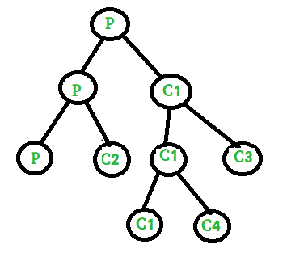
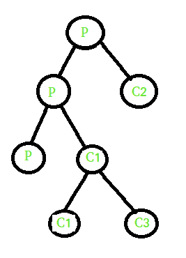
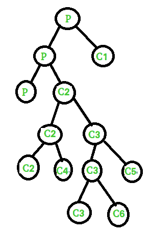

# Fork()–练习题

> 原文:[https://www.geeksforgeeks.org/fork-practice-questions/](https://www.geeksforgeeks.org/fork-practice-questions/)

先决条件:[叉基础](https://www.geeksforgeeks.org/fork-system-call/)、[叉和二叉树](https://www.geeksforgeeks.org/fork-and-binary-tree/)，

**范例 1:**
以下代码的输出是什么？

```
#include <stdio.h>
#include <unistd.h>
int main()
{
    if (fork() || fork())
        fork();
    printf("1 ");
    return 0;
}
```

输出:

```
 1 1 1 1 1 
```



**说明:**
1。它将创建两个进程，一个是父进程(具有子进程的进程标识)，另一个是子进程 C1(进程标识= 0)。
2。在 if 语句中，我们使用了 OR 运算符(||)，在这种情况下，当第一个条件为假时，将计算第二个条件。
3。父进程 P 将返回正整数，因此它直接执行语句并创建两个以上的进程(一个父进程 P，另一个是子进程 C2)。子进程 C1 将返回 0，因此它检查第二个条件，第二个条件再次创建另外两个进程(一个是父进程 C1，另一个是子进程 C3)。
4。C1 返回正整数，因此它将进一步创建两个进程(一个是父 C1，另一个是子 C4)。子 C3 返回 0，因此它将直接打印 1。

**例 2:**
以下代码的输出是什么？

```
#include <stdio.h>
#include <unistd.h>

int main()
{
    if (fork()) {
        if (!fork()) {
            fork();
            printf("1 ");
        }
        else {
            printf("2 ");
        }
    }
    else {
        printf("3 ");
    }
    printf("4 ");
    return 0;
}
```

**输出:**

```
 2 4 1 4 1 4 3 4 
```


**解说:**
1。它将创建两个进程，一个是父进程(具有子进程的进程标识)，另一个是子进程 C1(进程标识= 0)。
2。当条件为真时，父 P 执行 if 语句，子 C1 执行 else 语句并打印 3。父进程检查下一个 if 语句并创建两个进程(一个父进程和一个子进程 C2)。在 if 语句中，我们使用的不是运算符(即，！)，它为子进程 C2 执行，父进程 P 执行其他部分并打印值 2。子 C2
进一步创建了两个新流程(一个是父 C2，另一个是子 C3)。

**例 3:**
以下代码的输出是什么？

```
#include <stdio.h>
#include <unistd.h>

int main()
{
    if (fork() && (!fork())) {
        if (fork() || fork()) {
            fork();
        }
    }
    printf("2 ");
    return 0;
}
```

**输出:**

```
 2 2 2 2 2 2 2 
```


**解说:**
1。Fork 将创建两个进程，一个是父进程 P(具有新子进程的进程 id)，另一个是子进程 C1(进程 id=0)。
2。在 if 语句中，我们使用 AND 运算符(即& &)，在这种情况下，如果第一个条件为假，则它不会计算第二个条件并打印 2。父进程 P 检查第二个条件，并创建两个新进程(一个父进程 P，另一个子进程 C2)。在第二种情况下，我们使用非运算符，它为子进程 C2 返回真，并执行内部 if 语句。
3。孩子 C2 再次创建了两个新的过程(一个父 C2 和孩子 C3)，我们正在使用 OR 运算符(即，| | |)在第一个条件为假时计算第二个条件。父 C2 执行 if part 并创建两个新进程(一个父 C2 和子 C4)，而子 C3 检查第二个条件并创建两个新进程(一个父 C3 和子 C5)。
4。家长 C3 进入 if 部分，并进一步创建两个新的过程(一个家长 C3 和孩子 C6)。