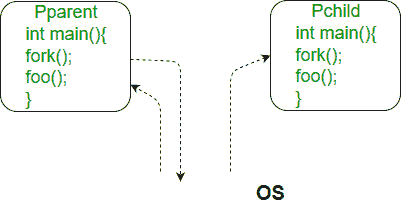

# C

中的叉()

> 原文:[https://www.geeksforgeeks.org/fork-system-call/](https://www.geeksforgeeks.org/fork-system-call/)

Fork 系统调用用于创建一个新的进程，称为 ***子进程*** ，与进行 fork()调用的进程(父进程)并发运行。创建新的子进程后，两个进程都将执行 fork()系统调用之后的下一条指令。子进程使用与父进程相同的 pc(程序计数器)、相同的 CPU 寄存器和相同的打开文件。

它不接受任何参数并返回一个整数值。下面是 fork()返回的不同值。

***负值*** :创建子流程不成功。
***零*** :返回到新创建的子流程。
***正值*** :返回给家长或来电者。该值包含新创建的子进程的进程标识。

[](https://media.geeksforgeeks.org/wp-content/cdn-uploads/Fork_in_C.jpg)

***请注意，以上程序不在 Windows 环境下编译。*T3】**

1.  **Predict the Output of the following program:**.

    ```
    #include <stdio.h>
    #include <sys/types.h>
    #include <unistd.h>
    int main()
    {

        // make two process which run same
        // program after this instruction
        fork();

        printf("Hello world!\n");
        return 0;
    }
    ```

    输出:

    ```
    Hello world!
    Hello world!

    ```

2.  **Calculate number of times hello is printed:**

    ```
    #include <stdio.h>
    #include <sys/types.h>
    int main()
    {
        fork();
        fork();
        fork();
        printf("hello\n");
        return 0;
    }
    ```

    输出:

    ```
    hello
    hello
    hello
    hello
    hello
    hello
    hello
    hello

    ```

    打印“你好”的次数等于创建流程的次数。进程总数= 2 <sup>n</sup> ，其中 n 是分叉系统调用的数量。所以这里 n = 3，2 <sup>3</sup> = 8

    让我们为这三行输入一些标签名:

    ```
    fork ();   // Line 1
    fork ();   // Line 2
    fork ();   // Line 3

           L1       // There will be 1 child process 
        /     \     // created by line 1.
      L2      L2    // There will be 2 child processes
     /  \    /  \   //  created by line 2
    L3  L3  L3  L3  // There will be 4 child processes 
                    // created by line 3

    ```

    所以总共有八个进程(新的子进程和一个原始进程)。

    如果我们希望将流程之间的关系表示为一个树形层次结构，那么应该如下所示:

    主进程:第一个分叉创建的 P0
    进程:P1
    进程:第二个分叉创建的 P2、P3
    进程:第三个分叉创建的 P4、P5、P6、P7

    ```
                 P0
             /   |   \
           P1    P4   P2
          /  \          \
        P3    P6         P5
       /
     P7

    ```

3.  **Predict the Output of the following program:**

    ```
    #include <stdio.h>
    #include <sys/types.h>
    #include <unistd.h>
    void forkexample()
    {
        // child process because return value zero
        if (fork() == 0)
            printf("Hello from Child!\n");

        // parent process because return value non-zero.
        else
            printf("Hello from Parent!\n");
    }
    int main()
    {
        forkexample();
        return 0;
    }
    ```

    输出:

    ```
    1.
    Hello from Child!
    Hello from Parent!
         (or)
    2.
    Hello from Parent!
    Hello from Child!

    ```

    在上面的代码中，创建了一个子进程。fork()在子进程中返回 0，在父进程中返回正整数。
    这里，两个输出是可能的，因为父进程和子进程同时运行。所以我们不知道 OS 会先把控制权交给父进程还是子进程。

    **重要提示:**父进程和子进程运行的是同一个程序，但并不代表它们完全相同。OS 为这两个进程分配不同的数据和状态，这些进程的控制流程可以不同。参见下一个示例:

4.  **Predict the Output of the following program:**

    ```
    #include <stdio.h>
    #include <sys/types.h>
    #include <unistd.h>

    void forkexample()
    {
        int x = 1;

        if (fork() == 0)
            printf("Child has x = %d\n", ++x);
        else
            printf("Parent has x = %d\n", --x);
    }
    int main()
    {
        forkexample();
        return 0;
    }
    ```

    输出:

    ```
    Parent has x = 0
    Child has x = 2
         (or)
    Child has x = 2
    Parent has x = 0

    ```

    这里，一个进程中的全局变量变化不会影响另外两个进程，因为两个进程的数据/状态不同。并且父进程和子进程同时运行，因此两个输出是可能的。

**fork() vs exec()**

分叉系统调用创建了一个新的进程。除了返回值之外，fork()创建的新进程是当前进程的副本。exec()系统调用用新程序替换当前进程。

**运动:**

1.  A process executes the following code:

    ```
    for (i = 0; i < n; i++)
        fork();
    ```

    创建的子进程总数为:(gate-cs-2008)
    (a)n
    (b)2^n–1
    (c)2^n
    (d)2^(n+1–1；

    解决方法见[本](https://www.geeksforgeeks.org/gate-gate-cs-2008-question-66/)。

2.  Consider the following code fragment:

    ```
    if (fork() == 0) {
        a = a + 5;
        printf("%d, %d\n", a, &a);
    }
    else {
        a = a –5;
        printf("%d, %d\n", a, &a);
    }
    ```

    假设 u，v 是父进程打印的值，x，y 是子进程打印的值。以下哪一项是正确的？(GATE-CS-2005)
    (A) u = x + 10 和 v = y
    (B) u = x + 10 和 v！= y
    (C) u + 10 = x 和 v = y
    (D) u + 10 = x 和 v！= y
    见[本](https://www.geeksforgeeks.org/gate-gate-cs-2005-question-72/)解。

3.  预测以下程序的输出。

    ```
    #include <stdio.h>
    #include <unistd.h>
    int main()
    {
        fork();
        fork() && fork() || fork();
        fork();

        printf("forked\n");
        return 0;
    }
    ```

    解决方法见[本](https://www.geeksforgeeks.org/fork-and-binary-tree/)

**相关文章:**
[C 程序演示 fork()和 pipe()](https://www.geeksforgeeks.org/c-program-demonstrate-fork-and-pipe/)
[C 中的僵尸和孤儿进程](https://www.geeksforgeeks.org/zombie-and-orphan-processes-in-c/)
[fork()和使用它创建的内存共享 b/w 进程。](https://www.geeksforgeeks.org/fork-memory-shared-bw-processes-created-using/)

**参考文献:**
[http://www . csl . MTU . edu/cs 4411 . CK/www/NOtes/process/fork/create . html](http://www.csl.mtu.edu/cs4411.ck/www/NOTES/process/fork/create.html)

本文由**团队 GeeksforGeeks** 和 **Kadam Patel** 投稿。如果你喜欢 GeeksforGeeks 并想投稿，你也可以使用[contribute.geeksforgeeks.org](http://www.contribute.geeksforgeeks.org)写一篇文章或者把你的文章邮寄到 contribute@geeksforgeeks.org。看到你的文章出现在极客博客主页上，帮助其他极客。

如果你发现任何不正确的地方，或者你想分享更多关于上面讨论的话题的信息，请写评论。