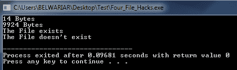
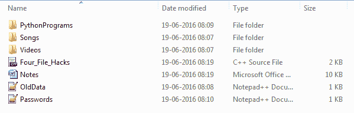
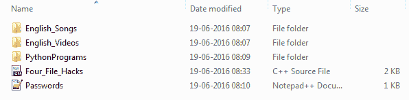

# 每个 C/C++ 程序员都应该知道的四个文件处理黑客

> 原文:[https://www . geesforgeks . org/四-文件处理-黑客-每个 cc-程序员都应该知道的/](https://www.geeksforgeeks.org/four-file-handling-hacks-which-every-cc-programmer-should-know/)

我们将讨论下面列出的四种文件黑客攻击-

1.  重命名–使用 C/C++ 重命名文件
2.  移除–使用 C/C++ 移除文件
3.  文件大小–使用 C/C++ 获取文件大小
4.  检查存在性–检查文件在 C/C++ 中是否存在

```cpp
// A C++ Program to demonstrate the
// four file hacks every C/C++ must know

// Note that we are assuming that the files
// are present in the same file as the program
// before doing the below four hacks
#include<stdio.h>
#include<stdlib.h>
#include<stdbool.h>

// A Function to get the file size
unsigned long long int fileSize(const char *filename)
{
    // Open the file
    FILE *fh = fopen(filename, "rb");
    fseek(fh, 0, SEEK_END);
    unsigned long long int size = ftell(fh);
    fclose(fh);

    return (size);
}

// A Function to check if the file exists or not
bool fileExists(const char * fname)
{
    FILE *file;
    if (file = fopen(fname, "r"))
    {
        fclose(file);
        return (true);
    }
    return (false);
}

// Driver Program to test above functions
int main()
{
    printf("%llu Bytes\n", fileSize("Passwords.txt"));
    printf("%llu Bytes\n", fileSize("Notes.docx"));

    if (fileExists("OldData.txt") == true )
        printf("The File exists\n");
    else
        printf("The File doen't exist\n");

    rename("Videos", "English_Videos");
    rename("Songs", "English_Songs");

    remove("OldData.txt");
    remove("Notes.docx");

    if (fileExists("OldData.txt") == true )
        printf("The File exists\n");
    else
        printf("The File doesn't exist\n");

    return 0;
}
```

输出:
[](https://media.geeksforgeeks.org/wp-content/cdn-uploads/cfile3.png)

**执行程序前截图:**
[](https://media.geeksforgeeks.org/wp-content/cdn-uploads/cfile1.png)

**执行程序后截图:**
[](https://media.geeksforgeeks.org/wp-content/cdn-uploads/cfile2.png)

本文由**拉希特·贝尔瓦亚尔**供稿。如果你喜欢极客博客并想投稿，你也可以写一篇文章并把你的文章邮寄到 contribute@geeksforgeeks.org。看到你的文章出现在极客博客主页上，帮助其他极客。

如果您发现任何不正确的地方，或者您想分享更多关于上面讨论的主题的信息，请写评论