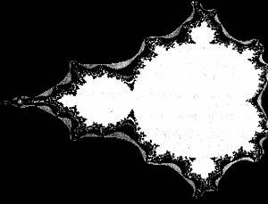
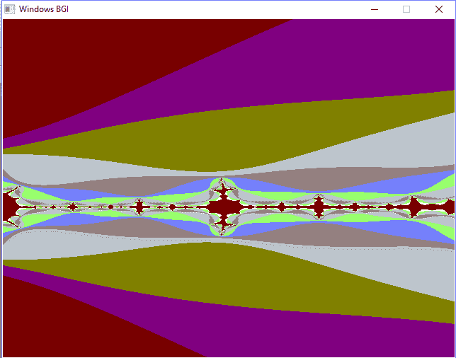

# C/c++

中的分形

> 原文:[https://www.geeksforgeeks.org/fractals-in-cc/](https://www.geeksforgeeks.org/fractals-in-cc/)

A **分形**是一种永无止境的模式。分形是无限复杂的模式，在不同的尺度上是自相似的。它们是通过在一个持续的反馈循环中一遍又一遍地重复一个简单的过程而产生的。数学上分形可以解释如下。

*   屏幕上一个点的位置被输入一个方程作为它的初始解，这个方程被迭代很多次。
*   如果该等式趋于零(即迭代结束时的值小于初始值)，则该点被涂黑。
*   如果方程趋于无穷大(即最终值大于初始值)，那么根据增加的速率(即值趋于无穷大的速率)，像素被涂上适当的颜色。

**曼德勃罗集合:**
曼德勃罗集合是复数 c 的集合，对于该集合，函数**f<sub>c</sub>(z)= z<sup>2</sup>+c**在从 z = 0 迭代时不发散，即对于该集合，序列 fc(0)、fc(fc(0))等在绝对值上保持有界。

曼德勃罗集是复平面中 c 的值的集合，对于该集合，在二次映射**Z<sub>n+1</sub>= Z<sub>n</sub>T5】2+c**的迭代下 0 的轨道保持有界。也就是说，当从 Z <sub>0</sub> = 0 开始并重复应用迭代时，如果 Z <sub>n</sub> 的绝对值保持有界，则复数 c 是曼德勃罗集的一部分。下面给出的是曼德尔布罗设置缩放序列的初始图像。黑点对应于集合之外的数字。


**曼德勃罗集合的属性:**

*   曼德尔布罗集是一个连通集，因为它总是有一条从该集的一点到该集的另一点的路径，所以该路径中的所有点也在该集中。
*   曼德尔布罗集有一个有限的区域，但有无限长的边界。
*   曼德尔布罗集相对于实轴是对称的。这意味着如果一个复数属于该集合，那么它的共轭也将属于该集合。
*   曼德勃罗集是有界的。
*   曼德尔布罗集本身在非精确意义上是相似的。
*   曼德尔布罗集的边界是一个分形结构，分形维数未知。

**实现:**由于分形的概念涉及方程的数学性质，因此创建分形的算法和程序很难编写和优化。人们可以找到许多创造分形的商业软件。这些程序代表了一些最优化的，可能是最好的分形算法和已创建的实现。下面给出了方法:

*   对于绘制曼德勃罗集，设置为复数的像素。
*   如果像素属于该集合，则对其进行着色。
*   遍历每个像素，计算相应的复数，结果保存在 **c_real** 实部，**c _ 虚部**虚部。
*   计算 Mandelbrot 函数，定义为 **z = z*z + c** ，其中 z 为复数。
*   因为复数乘法很难，所以打破等式，分别计算子部分，即实部和虚部。
*   作为复数的平方(a+IB)<sup>2</sup>= a<sup>2</sup>–b<sup>2</sup>+2abi，其中 a <sup>2</sup> -b <sup>2</sup> 为 ***实部*** ，2 ABI 为 ***虚部*** 。
*   While calculating z, calculate them separately, i.e.,

    > Z _ real number = z _ real number * Z _ real number -Z _ imaginary number +c _ real number [T3】 Z _ imaginary number = 2 * z _ real number * Z _

*   继续计算每个像素的这些值，直到我们达到最大迭代次数，z 的绝对值不小于 2。最后，我们给像素上色。

```cpp
// C++ implementation for mandelbrot set fractals
#include <graphics.h>
#include <stdio.h>
#define MAXCOUNT 30

// Function to draw mandelbrot set
void fractal(float left, float top, float xside, float yside)
{
    float xscale, yscale, zx, zy, cx, tempx, cy;
    int x, y, i, j;
    int maxx, maxy, count;

    // getting maximum value of x-axis of screen
    maxx = getmaxx();

    // getting maximum value of y-axis of screen
    maxy = getmaxy();

    // setting up the xscale and yscale
    xscale = xside / maxx;
    yscale = yside / maxy;

    // calling rectangle function
    // where required image will be seen
    rectangle(0, 0, maxx, maxy);

    // scanning every point in that rectangular area.
    // Each point represents a Complex number (x + yi).
    // Iterate that complex number
    for (y = 1; y <= maxy - 1; y++) {
        for (x = 1; x <= maxx - 1; x++)
        {
            // c_real
            cx = x * xscale + left;

            // c_imaginary
            cy = y * yscale + top;

            // z_real
            zx = 0;

            // z_imaginary
            zy = 0;
            count = 0;

            // Calculate whether c(c_real + c_imaginary) belongs
            // to the Mandelbrot set or not and draw a pixel
            // at coordinates (x, y) accordingly
            // If you reach the Maximum number of iterations
            // and If the distance from the origin is
            // greater than 2 exit the loop
            while ((zx * zx + zy * zy < 4) && (count < MAXCOUNT))
            {
                // Calculate Mandelbrot function
                // z = z*z + c where z is a complex number

                // tempx = z_real*_real - z_imaginary*z_imaginary + c_real
                tempx = zx * zx - zy * zy + cx;

                // 2*z_real*z_imaginary + c_imaginary
                zy = 2 * zx * zy + cy;

                // Updating z_real = tempx
                zx = tempx;

                // Increment count
                count = count + 1;
            }

            // To display the created fractal
            putpixel(x, y, count);
        }
    }
}

// Driver code
int main()
{
    // gm is Graphics mode which is
    // a computer display mode that
    // generates image using pixels.
    // DETECT is a macro defined in
    // "graphics.h" header file
    int gd = DETECT, gm, errorcode;

    float left, top, xside, yside;

    // setting the left, top, xside and yside
    // for the screen and image to be displayed
    left = -1.75;
    top = -0.25;
    xside = 0.25;
    yside = 0.45;
    char driver[] = "";

    // initgraph initializes the
    // graphics system by loading a
    // graphics driver from disk
    initgraph(&gd, &gm, driver);

    // Function calling
    fractal(left, top, xside, yside);

    getch();

    // closegraph function closes the
    // graphics mode and deallocates
    // all memory allocated by
    // graphics system
    closegraph();

    return 0;
}
```

输出:


**分形的应用:**分形的基本思想是在已有的不规则中寻找规律。以下是分形的一些应用:

*   基于分形几何的事实，分形图像压缩被用于计算机科学。通过使用这种技术，图像比 JPEG、GIF 等压缩得多。此外，放大图片时没有像素化。
*   为了便于湍流的研究，采用了分形表示法。此外，分形用于表示石油科学中使用的多孔介质。
*   分形天线最近已经被使用，这有助于减小天线的尺寸和重量，并提供高性能。