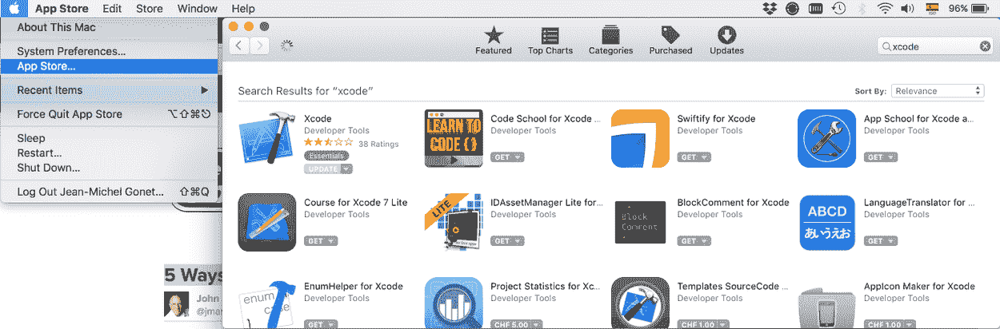
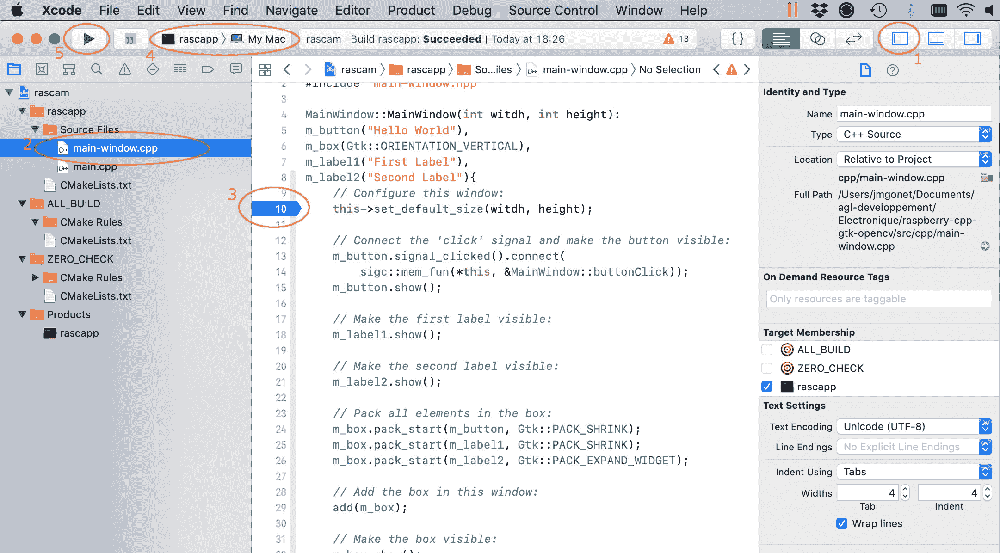

# 运行在树莓 PI 上的 C++ 全屏 OpenCV / GtK 应用

> 原文:[https://www . geesforgeks . org/全屏-opencv-GTK-application-in-c-running-on-覆盆子-pi/](https://www.geeksforgeeks.org/full-screen-opencv-gtk-application-in-c-running-on-raspberry-pi/)

# 介绍

*C++* 、 *OpenCV* 和 *Gtk* 是构建运行在树莓 PI 上的应用程序的不错的三元组，可以从相机中拍摄图像、处理图像、显示图像，并且拥有无限的用户界面。在本文中，我将向您展示一种将摄像机捕获显示到全屏窗口的简单方法。在第二篇文章中，我将修正这个过于简单的方法的一些缺点。希望这两篇文章能帮助你在到达可以玩得开心的地方之前，度过需要解决的无聊问题。

我假设你知道编码，但是你不熟悉 *C++* 、 *Gtk* 或者 *OpenCV* 。当我开始这个小项目时，这就是我的情况，我花了大量的时间来发现这种丰富语言的细节及其依赖性。由于这不是一个 *C++* 教程，我将只命名概念并提供解释的链接。

这里你会发现项目来源:[https://github.com/cpp-tutorial/raspberry-cpp-gtk-opencv](https://github.com/cpp-tutorial/raspberry-cpp-gtk-opencv)。主分支只显示了本教程的第一步。进一步的步骤在分支步骤 1、步骤 2 等。要获得完整版本，您可以检查最后一步，或者最后一个版本。

一个重要的因素是能够在你喜欢的台式电脑或笔记本上构建和测试你的项目。*树莓 Pi* 本意是一个嵌入式系统平台。这是一个令人惊叹的工具，但它没有合适的键盘、鼠标、显示器或足够的内存来作为一个开发工具。

我使用以下技术堆栈:

*   ***【树莓皮】***–最终目标是在其上启动应用。
*   ***CMake***–这是让你的代码在大多数平台上都可以构建的必要因素。它还将您的项目导出到 Xcode、VisualStudio、Eclipse 和一长串其他项目中，因此您将能够选择您喜欢的 IDE。
*   ***Mac OS X**Ubuntu**Windows***——在这里可以编写和测试应用程序。
*   ***c++***–*Python*时尚、年轻、高效，深受树莓乡亲们的支持。但是我恰好比较喜欢 *C++* 。如果 *Python* 是你的东西，那就停止阅读。
*   ***【openCV】***–一个非常广泛使用的开源(因此有了 Open)计算机视觉(因此有了 CV)库。
*   ***Gtkmm*, which is the *C++* oriented port of *Gtk*** – Although *OpenCV* lets you display images on screen, it is somewhat limited when interacting with the user. Being easily compatible, *Gtk / Gtkmm* are a great complement to *OpenCV* for building real user interfaces around computer vision applications.

    # 安装您的开发环境

    你首先需要的是一个工作的开发环境。我试过三个专业，*Mac OS X**Windows*和 *Linux* 。 *Linux* 指令同样适用于*树莓*。

    ## 苹果操作系统的开发环境

    在 Mac OS 世界中，默认 IDE 是 *Xcode* 。其他软件包通过*家酿*安装。

    ### c++-xcode

    你有一台苹果电脑，所以你有权免费使用 *Xcode* 。我知道很多人讨厌它，他们有他们的理由。如果你知道得更清楚，那就使用你喜欢的 IDE。如果没有，则使用 *Xcode* :

    *   在你的苹果电脑上，打开*应用商店*。
    *   浏览或搜索 *Xcode* 。
    *   得到它或更新它。
    *   刚推出的时候，它会提议安装更多的东西。接受他们。

    

    ### 公司自产自用

    这是 Mac OS X 的软件包管理器，也是安装其余所需软件包的最简单方法。

    *   去参观 https://brew.sh/
    *   遵循说明

    如果你已经安装了*家酿*的版本，现在是验证、更新和修复所有需要的东西的好时机。以下命令将为您提供大量建议:

    ```cpp
    $ brew update
    $ brew doctor

    ```

    按照指示去做，直到你把它们都修好(好吧，无论如何不要太偏执；尽你所能修复)。

    ### pkg-config

    这个包有助于将你的项目链接到 *OpenCV* 和 *GtK* 库(参见 pkg-config 上的[维基百科)。](https://en.wikipedia.org/wiki/Pkg-config)

    要安装它:

    ```cpp
    $ brew install pkg-config

    ```

    安装完成后，您可以通过键入以下命令来检查是否一切正常:

    ```cpp
    $ pkg-config --version
    > 0.29.2
    $ pkg-config --list-all
    > zlib                                zlib - zlib compression library
    > ...                                 etc...
    > ...                                 etc...
    > ...                                 etc...
    > harfbuzz-icu                        HarfBuzz text shaping library ICU integration

    ```

    ### OpenCV 和 GtK

    我们通过第三方贡献安装 *OpenCV* 。一开始你不需要它们，但它们也不会打扰你。我们用的是 *Gtkmm3* ，也就是 C++ 的 *GtK* :

    ```cpp
    brew install opencv3 --with-contrib
    brew install gtkmm3

    ```

    要验证库是否已到位，请执行以下操作:

    ```cpp
    $ pkg-config --list-all | grep opencv
    > opencv                              OpenCV - Open Source Computer Vision Library
    $ pkg-config --list-all | grep gtkmm
    > gtkmm-3.0                           gtkmm - C++ binding for the GTK+ toolkit

    ```

    ### 饭桶

    您可能在运行 *brew doctor* 时安装了它，它需要执行以下操作:

    ```cpp
    $ xcode-select --install

    ```

    要验证您确实拥有它:

    ```cpp
    $ git --version
    git version 2.17.2 (Apple Git-113)

    ```

    ## Windows 的开发环境

    待办事项

    ## Linux 开发环境(Debian)

    为了写这一部分，在安装了一个全新的 *Ubuntu* 发行版之后，我的最初意图是建立任何众所周知的 IDE 并点击直到我可以编译、调试和运行这个项目。孩子，我不是天真的吗！几天后，我已经放弃了 *Clion* ，因为它是一个付费应用程序，我尝试了 *Code::Blocks* 、 *Eclipse* 但没有成功，在尝试 *Qt Builder* 之前我已经失去了耐心——然而，我还没有找到一个可以接受的 IDE 来以合理的简单性完成基本的工作。然后发现这个[栈溢出问题 C++ IDE 适合 Linux？](https://stackoverflow.com/questions/24109/c-ide-for-linux)在被接受和大多数人投票的地方，答案是 *UNIX 是一个 IDE。全部*。

    ### c++–Linux 是一个 IDE

    让我们接受这样一个事实:在 Linux 中，我们不会得到一个花哨的 IDE，也不会满足于一个文本编辑器。两个流行的选择是:

    *   [升华文字](https://www.sublimetext.com/docs/3/linux_repositories.html)
    *   真正的铁杆极客可以[将 Vim 配置为 IDE](https://coderoncode.com/tools/2017/04/16/vim-the-perfect-ide.html) 。

    调试代码的工具是 *gdb* 。看起来很暗淡，但实际上你可以做得很好。看看这些视频:

    *   [Linux 中的 C 编程教程# 056–GDB 调试器(1/2)](https://www.youtube.com/watch?v=rlN3XI8kuhI)
    *   [gdb 快速入门](https://www.youtube.com/watch?v=xQ0ONbt-qPs)
    *   [CppCon 2015: Greg Law“给我 15 分钟&我会改变你对 GDB 的看法”](https://www.youtube.com/watch?v=PorfLSr3DDI)
    *   [gdb 的搭便车指南](http://apoorvaj.io/hitchhikers-guide-to-the-gdb.html)

    第一步，下面一点，我会给出用调试符号编译的简短具体说明，用 *gdb* 调试程序。

    ### 容易得到

    这是大多数 *Linux* 发行版的官方包管理器。大多数流行的应用程序都是通过它分发的，并且通常是预安装的。

    ### pkg-config

    在 Linux 发行版中， *pkg-config* 已经安装的几率最高。反正你可以试一试；如果它已经安装，它会告诉你:

    ```cpp
    sudo apt-get update
    sudo apt-get install pkg-config

    ```

    ### CMake

    你将需要它来编译 *OpenCV* ，所以你最好现在安装它:

    ```cpp
    $ sudo apt-get install cmake

    ```

    ### OpenCV

    作为先决条件，您需要从 *apt-get* 获得以下库:

    ```cpp
    # required:
    sudo apt-get install \
       libgtk-3-dev \
       pkg-config \
       libavcodec-dev \
       libavformat-dev \
       libswscale-dev 
    # Optional:
    sudo apt-get install \
       python-dev \
       python-numpy \
       libjpeg-dev \
       libpng-dev \
       libtiff-dev \
       libjasper-dev \
       libdc1394-22-dev

    ```

    安装完所有先决条件后，获取最新版本的 *OpenCV* 源代码，并将其解压缩:

    ```cpp
    $ wget https://github.com/opencv/opencv/archive/3.4.1.zip
    $ unzip 3.4.1.zip

    ```

    准备和编译:

    ```cpp
    $ cd opencv-3.4.1
    $ mkdir build
    $ cd build
    $ cmake -DCMAKE_BUILD_TYPE=Release -DCMAKE_INSTALL_PREFIX=/usr/local ..
    $ make -j4  # Number of processors. Don't use more that you computer has.

    ```

    去散步；这需要很长时间。如果进程中断，您只需重新键入以下内容即可再次启动:

    ```cpp
    $ make -j4

    ```

    编译完成后，完成安装:

    ```cpp
    $ sudo make install
    $ sudo ldconfig

    ```

    要检查库是否作为依赖项可用:

    ```cpp
    $ pkg-config --list-all | grep opencv
    > opencv                         OpenCV - Open Source Computer Vision Library

    ```

    您现在可以删除源文件夹；你不再需要它了:

    ```cpp
    $ cd ..
    $ cd ..
    $ rm -rf opencv-3.4.1
    $ rm 3.4.1.zip

    ```

    ### gtkmm(gtkmm)

    *Gtkmm* 是 *C++* 的 *Gtk* :

    ```cpp
    $ sudo apt-get install libgtkmm-3.0-dev

    ```

    要检查库是否作为依赖项可用:

    ```cpp
    $ pkg-config --list-all | grep gtkmm
    gtkmm-3.0                      gtkmm - C++ binding for the GTK+ toolkit

    ```

    ### 饭桶

    要安装 *Git* :

    ```cpp
    $ sudo apt-get install git

    ```

    并验证 *Git* 是否存在:

    ```cpp
    $ git --version
    > git version 2.7.4

    ```

    # 项目的文件夹结构

    有几篇很棒的文章讨论了用 *CMake* 构建的项目的最佳文件夹结构:

    *   [https://arne-mertz.de/2018/06/cmake-project-structure/](https://arne-mertz.de/2018/06/cmake-project-structure/):我喜欢这个，因为它讨论了如何集成那些只有头文件的库，并以 *Catch* 为例。
    *   [https://rix0r.nl/blog/2015/08/13/cmake-guide/](https://rix0r.nl/blog/2015/08/13/cmake-guide/):我喜欢这个，因为它详细展示了如何配置 CMake 以及为什么，也承认了库(容易单元测试)和应用(是用户界面，不太容易单元测试)的区别。

    在第一阶段(文章的第二部分有更多内容)，我提出了一个简化的文件夹结构。具有多个可执行文件和库的项目每个模块需要一个文件夹，并且结构要复杂得多。在这种情况下，因为只有一个可执行文件，所以我只有一个名为`src`的根文件夹，在其中，每种类型的文件都有一个文件夹——源、头和资源。

    ```cpp
    .gitignore  <-- Ignore xcode, codeb, build folders.
    /src  <----- All sources are here
       CMakeList.txt  <-- The CMake configuration file.
          /cpp  <----- Contains the C++ source files.
          /hpp  <----- Contains the C++ header files.
          /res  <----- Contains resource files.
    /build  <----- Contains the temporary build files. 
                     Not under version control
    /xcode  <----- Contains the XCode project.
                     Not under version control.
    /codeb  <----- Contains the Code::Blocks project. 
                     Not under version control. 

    ```

    # 步骤 1–单窗口应用程序

    在第一步中，我们构建了一个非常简单的单窗口应用程序，使用 *CMake* 来配置项目，使用 *Gtk* 来显示窗口。源代码作为主分支可在:[https://github.com/cpp-tutorial/raspberry-cpp-gtk-opencv](https://github.com/cpp-tutorial/raspberry-cpp-gtk-opencv)获得。要检索它:

    ## 用*配置项目，做*

    这是 *src* 文件夹中的 *CMakeLists.txt* :

    ```cpp
    # src/CMakeLists.txt
    cmake_minimum_required(VERSION 3.3 FATAL_ERROR)

    # Project name and current version
    project(rascam VERSION 0.1 LANGUAGES CXX)

    # Enable general warnings
    # See http://gcc.gnu.org/onlinedocs/gcc/Warning-Options.html
    set(CMAKE_CXX_FLAGS "${CMAKE_CXX_FLAGS} -Wall")

    # Use 2014 C++ standard.
    set(CMAKE_CXX_STANDARD 14)
    set(CMAKE_CXX_STANDARD_REQUIRED ON)
    set(CMAKE_CXX_EXTENSIONS OFF)

    # Must use GNUInstallDirs to install libraries into correct locations on all platforms:
    include(GNUInstallDirs)

    # Pkg_config is used to locate headers and files for dependency libraries:
    find_package(PkgConfig)

    # Defines variables GTKMM_INCLUDE_DIRS, GTKMM_LIBRARY_DIRS and GTKMM_LIBRARIES.
    pkg_check_modules(GTKMM gtkmm-3.0)

    # Adds GTKMM_INCLUDE_DIRS, GTKMM_LIBRARY_DIRS to the list of folders the
    # compiler and linker will use to look for dependencies:
    link_directories( ${GTKMM_LIBRARY_DIRS} )
    include_directories( ${GTKMM_INCLUDE_DIRS} )

    # Declares a new executable target called rascapp
    # and lists the files to compile for it:
    add_executable(rascapp
        cpp/main.cpp    
        cpp/main-window.cpp
    )

    # Adds the folder with all headers:
    target_include_directories(rascapp PRIVATE hpp)

    # Link files:
    target_link_libraries(rascapp
       ${GTKMM_LIBRARIES}  
    )

    ```

    让我们逐一查看这些命令:

    *   `cmake_minimum_required`需要最低版本的 *CMake* 。这允许您放心地使用指定版本中存在的功能，或者在安装的版本太旧时显示明确的错误消息。
    *   `project`声明全局项目的名称，`rascam`，指定当前版本并列出我们正在使用的语言，即 C++。从历史上看， *C++* 的扩展是`*.c++ `，但在某些上下文中++ 有问题，所以他们切换到`cpp`或`cxx`。在 *CMake* 中，`CXX`表示 *C++* 。
    *   `set(CMAKE_CXX...)`设置一些适合现代 *C++* 的标志。
    *   `find_package(PkgConfig)`链接到`pkg-config`命令，所以我们可以稍后使用它。
    *   `pkg_check_modules(GTKMM gtkmm-3.0)`做的和在终端执行`pkg-config gtkmm-3.0`一样(如果愿意可以试试)，然后将答案的每一段复制到前缀为指定`GTKMM`的变量中。因此，在这个命令之后，我们有三个名为`GTKMM_LIBRARY_DIRS`、`GTKMM_INCLUDE_DIRS`和`GTKMM_LIBRARIES`的变量。
    *   然后我们宣布一个目标。一个项目可以有多个目标。一般来说，目标包括通过调用`add_executable`或`add_library`定义的可执行文件或库，并且可以设置许多属性(参见[区分“目标”和“命令”](https://stackoverflow.com/questions/11971917/why-does-cmake-make-a-distinction-between-a-target-and-a-command))。由于这是一个单一的目标项目，直接在主`CMakeLists.txt`文件中定义目标非常方便。我们列出要编译以创建目标的源文件。
    *   `target_include_directories`设置在源中查找文件的文件夹列表，称为`include "..."`。
    *   `target_link_libraries`设置链接器必须链接的库的列表(参见关于[链接器做什么](https://stackoverflow.com/questions/3322911/what-do-linkers-do))以完成构建。

    如果您想了解更多关于编译步骤的信息:

    *   [c++ 如何工作:理解编译](https://www.toptal.com/c-plus-plus/c-plus-plus-understanding-compilation)
    *   [堆栈溢出–编译/链接过程如何工作？](https://stackoverflow.com/questions/6264249/how-does-the-compilation-linking-process-work)

    ## *Gtk* 启动

    所有 *C++* 可执行文件都需要一个`main`方法作为入口点。要启动 *GtK* 应用程序，您需要指定一个主窗口，它将作为所有其他用户交互的基础，包括打开更多窗口。

    ```cpp
    #include "main-window.hpp"

    int main(int argc, char* argv[])
    {
        auto app
            = Gtk::Application::create(argc,
                                       argv,
                                       "raspberry-cpp-gtk-opencv");

        MainWindow mainWindow(300, 300);
        return app->run(mainWindow);
    }
    ```

    将变量声明为`auto`指定[被声明变量的类型将从其初始化器](https://en.cppreference.com/w/cpp/language/auto)中自动推导出来。这叫[式推断](https://en.wikipedia.org/wiki/Type_inference)。

    对`Gtk::Application::create`的调用初始化一个新的 *GtK* 执行上下文，传递[程序参数](https://www.gnu.org/software/libc/manual/html_node/Program-Arguments.html)，并设置[应用程序 id](https://developer.gnome.org/ChooseApplicationID/) (可以是任何东西，但是惯例要求它应该包含你的域名的反向，然后是它的名称，就像在`ch.agl-developpement.cpp-tutorial.raspberry-cpp-gtk-opencv`中一样)

    一旦你准备好了上下文，你可以用它来打开一个窗口。该窗口可以是扩展`Gtk::Window`的任何类的实例。在这种情况下，我们的主窗口被非常明确地调用`mainWindow`，它是类`MainWindow`的一个实例，我们将在后面定义。

    我们定义`mainWindow`变量的方式(参见[定义和声明](https://msdn.microsoft.com/en-us/library/0e5kx78b.aspx)的区别)使其成为*自动*变量(与之前看到的`auto`类型推断修饰符不同)。自动变量在定义时在内存中初始化和分配，当它们的作用域结束时自动取消初始化和分配(阅读更多关于[作用域](https://en.wikipedia.org/wiki/Scope_(computer_science)))。在局部变量上，这发生在代码块的结尾' } '处。我们不需要关心删除自动变量(相比之下，参见[带新增和删除的动态内存分配](https://www.learncpp.com/cpp-tutorial/69-dynamic-memory-allocation-with-new-and-delete/)，或者也可以在极客这里为极客进行[动态内存分配)。](https://www.geeksforgeeks.org/c-plus-plus/#Dynamic%20memory%20allocation)

    每当变量的类型是类(与像`int`这样的基本类型相反)时，类构造函数就用构造参数调用，并返回初始化的实例。在这种情况下，构造参数是窗口的初始大小。

    当用户关闭窗口时，对`run`的调用将返回。这给了 *Gtk* 执行上下文控制[退出状态](https://en.wikipedia.org/wiki/Exit_status)的机会。

    ## 基本 *GtK* 窗口

    在 *Gtk* 中，所有显示或与用户交互的按钮、标签、复选框和元素都被称为*小部件*。这里是*小部件*和的[画廊。](https://developer.gnome.org/gtk3/stable/ch03.html)

    然后， *gtkmm* 加入自己的酱料:

    > *gtkmm* 使用容器分层排列小部件。容器小部件包含其他小部件。大多数 gtkmm 小部件都是容器。窗口、笔记本标签和按钮都是容器小部件。容器有两种风格:独子容器，都是 Gtk::Bin 的后代；多子容器，都是 Gtk::Container 的后代。gtkmm 中的大多数小部件都是 Gtk::Bin 的后代，包括 Gtk::Window
    > 
    > 参见 [*Gtkmm* 官方文档](https://developer.gnome.org/gtkmm-tutorial/stable/sec-multi-item-containers.html.en)。

    ### `MainWindow`类声明–标题

    `class MainWindow : public Gtk::Window`宣布`MainWindow`为[级](https://www.geeksforgeeks.org/c-classes-and-objects/)，为`Gtk::Window`的后代或继承。`public`修饰符使祖先的所有公共成员也成为后代的公共成员。公共继承是扩展类最常用的方式(与[私有继承](https://www.bogotobogo.com/cplusplus/private_inheritance.php)形成对比)。我们正在向 *Gtk* 执行上下文提供`MainWindow`，该上下文期望`Gtk::Window`的所有功能都可用，因此我们避免限制它们的访问。

    作为`Gtk::Window`的后代，`MainWindow`是独生子容器，只能包含一个`Gtk::Widget`。我选择它是一个`Gtk::Box`，这是一个`Gtk::Container`，所以反过来，它能够包含几个*小部件*。在这种情况下，我希望它们是一个`Gtk::Button`和两个`Gtk::Label`，以说明*打包*机制，即 *GtK* 用来将一堆控件堆叠在一起。对于`MainWindow`来响应按钮上的点击，我们声明了一个`buttonClick`方法(可以是任何其他名称，但保持它们有意义)——我稍后将解释如何将“点击”信号连接到它。

    ```cpp
    #ifndef MAIN_WINDOW_H
    #define MAIN_WINDOW_H

    #include <gtkmm.h>

    class MainWindow : public Gtk::Window {
    public:
        MainWindow(int width, int height);
        virtual ~MainWindow() = default;

    private:
        void buttonClick();
        Gtk::Button m_button;
        Gtk::Box m_box;
        Gtk::Label m_label1, m_label2;
    };

    #endif
    ```

    前两个方法是构造函数和析构函数。如前所述，每次我们声明这个类的新实例时，都会调用一个构造函数。此构造函数接受窗口的初始宽度和高度作为参数。

    每当实例被销毁时，都会调用类析构函数来执行所有需要的清理任务。这个析构函数有两个重要的修饰符:

    *   `virtual`表示在继承的情况下，调用的方法将是动态类型的方法。阅读更多关于[什么是动态类型的对象](https://stackoverflow.com/questions/7649649/what-is-dynamic-type-of-object)、[虚拟函数](https://www.ibm.com/support/knowledgecenter/en/ssw_ibm_i_72/rzarg/cplr139.htm)，以及为什么大多数时候拥有[虚拟析构函数](https://www.geeksforgeeks.org/virtual-destructor/)是个好主意。
    *   `default`意味着我们定义这个析构函数有一个默认的实现。析构函数的默认实现能够解除类的所有已定义成员的分配，它们是`m_box`、`m_button`、`m_label1`和`m_label2`(代码> buttonClick 是一个方法，因此它不需要分配或解除分配)。通过指定默认的实现，我们就不需要定义析构函数了。

    *C++* 的内存模型没有[垃圾收集器](https://en.wikipedia.org/wiki/Garbage_collection_(computer_science))。保留和释放内存依赖于类构造函数和析构函数的存在，以及一种叫做[资源获取是初始化，或者 RAII](https://www.tomdalling.com/blog/software-design/resource-acquisition-is-initialisation-raii-explained/) 的策略。

    ### `MainWindow`类别定义–来源

    `MainWindow`的声明需要两个进一步的定义——类构造函数和`buttonClick`方法。下面是代码:

    ```cpp
    #include "main-window.hpp"
    #include <iostream>

    MainWindow::MainWindow(int witdh, int height)
        : m_button("Hello World"), m_box(Gtk::ORIENTATION_VERTICAL), m_label1("First Label"), m_label2("Second Label")
    {
        // Configure this window:
        this->set_default_size(witdh, height);

        // Connect the 'click' signal and make the button visible:
        m_button.signal_clicked().connect(
            sigc::mem_fun(*this, &MainWindow::buttonClick));
        m_button.show();

        // Make the first label visible:
        m_label1.show();

        // Make the second label visible:
        m_label2.show();

        // Pack all elements in the box:
        m_box.pack_start(m_button, Gtk::PACK_SHRINK);
        m_box.pack_start(m_label1, Gtk::PACK_SHRINK);
        m_box.pack_start(m_label2, Gtk::PACK_EXPAND_WIDGET);

        // Add the box in this window:
        add(m_box);

        // Make the box visible:
        m_box.show();
    }

    void MainWindow::buttonClick()
    {
        std::cout << "Hello World" << std::endl;
    }
    ```

    构造函数的全称是`MainWindow::MainWindow`，意思是属于类`MainWindow`的叫做`MainWindow`的函数(构造函数的名字和类一样)。它以`width`和`height`为参数，从调用所有声明成员的构造函数开始(详细阅读[构造函数成员初始化器列表](https://www.learncpp.com/cpp-tutorial/8-5a-constructor-member-initializer-lists/))。

    然后我们通过调用`[this->set_default_size](https://developer.gnome.org/gtk3/stable/GtkWindow.html#gtk-window-set-default-size)`来设置窗口的默认大小。 [`this`是指向当前类实例](https://www.geeksforgeeks.org/this-pointer-in-c/)的指针。作为一个指针，我们使用`->`来访问它的成员。随着类`MainWindow`扩展`Gtk::Window`，该实例包含该类和父类的所有公共或受保护成员。这叫[继承](https://www.geeksforgeeks.org/inheritance-in-c/)。`this`指针的使用实际上是可选的，下面的代码片段也是有效的:

    。

    ```cpp
    // Configure this window (now, without the 'this'):
    set_default_size(witdh, height);

    ```

    接下来我们要对被点击的`m_button`做出反应。实现这一点的一种方法是将一个功能连接到`m_button`实例的点击信号(要查看小部件的所有可用信号，您可以查看官方文档，例如，[T2 只有*点击了*信号](https://developer.gnome.org/gtkmm-tutorial/stable/sec-pushbuttons.html))。将函数连接到小部件的信号允许从代码中的任何地方处理事件，只要您可以访问小部件并且您可以提供函数的地址。

    ```cpp
    m_button.signal_clicked().connect([address of the method to call]);

    ```

    函数的地址可以简单到放入函数的名称(参见关于函数的[地址](https://www.geeksforgeeks.org/address-function-c-cpp/))。我们的情况更复杂，因为我们要指定的函数是一个类的成员。成员函数需要提供`this`指针，这样就可以访问同一个实例的其他成员。要构建指向特定实例的方法的指针，我们使用 [`sigc::mem_fun`](http://www.cplusplus.com/reference/functional/mem_fun/) :

    ```cpp
    sigc::mem_fun(                    // Convert member function to function pointer.
       *this,                         // The address of the instance.
       &MainWindow::buttonClick   // The address of the method.
    );

    ```

    默认情况下，小部件不可见。我们需要通过调用`show()`来明确设置它们的可见性。我们对所有小部件都这样做，包括`m_box`。

    接下来，我们将所有元素打包到盒子中。在初始化期间，我们已经将该框设置为 [`Gtk::ORIENTATION_VERTICAL`](https://developer.gnome.org/gtk3/stable/gtk3-Standard-Enumerations.html#GtkOrientation) ，这意味着小部件将一个位于另一个下方，使用所有可用的水平空间。`pack_start`给盒子增加了一个新的小部件，`Gtk::PACK_SHRINK`指定小部件的垂直尺寸要尽可能小(`Gtk::ORIENTATION_VERTICAL`已经指定盒子里的所有小部件都要有尽可能大的宽度，所以结果会是小部件很宽很平。)

    相比之下， [`Gtk::PACK_EXPAND_WIDGET`](https://developer.gnome.org/gtkmm-tutorial/stable/sec-multi-item-containers.html) 指定小部件应该占据所有可用空间。这使得`m_label2`在用户展开窗口时展开(你可以简单测试一下)。

    最后一步是让`m_box`本身可见。

    至于`buttonClick`方法，我们只是向[标准输出](https://www.geeksforgeeks.org/basic-input-output-c/)显示一条消息。

    ## 在 XCode 中启动应用程序

    首先，在您想要放置项目的文件夹中签出源代码。进入检出文件夹并创建一个`xcode`文件夹，该文件夹将包含 *Xcode* 的所有工作数据。进入工作文件夹，创建 *Xcode* 项目:

    ```cpp
    $ cd go-to-your-working-folder
    $ git clone https://github.com/cpp-tutorial/raspberry-cpp-gtk-opencv.git
    $ cd raspberry-cpp-gtk-opencv
    $ mkdir xcode
    $ cd xcode
    $ cmake -G Xcode ../src
    $ make

    ```

    现在打开 *Xcode* ，从菜单中，做一个*文件*和*打开*并导航到`xcode`文件夹，打开一个名为`rascam.xcodeproj`的文件(注意`rascam`是*中指定的项目名称为*。导航器将打开，显示每个目标一个文件夹。一些目标，像`ALL_BUILD`和`ZERO_CHECK`是 *Xcode* 内部。应该有一个目标叫`rascapp`，是`Cmake`中可执行目标的名字。你会在那里找到你的来源和标题。打开你喜欢的任何一个，放一个断点。然后在工具栏的非描述下拉列表中选择`rascapp`目标，最后播放。如果一切正常，应用程序应该执行。有可能窗户不在上面，所以你看不到。

    [](https://media.geeksforgeeks.org/wp-content/uploads/mac-os-x-xcode-cpp-debug-cmake-project.jpg)

    ## 在 VisualStudio 中启动应用程序

    ## 在 Linux 中启动应用程序

    克隆示例项目，用[调试符号](https://bytefreaks.net/programming-2/cc-how-do-you-set-gdb-debug-flag-g-with-cmake)配置，并构建:

    ```cpp
    $ cd go-to-your-working-folder
    $ git clone https://github.com/cpp-tutorial/raspberry-cpp-gtk-opencv.git
    $ cd raspberry-cpp-gtk-opencv
    $ mkdir build
    $ cd build
    $ cmake -DCMAKE_BUILD_TYPE=Debug ../src
    $ make

    ```

    要使用 *gdb* 进行调试，假设您仍在`build`文件夹中:

    ```cpp
    $ gdb ./rascapp
    [Now you're in gdb]
    b main-window.cpp:10  # Place a break-point on line 10 of this file.
    run                   # Run the program. It will stop at the breakpoint.
    where                 # It will show the stack trace
    list                  # It will show some context.
    print width           # Displays the value of this variable
    n                     # Step over
    s                     # Step into
    c                     # To continue the program
    q                     # Quit gdb 

    ```

    # 第二步——一点精致

    第二步对应用程序进行了一些小的改进。首先是对关键事件做出反应。由于应用程序将位于*树莓皮*上，并且不总是可以通过鼠标轻松访问，因此使用一些键盘快捷键可能会很方便，尤其是切换全尺寸窗口或关闭应用程序。第二个改进是在系统日志中记录事件。从命令行运行的应用程序可以直接看到`cout`消息。但是，如果您从用户桌面启动您的窗口应用程序，您将看不到控制台，也看不到`cout`的结果。

    ## 记录到系统日志

    由于窗口应用程序通常从桌面启动，因此通过`cout`产生的内容不容易看到。相反，您可以[提交系统日志消息](https://www.gnu.org/software/libc/manual/html_node/Submitting-Syslog-Messages.html)(另请参见[系统日志示例](https://www.gnu.org/software/libc/manual/html_node/Syslog-Example.html))。这很容易做到，并且适用于所有平台。

    在 *Linux* ( *Ubuntu* )中，可以通过[系统日志](https://www.howtogeek.com/117878/how-to-view-write-to-system-log-files-on-ubuntu/)应用查看系统日志。在 *Mac OS X* 中，是[控制台](https://support.apple.com/en-en/guide/console/welcome/mac)应用程序。在*窗口*中，可以使用[事件查看器](https://www.howtogeek.com/123646/htg-explains-what-the-windows-event-viewer-is-and-how-you-can-use-it/)。

    ## 对键盘事件做出反应

    对事件做出反应的另一种方式是覆盖小部件中的特定函数，每当事件发生时都会调用该函数。例如，为了对`MainWindow`中的键盘事件做出反应，我们必须覆盖`on_key_press_event`方法。要[覆盖*c++*T5 中的功能:](https://www.geeksforgeeks.org/function-overloading-vs-function-overriding-in-cpp/)

    *   该函数必须在我们类的祖先之一中声明为`virtual`。
    *   我们需要在我们的类中用完全相同的签名和可访问性再次声明它。
    *   我们可以在函数声明中添加`override`关键字，以确认我们正在覆盖父类中的现有方法。当我们在一个不存在或者不是`virtual`的方法上使用`override`时，编译器会显示一个错误。

    `on_key_press_event`在类`Gtk::Widget`中声明如下:

    ```cpp
    /// This is a default handler for the signal signal_key_press_event().
    virtual bool on_key_press_event(GdkEventKey* key_event);

    ```

    因此，我们必须重新声明它是我们的类。

    ```cpp
    #ifndef MAIN_WINDOW_H
    #define MAIN_WINDOW_H

    #include <gtkmm.h>

    #include "camera-drawing-area.hpp"

    class MainWindow : public Gtk::Window {
    public:
        MainWindow(int width, int height);
        virtual ~MainWindow() = default;

    protected:
        bool on_key_press_event(GdkEventKey* event) override;

    private:
        void buttonClick();
        bool probablyInFullScreen;
        Gtk::Button m_button;
        Gtk::Box m_box;
        Gtk::Label m_label1;
        CameraDrawingArea cameraDrawingArea;
    };

    #endif
    ```

    事件发生的小部件是第一个在其`on_xx_xxx_event()`事件处理程序上接收到它的部件。如果返回`true`，则该事件被视为已处理，不再处理。相反，如果处理程序对事件无能为力，它将返回`false`，使事件被提供给其父小部件和父小部件的父小部件的相同处理程序，以此类推(参见官方文档中关于[事件传播](https://developer.gnome.org/gtkmm-tutorial/stable/sec-keyboardevents-propagation.html))。像`on_key_press_event`这样的处理程序的默认实现是除了返回`false`之外什么都不做，所以事件会被传播，除非另有说明。

    [Ctrl] + [C]退出应用程序，[f]或[F]切换全屏模式，[esc]关闭全屏模式:

    ```cpp
    #include "main-window.hpp"
    #include <syslog.h>

    MainWindow::MainWindow(int witdh, int height)
        : probablyInFullScreen(false), m_button("Hello World"), m_box(Gtk::ORIENTATION_VERTICAL), m_label1("First Label")
    {
        // Configure this window:
        this->set_default_size(witdh, height);

        // Connect the 'click' signal and make the button visible:
        m_button.signal_clicked().connect(
            sigc::mem_fun(*this, &MainWindow::buttonClick));
        m_button.show();

        // Make the first label visible:
        m_label1.show();

        // Make the second label visible:
        cameraDrawingArea.show();

        // Pack all elements in the box:
        m_box.pack_start(m_button, Gtk::PACK_SHRINK);
        m_box.pack_start(m_label1, Gtk::PACK_SHRINK);
        m_box.pack_start(cameraDrawingArea, Gtk::PACK_EXPAND_WIDGET);

        // Add the box in this window:
        add(m_box);

        // Make the box visible:
        m_box.show();

        // Activate Key-Press events
        add_events(Gdk::KEY_PRESS_MASK);
    }

    void MainWindow::buttonClick()
    {
        syslog(LOG_NOTICE, "Hello world!");
    }

    bool MainWindow::on_key_press_event(GdkEventKey* event)
    {
        switch (event->keyval) {
        // Ctrl + C: Ends the app:
        case GDK_KEY_C:
        case GDK_KEY_c:
            if ((event->state & GDK_CONTROL_MASK) == GDK_CONTROL_MASK) {
                get_application()->quit();
            }
            return true;

        // [F] toggles fullscreen mode:
        case GDK_KEY_F:
        case GDK_KEY_f:
            if (probablyInFullScreen) {
                unfullscreen();
                probablyInFullScreen = false;
            }
            else {
                fullscreen();
                probablyInFullScreen = true;
            }
            return true;

        // [esc] exits fullscreen mode:
        case GDK_KEY_Escape:
            unfullscreen();
            probablyInFullScreen = false;
            return true;
        }

        return false;
    }
    ```

    默认情况下，不会捕获事件。`add_events(Gdk::KEY_PRESS_MASK)`激活键盘事件的捕捉。

    切换全屏的功能是`fullscreen()`和`unfullscreen()`，它们都属于`Gtk::Window`类(这里我们省略了`this`指针)。文档警告[您不应该假设窗口之后肯定是全屏的，因为其他实体](https://developer.gnome.org/pygtk/stable/class-gtkwindow.html#method-gtkwindow--fullscreen)(例如用户或窗口管理器)可以再次打开或关闭它，并且不是所有的窗口管理器都满足这些请求。这就是为什么我们增加了一个`probablyInFullScreen`状态，传达了窗口没有处于预期状态的可能性。

    要退出应用程序，我们不直接调用`exit()`，而是使用`get_application()->quit()`告诉 *Gtk* 执行上下文调用`exit`。它最终会的，但首先它会为我们关闭所有窗口并打开设备。

    # 第 3 步–显示相机拍摄–粗略方式

    为了捕捉图像，我们使用 *OpenCV* 。如果您只想从相机中捕获图像，可以使用其他库，但最终目标是将计算机视觉算法应用于捕获的图像。因此， *OpenCV* 是最好的选择。

    ## 捆绑 Mac OS X 应用程序

    出于安全原因， *Mac OS X* 强制应用程序在使用相机前请求用户许可。其程序是包含一个包含必要内容的`Info.plist`文件:

    *   关于版本号和作者的一些说明。
    *   一个带有为什么你的应用程序需要摄像头的描述的键`NSCameraUsageDescription`。您在这里写的消息会显示给用户，用户必须接受它。如果他不接受，系统会终止你的申请。

    程序是包含一个`MacOSXBundleInfo.plist.in`文件，是一个模板；有些条目可以由`CMakeLists.txt`文件中的属性来管理，其他的你可以自己放。文件放在`src/res`文件夹中，内容如下:

    ```cpp
    <?xml version="1.0" encoding="UTF-8"?>
    <!DOCTYPE plist PUBLIC 
        "-//Apple Computer//DTD PLIST 1.0//EN" 
        "http://www.apple.com/DTDs/PropertyList-1.0.dtd">
    <plist version="1.0">
    <dict>
        <key>CFBundleDevelopmentRegion</key>
        <string>English</string>
        <key>CFBundleExecutable</key>
        <string>${MACOSX_BUNDLE_EXECUTABLE_NAME}</string>
        <key>CFBundleGetInfoString</key>
        <string>${MACOSX_BUNDLE_INFO_STRING}</string>
        <key>CFBundleIconFile</key>
        <string>${MACOSX_BUNDLE_ICON_FILE}</string>
        <key>CFBundleIdentifier</key>
        <string>${MACOSX_BUNDLE_GUI_IDENTIFIER}</string>
        <key>CFBundleInfoDictionaryVersion</key>
        <string>6.0</string>
        <key>CFBundleLongVersionString</key>
        <string>${MACOSX_BUNDLE_LONG_VERSION_STRING}</string>
        <key>CFBundleName</key>
        <string>${MACOSX_BUNDLE_BUNDLE_NAME}</string>
        <key>CFBundlePackageType</key>
        <string>APPL</string>
        <key>CFBundleShortVersionString</key>
        <string>${MACOSX_BUNDLE_SHORT_VERSION_STRING}</string>
        <key>CFBundleSignature</key>
        <string>????</string>
        <key>CFBundleVersion</key>
        <string>${MACOSX_BUNDLE_BUNDLE_VERSION}</string>
        <key>CSResourcesFileMapped</key>
        <true/>
        <key>NSHumanReadableCopyright</key>
        <string>${MACOSX_BUNDLE_COPYRIGHT}</string>
        <key>NSCameraUsageDescription</key>
        <string>This app requires to access your camera to retrieve images and perform the demo</string>
    </dict>
    </plist>

    ```

    这些是我曾经在 *Mac OS X* 中发现如何做捆绑包的一些资源:

    *   关于[捆绑包和框架](https://gitlab.kitware.com/cmake/community/wikis/doc/cmake/platform_dependent_issues/Bundles-And-Frameworks)的官方文档，相当旧
    *   原 [Info.plist 模板](https://github.com/Kitware/CMake/blob/master/Modules/MacOSXBundleInfo.plist.in)。

    ## 链接到 *OpenCV*

    按照前面的说明安装 *OpenCV* 后，您可以在 *CMake* 中将您的应用程序链接到它。

    ```cpp
    # src/CMakeLists.txt
    cmake_minimum_required(VERSION 3.3 FATAL_ERROR)

    # Project name and current version
    project(rascam VERSION 0.1 LANGUAGES CXX)

    # Enable general warnings
    # See http://gcc.gnu.org/onlinedocs/gcc/Warning-Options.html
    set(CMAKE_CXX_FLAGS "${CMAKE_CXX_FLAGS} -Wall")

    # Use 2014 C++ standard.
    set(CMAKE_CXX_STANDARD 14)
    set(CMAKE_CXX_STANDARD_REQUIRED ON)
    set(CMAKE_CXX_EXTENSIONS OFF)

    # Must use GNUInstallDirs to install libraries into correct locations on all platforms:
    include(GNUInstallDirs)

    # Pkg_config is used to locate header and files for dependency libraries:
    find_package(PkgConfig)

    # Defines variables GTKMM_INCLUDE_DIRS, GTKMM_LIBRARY_DIRS and GTKMM_LIBRARIES.
    pkg_check_modules(GTKMM gtkmm-3.0) 
    link_directories( ${GTKMM_LIBRARY_DIRS} )
    include_directories( ${GTKMM_INCLUDE_DIRS} )

    # OpenCV can be linked in a more standard manner:
    find_package( OpenCV REQUIRED )

    # Compile files:
    add_executable(rascapp
        cpp/main.cpp
        cpp/main-window.cpp
        cpp/camera-drawing-area.cpp
    )

    # Add folder with all headers:
    target_include_directories(rascapp PRIVATE hpp)

    # Link files:
    target_link_libraries(rascapp
        ${GTKMM_LIBRARIES}
        ${OpenCV_LIBS}
    )

    # Apple requires a bundle to add a Info.plist file that contains the required
    # permissions to access some restricted resources like the camera:
    if (APPLE)
        set_target_properties(rascapp PROPERTIES
            MACOSX_BUNDLE TRUE
            MACOSX_FRAMEWORK_IDENTIFIER org.cmake.ExecutableTarget
            MACOSX_BUNDLE_INFO_PLIST ${CMAKE_CURRENT_SOURCE_DIR}/res/MacOSXBundleInfo.plist.in

            # This property is required:
            MACOSX_BUNDLE_GUI_IDENTIFIER "rascapp-${PROJECT_VERSION}"

            # Those properties are not required:
            MACOSX_BUNDLE_INFO_STRING "rascapp ${PROJECT_VERSION}, by jmgonet@agl-developpement.ch"
            MACOSX_BUNDLE_LONG_VERSION_STRING ${PROJECT_VERSION}
            MACOSX_BUNDLE_BUNDLE_NAME "rascapp"
            MACOSX_BUNDLE_SHORT_VERSION_STRING ${PROJECT_VERSION}
            MACOSX_BUNDLE_BUNDLE_VERSION ${PROJECT_VERSION}
        )
    endif()

    ```

    ## 图形部件

    [`Gtk::DrawingArea`](https://developer.gnome.org/gtkmm-tutorial/stable/sec-draw-images.html) 是一个小部件，它包含一个图形区域来显示自定义的绘图或位图。我们定义了一个`CameraDrawingArea`来扩展这个小部件，并将从摄像机捕捉到的图像复制到图形区域:

    ```cpp
    #ifndef CAMERA_DRAWING_AREA_H
    #define CAMERA_DRAWING_AREA_H

    #include <gtkmm.h>
    #include <opencv2/highgui.hpp>

    class CameraDrawingArea : public Gtk::DrawingArea {
    public:
        CameraDrawingArea();
        virtual ~CameraDrawingArea();

    protected:
        bool on_draw(const Cairo::RefPtr<Cairo::Context>& cr) override;
        void on_size_allocate(Gtk::Allocation& allocation) override;

        bool everyNowAndThen();

    private:
        sigc::connection everyNowAndThenConnection;
        cv::VideoCapture videoCapture;
        cv::Mat webcam;
        cv::Mat output;
        int width, height;
    };
    #endif
    ```

    我们将扩展这个类并覆盖它的两个方法:

    *   `void on_size_allocate(Gtk::Allocation& allocation)`–每次小部件的大小改变时都会调用这个方法。这种情况会在第一次显示时发生，并且每次用户或系统的某个操作都会改变大小。
    *   `bool on_draw(const Cairo::RefPtr& cr)`–每次必须重新绘制小部件中包含的区域或部分区域时，都会调用该方法。它引用了 T2 开罗 T4 的上下文。该方法可以使用它来呈现任何绘图或图形。在我们的例子中，我们将使用它来复制从相机捕获的图像。

    `cv::Mat`是一个包含 *OpenCV* 图像的类。我们使用其中的两个:一个包含从相机捕获的图像，另一个包含调整到 Widget 当前大小的图像。

    `width`和`height`包含当前小部件大小。

    `VideoCapture`是一个 *OpenCV* 接入的视频摄像头。

    `everyNowAndThenConnection`是以固定的时间间隔调用`everyNowAndThen()`方法的一种方式，类似于我们在前面的步骤中设置对按钮点击的响应。

    这是

    ```cpp
    #include "opencv2/core.hpp"
    #include "opencv2/highgui.hpp"
    #include "opencv2/imgproc.hpp"

    #include "camera-drawing-area.hpp"

    CameraDrawingArea::CameraDrawingArea()
        : videoCapture(0)
    {
        // Lets refresh drawing area very now and then.
        everyNowAndThenConnection = Glib::signal_timeout().connect(sigc::mem_fun(*this, &CameraDrawingArea::everyNowAndThen), 100);
    }

    CameraDrawingArea::~CameraDrawingArea()
    {
        everyNowAndThenConnection.disconnect();
    }

    /**
     * Every now and then, we invalidate the whole Widget rectangle,
     * forcing a complete refresh.
     */
    bool CameraDrawingArea::everyNowAndThen()
    {
        auto win = get_window();
        if (win) {
            Gdk::Rectangle r(0, 0, width, height);
            win->invalidate_rect(r, false);
        }

        // Don't stop calling me:
        return true;
    }

    /**
     * Called every time the widget has its allocation changed.
     */
    void CameraDrawingArea::on_size_allocate(Gtk::Allocation& allocation)
    {
        // Call the parent to do whatever needs to be done:
        DrawingArea::on_size_allocate(allocation);

        // Remember the new allocated size for resizing operation:
        width = allocation.get_width();
        height = allocation.get_height();
    }

    /**
     * Called every time the widget needs to be redrawn.
     * This happens when the Widget got resized, or obscured by
     * another object, or every now and then.
     */
    bool CameraDrawingArea::on_draw(const Cairo::RefPtr<Cairo::Context>& cr)
    {

        // Prevent the drawing if size is 0:
        if (width == 0 || height == 0) {
            return true;
        }

        // Capture one image from camera:
        videoCapture.read(webcam);

        // Resize it to the allocated size of the Widget.
        resize(webcam, output, cv::Size(width, height), 0, 0, cv::INTER_LINEAR);

        // Initializes a pixbuf sharing the same data as the mat:
        Glib::RefPtr<Gdk::Pixbuf> pixbuf = Gdk::Pixbuf::create_from_data(
            (guint8*)output.data,
            Gdk::COLORSPACE_RGB,
            false,
            8,
            output.cols,
            output.rows,
            (int)output.step);

        // Display
        Gdk::Cairo::set_source_pixbuf(cr, pixbuf);
        cr->paint();

        // Don't stop calling me.
        return true;
    }
    ```

    在构造函数中，我们首先将`videoConstructor`初始化为默认设备。然后我们建立一个连接，每 100 毫秒(每秒 10 次)调用一次`everyNowAndThen`方法。稍后我们调用连接，在销毁过程中断开连接。

    `everyNowAndThen()`方法使小部件的整个区域无效。这是一种间接的方式来挑起对`on_draw`的呼叫。

    `on_size_allocate`记录小部件的当前大小。万一父类在它自己的实现中实现了一些重要的东西，我们称之为父方法。

    我们之前放好的东西都是这样的`on_draw`是有规律的调用的，我们可以用对`Cairo::Context`的引用来粘贴从摄像头拍摄到的图像:

    *   首先我们检查电流`width`和`height`不为零。这可能发生在启动阶段。用 0 维调用`resize`会立即终止应用程序，所以我们最好避免它。
    *   `videoCapture.read(webcam)`将捕获的图像复制到提供的`cv::Mat`中，在本例中为`webcam`。如果提供的材料没有初始化，或者它的大小不合适，那么该方法将执行必要的任务，并保留所需的内存。
    *   `resize`将图像从源(`webcam`)复制到目标(`output`，改变其大小。如果目的地没有初始化或大小不合适，它会执行必要的任务和内存预留。为了保持变量在范围内，我们还将其声明为类属性:第一次调用将初始化变量，下一次调用可以重用它。
    *   `webcam`和`output`都是类属性，所以只要类实例保持在范围内，它们就保持在范围内。它们只需要在第一次呼叫`on_draw`时初始化，但在随后的呼叫中将保持它们的值。这有助于显著提高性能。
    *   `create_from_data`创建一个新的`Gdk::Pixbuf`对象，该对象包含一个与 *Cairo* 兼容格式的图像。长长的参数列表将作为将 *OpenCV* 的`Material`转换为 *Gtk* 的`Pixbuf`的方法。
    *   `set_source_pixbuf`设置下一次调用`paint`时使用的位图源
    *   最后，`paint`做画。

    ## 放置绘图区域

    最后一步是将我们刚刚创建的小部件放在主窗口中。我们需要在`MainWindow`表头声明:

    ```cpp
    #ifndef MAIN_WINDOW_H
    #define MAIN_WINDOW_H

    #include <gtkmm.h>

    #include "camera-drawing-area.hpp"

    class MainWindow : public Gtk::Window {
    public:
        MainWindow(int width, int height);
        virtual ~MainWindow() = default;

    protected:
        bool on_key_press_event(GdkEventKey* event) override;

    private:
        void buttonClick();
        bool probablyInFullScreen;
        Gtk::Button m_button;
        Gtk::Box m_box;
        Gtk::Label m_label1;
        CameraDrawingArea cameraDrawingArea;
    };

    #endif
    ```

    把它放在盒子里，就像标签或按钮一样:

    ```cpp
    #include <syslog.h>
    #include <unistd.h>

    #include "main-window.hpp"

    MainWindow::MainWindow(int width, int height)
        : probablyInFullScreen(false), m_button("Hello World"), m_box(Gtk::ORIENTATION_VERTICAL), m_label1("First Label")
    {
        // Configure this window:
        this->set_default_size(width, height);

        // Connect the 'click' signal and make the button visible:
        m_button.signal_clicked().connect(
            sigc::mem_fun(*this, &MainWindow::buttonClick));
        m_button.show();

        // Make the first label visible:
        m_label1.show();

        // Make the second label visible:
        cameraDrawingArea.show();

        // Pack all elements in the box:
        m_box.pack_start(m_button, Gtk::PACK_SHRINK);
        m_box.pack_start(m_label1, Gtk::PACK_SHRINK);
        m_box.pack_start(cameraDrawingArea, Gtk::PACK_EXPAND_WIDGET);

        // Add the box in this window:
        add(m_box);

        // Make the box visible:
        m_box.show();

        // Activate Key-Press events
        add_events(Gdk::KEY_PRESS_MASK);
    }

    void MainWindow::buttonClick()
    {
        syslog(LOG_NOTICE, "User %d says 'Hello World'", getuid());
    }

    bool MainWindow::on_key_press_event(GdkEventKey* event)
    {
        switch (event->keyval) {
        // Ctrl + C: Ends the app:
        case GDK_KEY_C:
        case GDK_KEY_c:
            if ((event->state & GDK_CONTROL_MASK) == GDK_CONTROL_MASK) {
                get_application()->quit();
            }
            return true;

        // [F] toggles fullscreen mode:
        case GDK_KEY_F:
        case GDK_KEY_f:
            if (probablyInFullScreen) {
                unfullscreen();
                probablyInFullScreen = false;
            }
            else {
                fullscreen();
                probablyInFullScreen = true;
            }
            return true;

        // [esc] exits fullscreen mode:
        case GDK_KEY_Escape:
            unfullscreen();
            probablyInFullScreen = false;
            return true;
        }

        return false;
    }
    ```

    # 安装在*树莓皮*上

    最后但同样重要的是，您需要将项目安装在一个*树莓皮*上。

    ## 激活摄像头

    最简单的方法是从桌面开始:

    1.  *树莓*–>T2【首选项
    2.  打开*界面*选项卡。
    3.  *Enable* the *Camera*

        要检查摄像机是否工作，请键入:

        ```cpp
        $ raspistill -f -t 0

        ```

        你应该能从照相机里看到图像。用 *Ctrl+C* 退出。

        ## 驱动器 v4L2

        在*树莓*中，v4L2 驱动程序提供了 *OpenCV* 拍摄图像所需的标准摄像头接口。默认情况下，驱动程序已安装，但未激活。要激活它:

        ```cpp
        $ sudo modprobe bcm2835-v4l2
        $ ls /dev/video0

        ```

        如果设备`/dev/vide0`存在，则表示驱动程序处于活动状态。要在树莓启动时默认激活它，编辑文件`/etc/modules`并在底部添加以下片段:

        ```cpp
        bcm2835-v4l2

        ```

        ## 安装工具

        为了能够下载和构建项目，您需要与开发平台中相同的工具: *Git* 、 *Cmake* 、 *pkg-config* 以及库 *Gtk* 和 *OpenCV* 。要安装它们，请遵循本文中 *Linux* 环境的步骤。

        ## 自动运行

        您可能希望*树莓皮*在启动时启动您的应用程序。我发现在树莓中自动运行图形用户界面应用程序最简单的方法是在`autostart`目录下创建一个桌面文件。在全新的安装中，此目录不存在，您需要创建它:

        ```cpp
        $ mkdir ~/.config/autostart
        $ vim ~/.config/autostart/rascapp.desktop

        ```

        “rascapp.desktop”的内容应该类似于:

        ```cpp
        [Desktop Entry]
        Name=raspberry-pi-camera-display
        Exec=/home/pi/raspberry-cpp-gtk-opencv/build/rascapp
        Path=/home/pi
        Type=application

        ```

        当通过相对路径访问文件时，`Path`键是应用程序的根文件夹。

        *   请在这里查看更多关于语法的信息:
        *   见此处原解释:

        ## 避免控制台空白

        如果您使用 ssh 执行命令，控制台消隐会影响您。如果有一段时间，你没有在控制台输入任何东西
        ，它就会关闭。

        为了避免这种情况，编辑文件`/boot/cmdline.txt`并添加参数`consoleblank=0`

        见此处的原始解释:https://www . raspberrypi . org/documentation/configuration/screen saver . MD

        ## 避免空闲屏幕

        纯显示应用程序通常没有用户交互，因此屏幕可能会闲置，让您蒙在鼓里。为了防止这种情况，最简单的方法是安装一个屏幕保护程序，然后将其配置为不运行:

        ```cpp
        $ sudo apt-get install xscreensaver

        ```

        之后，屏保应用在*首选项*中，在桌面菜单中。使用适当的选项来阻止屏幕保护程序。

        ## 启用复合视频输出

        如果你把树莓放在某个带有 FPV 发射器 T2 的移动设备上，你可能想使用模拟视频输出。编辑`/boot/config.txt`文件，修改条目如下:

        ```cpp
        ...
        sdtv_mode=2
        ...
        hdmi_force_hotplug=0
        ...

        ```

        当`hdmi_force_hotplug`设置为 1 时，系统假设存在 HDMI 设备，因此
        从不激活视频合成输出。

        当`hdmi_force_hotplug`设置为 0 时，除非检测到 HDMI 设备，否则系统将使用复合视频。所以，
        *树莓*如果开机序列中连接了 HDMI 显示器，仍然会使用。

        查看更多信息:

        *   原创文章:[强制树莓 Pi 输出为复合视频而非 HDMI](https://bhavyanshu.me/tutorials/force-raspberry-pi-output-to-composite-video-instead-of-hdmi/03/03/2014)
        *   官方文档:[配置合成视频](https://www.raspberrypi.org/documentation/configuration/config-txt/video.md)
        *   更多官方消息:[配置树莓皮](https://www.raspberrypi.org/documentation/configuration/config-txt/README.md)

        # 解决纷争

        我希望你不需要这部分。

        ## Gtk-ERROR **:检测到 GTK+ 2.x 符号。

        如果您收到此错误消息:

        ```cpp
        Gtk-ERROR **: GTK+ 2.x symbols detected. 
        Using GTK+ 2.x and GTK+ 3 in the same process is not 
        supported

        ```

        你可能不小心把 *OpenCV* 和 *Gtk2* 联系到了一起。由于本项目使用 *Gtk3* ，存在冲突。你需要确定 *OpenCV* 与 *Gtk3* 联动。

        首先卸载 *Gtk2* 并确保 *Gtk3* 存在:

        ```cpp
        $ sudo apt-get remove libgtk2.0-dev
        sudo apt-get install libgtk-3-dev
        sudo apt-get auto-remove
        sudo apt-get install libgtkmm-3.0-dev

        ```

        再次构建 *OpenCV* :

        *   如果您还没有这样做，那么删除 *OpenCV* 的构建目录。
        *   按照上述步骤重新开始构建程序，但是…
        *   启动`make`前，查看`cmake`日志，验证 *Gtk* 版本是否链接。寻找类似这样的东西:

        ```cpp
        ...
        --   GUI: 
        --     GTK+:                        YES (ver 3.22.11)
        --       GThread :                  YES (ver 2.50.3)
        --       GtkGlExt:                  NO
        --     VTK support:                 NO
        ...

        ```

        # 结论

        这个例子是一个关于如何基于两个非常流行的库编写跨平台应用程序的有效概念证明，这两个库分别是用于处理计算机视觉的 *OpenCV* 和用于用户界面的 *Gtk* 。但是，在将它用作您可能想到的更复杂应用程序的基础之前，有一系列缺点需要解决:

        *   更明显的是图像变形以匹配窗口的大小。这可以很容易地解决，使用一个更复杂的算法来计算一个大小，将适合窗口，但保持原来的纵横比。
        *   第二个，如果你计划一个[第一人称视角](https://en.wikipedia.org/wiki/First-person_view_(radio_control))应用程序，非常烦人的是现实生活和图像流之间的明显滞后。滞后似乎因相机和光线条件而异。原因是相机有图像缓冲区；当我们时不时地检索一个图像时，我们总是会消耗缓冲区中最早的图像。为了解决这个问题，我们应该让捕获过程驱动窗口刷新，而不是使用计时器。
        *   代码普遍缺乏解耦，这使得一切都非常依赖于其他一切。这个缺陷在这样一个简单的应用程序中并不存在，但是一旦我们试图解决滞后问题，它就会显现出来。此外，部分代码应该是一个纯粹的 *OpenCV* 过程，您可以从其他一些博客复制/粘贴，而不需要使其适应依赖于 *OpenCV* 和 *Gtk* 库的`CameraDrawingArea`。
        *   最后，您应该能够对 *OpenCV* 处理进行单元测试，以增加类型编译调试周期。

        我的下一篇文章涵盖了这些主题。