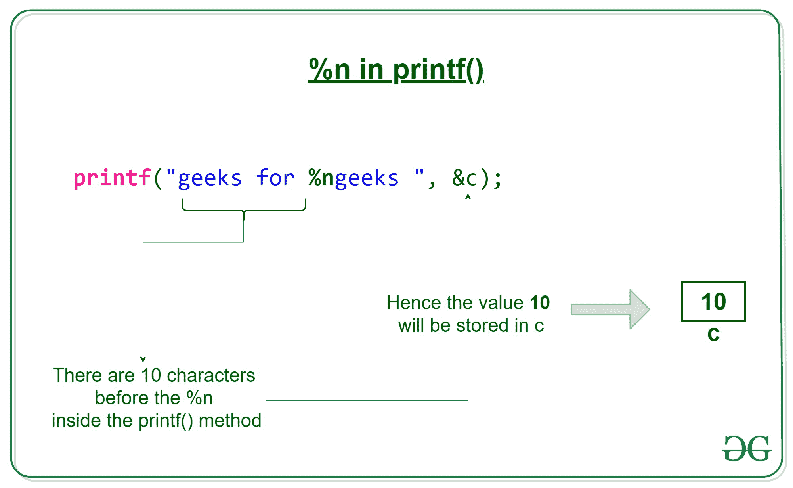

# printf()中%n 的用法是什么？

> 原文:[https://www.geeksforgeeks.org/g-fact-31/](https://www.geeksforgeeks.org/g-fact-31/)

在 C printf()中，%n 是一个特殊的格式说明符，它不是打印某些内容，而是使 printf()加载相应参数所指向的变量，该变量的值等于 printf()在出现%n 之前已打印的字符数。

[](https://media.geeksforgeeks.org/wp-content/cdn-uploads/20191009172738/n-in-printf.jpg)

```
#include<stdio.h>

int main()
{
  int c;
  printf("geeks for %ngeeks ", &c);
  printf("%d", c);
  getchar();
  return 0;
}
```

上面的程序打印了“极客为极客 10”。第一个 printf()打印“极客为极客”。第二个 printf()打印 10 个字符，因为在第一个 printf()中的%n 之前打印了 10 个字符(这 10 个字符是“极客用的”)，第一个 printf()将 c 设置为 10。

如果你发现任何不正确的地方，或者你想分享更多关于上面讨论的话题的信息，请写评论。