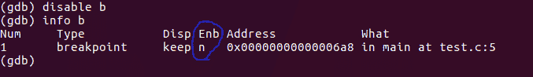

# GDB(分步介绍)

> 原文:[https://www . geesforgeks . org/gdb-逐步介绍/](https://www.geeksforgeeks.org/gdb-step-by-step-introduction/)

GDB 代表 GNU 项目调试器，是 C 语言(以及 C++ 等其他语言)的强大调试工具。它可以帮助你在 C 程序执行的时候在里面闲逛，还可以让你看到当你的程序崩溃的时候会发生什么。GDB 操作的可执行文件是由编译过程产生的二进制文件。

出于演示的目的，下面的例子是在一台规格如下的 Linux 机器上执行的。

让我们边做边学:-

1.转到您的 Linux 命令提示符并键入“gdb”。

Gdb 打开提示让你知道它已经准备好接受命令了。要退出 gdb，请键入 quit 或 q。

2.下面是一个使用 C99 编译时显示未定义行为的程序。

**注意:**如果具有自动存储持续时间的对象没有被显式初始化，则它的值是不确定的，其中不确定的值是未指定的值或陷阱表示。

3.现在编译代码。(这里是 test.c)。
**g flag** 意味着你可以在你的堆栈框架中看到变量和函数的专有名称，获取行号，并在可执行文件中查看源代码。
**-std=C99 标志**暗示使用标准 C99 来编译代码。
**-o 标志**将构建输出写入输出文件。

4.用生成的可执行文件运行 gdb。

对于上面的例子，有几个有用的命令可以开始使用 gdb:-
run 或 r–>从头到尾执行程序。
break 或 b–>在特定行设置断点。
禁用- >禁用断点。
启用–>启用禁用的断点。
next 或 n - >执行下一行代码，但不要深入函数。
步骤–>进入下一个指令，进入功能。
列表或 l–>显示代码。
打印或 p–>用于显示存储值。
退出或 q–>退出广发银行。
清除–>清除所有断点。
继续–>继续正常执行。

5.现在，在 gdb 提示符下键入“l”来显示代码。

6.让我们引入一个断点，比如第 5 行。

如果要在不同的行放断点，可以输入“b *行号*”。默认情况下，“list 或 l”仅显示前 10 行。

7.要查看断点，请键入“info b”。

8.完成以上工作后，假设您改变了主意，并且想要恢复原状。
输入“禁用 b”。

如蓝色圆圈所示，Enb 变为 n 表示禁用。

9.重新启用最近禁用的断点。键入“启用 b”。

10.通过键入“Run 或 r”运行代码。如果您没有设置任何断点，run 命令将简单地执行整个程序。

11.要查看变量值，请键入“打印*变量名*或 p *变量名*”。

上面显示了执行时存储在 x 处的值。

12.要更改 gdb 中变量的值并使用更改后的值继续执行，请键入“设置*变量 _ 名称*”。

13.下面的截图显示了变量的值，从中可以很好地理解为什么我们得到一个垃圾值作为输出。每次执行**时。/test** 我们将收到不同的输出。

**练习:第一次运行时尝试在 gdb 中使用 set x = 0，查看 c 的输出**

GDB 提供了更多调试和理解代码的方法，比如检查堆栈、内存、线程、操作程序等。我希望上面的例子能帮助你开始使用 gdb。