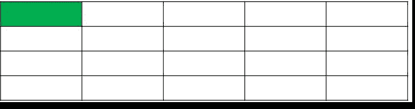
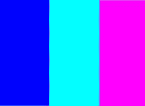

# 通过 C++ 生成 RGBA 便携式图形图像

> 原文:[https://www . geesforgeks . org/generating-rgba-portable-graphic-images-through-c/](https://www.geeksforgeeks.org/generating-rgba-portable-graphic-images-through-c/)

[PNG 图像](https://www.geeksforgeeks.org/difference-between-jpeg-and-png/)能够支持多种图像属性，如多种颜色、透明度、伽马校正、无损压缩等。PNG 图像被广泛使用，并且是许多类型图像的首选。

为了处理 PNG 文件，我们将使用 **PNGwriter** 独立于平台、包装开源的 [C++ ](https://www.geeksforgeeks.org/c-plus-plus/) 库作为 **libpng** (PNG 参考库)中功能最丰富的库之一，用 [C](https://www.geeksforgeeks.org/c/) 编写。PNGwriter 库适用于 Linux、Unix、macOS 和 Windows。其支持的功能包括打开现有的巴布亚新几内亚图像，绘制和读取 RGB、HSV 和 CMYK 颜色空间中的像素，基本形状，缩放，双线性插值，完整的 TrueType 抗锯齿和旋转文本支持，以及贝塞尔曲线。它需要 **FreeType2** 库提供文本支持。
更多文档和库请访问 [SourceForge](http://pngwriter.sourceforge.net/) 、 [PNGwriter-github](https://github.com/pngwriter/pngwriter) 。

**图像是如何生成的:**
像素是共同生成图像的最小单位。每个像素都有一些代表颜色的数值。以下是步骤:

1.  我们选择所需的图像高度和宽度。
2.  在期望中，我们逐个像素地迭代和应用颜色。
3.  这个像素集合然后以适当的扩展和属性存储，因此生成图像。

通过应用颜色生成图像:
[](https://media.geeksforgeeks.org/wp-content/uploads/20200501000352/pixel1.gif)

下面是用 C++ 生成 RGBA 门户图形图像的程序:

```cpp
// C++ program to generate PNG images

#include <iostream>
#include <pngwriter.h>
#include <string>

// Function to generate PNG image
void generate_PNG(int const width,
                  int const height,
                  std::string filepath)
{

    // Print the filepath
    cout << endl
         << "Filepath: "
         << filepath.c_str();

    // Generate the flag
    pngwriter flag{ width, height, 0,
                    filepath.data() };

    // Calculate sizes
    int const size = width / 3;

    // Fill the squares
    flag.filledsquare(0, 0, size,
                      2 * size, 0,
                      0, 65535);

    flag.filledsquare(size, 0, 2 * size,
                      2 * size, 0,
                      65535, 65535);

    flag.filledsquare(2 * size, 0,
                      3 * size, 2 * size,
                      65535, 0, 65535);

    // Close the flag
    flag.close();
}

// Driver code
int main()
{
    // Given width and height
    int width = 300, height = 200;

    // Filepath
    std::string filepath;

    // Function call to generate PNG image
    generate_PNG(width, height, filepath);

    return 0;
}
```

**输出:**
[](https://media.geeksforgeeks.org/wp-content/uploads/20200501104409/20200501_104039-300x220.jpg)

**说明:**
上面的程序用一个文件名取宽度、高度和文件地址。pngwriter 类表示一个 PNG 图像。PNG 图像的构造函数允许我们以像素为单位设置宽度和高度、背景颜色以及保存图像的文件路径。如上面的代码所示，我们只是并排排列了三种纯色，为此，我们使用了 **filledsquare()** 函数，该函数从开始位置到结束位置采用了 **x-y 坐标**值和一个颜色值 **(R，G，B)** 。当图像保存在内存中后，再调用 **close()** 方法将其保存到磁盘文件中。