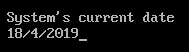
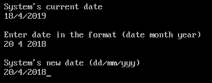

# C 中的 getdate()和 setdate()函数，示例

> 原文:[https://www . geesforgeks . org/get date-and-set date-function-in-c-with-examples/](https://www.geeksforgeeks.org/getdate-and-setdate-function-in-c-with-examples/)

**<u>【get data()</u>**

**getdate()** 函数在 **dos.h 头文件**中定义。该函数用系统的当前日期填充日期结构*dt。

**语法**

```
struct date dt;
getdate(&dt);

```

**参数:**该函数接受单个参数 **dt** ，该参数是结构日期的对象。

**返回值:**这个方法不返回任何东西。它只是获取系统日期并将其设置在指定的结构中。

**程序 1:**getdate()函数的实现

```
// C program to demonstrate getdate() method

#include <dos.h>
#include <stdio.h>

int main()
{
    struct date dt;

    // This function is used to get
    // system's current date
    getdate(&dt);

    printf("System's current date\n");
    printf("%d/%d/%d",
           dt.da_day,
           dt.da_mon,
           dt.da_year);

    return 0;
}
```

**输出:**


**<u>【setdate()</u>**

**setdate()** 功能在 **dos.h 头文件**中定义。该函数将系统日期设置为*dt 中的日期。

**语法**

```
struct date dt;
setdate(&dt)

```

**参数:**该函数接受单个参数 **dt** ，该参数是结构日期的对象，必须设置为系统日期。

**返回值:**这个方法不返回任何东西。它只是按照指定设置系统日期。

**程序 1:**setdate()函数的实现

```
// C program to demonstrate setdate() method

#include <dos.h>
#include <stdio.h>

int main()
{
    struct date dt;

    // This function is used to get
    // system's current date
    getdate(&dt);

    printf("System's current date\n");
    printf("%d/%d/%d",
           dt.da_day,
           dt.da_mon,
           dt.da_year);

    printf("Enter date in the format (date month year)\n");
    scanf("%d%d%d", &dt.da_day, &dt.da_mon, &dt.da_year);

    // This function is used to change
    // system's current date
    setdate(&dt);

    printf("System's new date (dd/mm/yyyy)\n")
        printf("%d%d%d", dt.da_day, dt.da_mon, dt.da_year);

    return 0;
}
```

**输出:**


**注意:**该程序在涡轮/C++编译器中运行