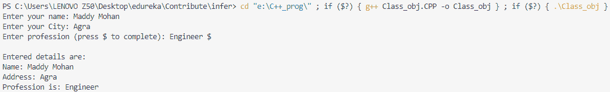
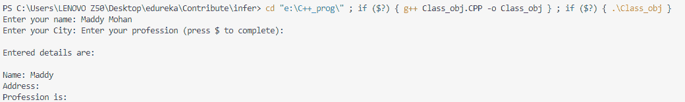

# c++中的 getline(字符串)

> 原文:[https://www.geeksforgeeks.org/getline-string-c/](https://www.geeksforgeeks.org/getline-string-c/)

C++ **getline()** 是一个标准库函数，用于从输入流中读取字符串或行。它是 ***<串>*** **表头**的一部分。getline()函数从输入流中提取字符，并将其追加到 string 对象中，直到遇到定界字符。这样做时，字符串对象*字符串*中先前存储的值将被输入字符串(如果有)替换。
getline()函数可以用两种方式表示:

**语法:**

```
istream& getline(istream& is, 
           string& str, char delim);
```

**2。参数:**

*   **是:**它是 istream 类的一个对象，告诉函数从哪里读取输入的流。
*   **str:** 它是一个字符串对象，输入从流中读取后存储在这个对象中。
*   **delim:** 是定界字符，告诉函数到达该字符后停止读取进一步输入。

**示例:**演示分隔符在 **getline()** 函数中的使用。

## C++

```
#include  <iostream>
#include  <bits/stdc++.h>

using namespace std;

//macro definitions
#define MAX_NAME_LEN 60  // Maximum len of your name can't be more than 60
#define MAX_ADDRESS_LEN 120  // Maximum len of your address can't be more than 120
#define MAX_ABOUT_LEN 250 // Maximum len of your profession can't be more than 250

int main () {
  char y_name[MAX_NAME_LEN], y_address[MAX_ADDRESS_LEN], about_y[MAX_ABOUT_LEN];

  cout << "Enter your name: ";
  cin.getline (y_name, MAX_NAME_LEN);

  cout << "Enter your City: ";
  cin.getline (y_address, MAX_ADDRESS_LEN);

  cout << "Enter your profession (press $ to complete): ";
  cin.getline (about_y, MAX_ABOUT_LEN, '{content}apos;);    //$ is a delimiter

  cout << "\nEntered details are:\n"<<'\n';
  cout << "Name: " << y_name << endl;
  cout << "Address: " << y_address << endl;
  cout << "Profession is: " << about_y << endl;
}
```

**输出:**



**输出**

**注意:**在上面的例子中如果***#定义 MAX_NAME_LEN 6，**那么在这种情况下如果你越过了定义的限制那么*，在这种情况下，*你的程序将停止执行并退出它的*适用于你使用 getline()函数的每个宏。你会得到如下**输出:**

## *C++*

```
*#include  <iostream>
#include  <bits/stdc++.h>

using namespace std;

//macro definitions
#define MAX_NAME_LEN 60  // Maximum length of your name can't be more than 60
#define MAX_ADDRESS_LEN 120  // Maximum length of your address can't be more than 120
#define MAX_ABOUT_LEN 250 // Maximum length of your profession can't be more than 250

int main () {
  char y_name[MAX_NAME_LEN], y_address[MAX_ADDRESS_LEN], about_y[MAX_ABOUT_LEN];

  cout << "Enter your name: ";
  cin.getline (y_name, MAX_NAME_LEN);

  cout << "Enter your City: ";
  cin.getline (y_address, MAX_ADDRESS_LEN);

  cout << "Enter your profession (press $ to complete): ";
  cin.getline (about_y, MAX_ABOUT_LEN, '{content}apos;);    //$ is a delimiter

  cout << "\n\nEntered details are:\n\n";
  cout << "Name: " << y_name << endl;
  cout << "Address: " << y_address << endl;
  cout << "Profession is: " << about_y << endl;
}*
```

***输出:***

*

**输出 _ 第 2 次*** 

*在这里，名称字段的长度超过了定义的限制是可以理解的，这就是程序停止执行并退出的原因。*

***1。语法:***

```
*istream& getline (istream& is, string& str);*
```

*2.第二个声明和第一个几乎一样。唯一的区别是，后者有一个定界字符，默认情况下是换行符(\n)。
**参数:*** 

*   ***是:**它是 istream 类的一个对象，告诉函数从哪里读取输入的流。*
*   ***str:** 它是一个字符串对象，输入从流中读取后存储在这个对象中。*

*下面的程序演示了 getline()函数的工作方式
**示例 1:*** 

## *卡片打印处理机（Card Print Processor 的缩写）*

```
*// C++ program to demonstrate getline() function

#include <iostream>
#include <string>
using namespace std;

int main()
{
    string str;

    cout << "Please enter your name: \n";
    getline(cin, str);
    cout << "Hello, " << str
         << " welcome to GfG !\n";

    return 0;
}*
```

***输入:***

```
*Harsh Agarwal*
```

***输出:***

```
*Hello, Harsh Agarwal welcome to GfG!*
```

***例 2:** 我们可以使用 getline()函数，在一个字符的基础上拆分一个句子。让我们看一个例子来了解如何做到这一点。*

## *卡片打印处理机（Card Print Processor 的缩写）*

```
*// C++ program to understand the use of getline() function

#include <bits/stdc++.h>
using namespace std;

int main()
{
    string S, T;

    getline(cin, S);

    stringstream X(S);

    while (getline(X, T, ' ')) {
        cout << T << endl;
    }

    return 0;
}*
```

***输入:***

```
*Hello, Faisal Al Mamun. Welcome to GfG!*
```

***输出:***

```
*Hello,
Faisal
Al
Mamun.
Welcome
to
GfG!*
```

***注意:**该功能将一个新行或(' \n ')字符视为定界字符，**新行字符是该功能的有效输入。**
新线路如何导致问题的示例如下:
**示例:***

## *卡片打印处理机（Card Print Processor 的缩写）*

```
*// C++ program to demonstrate
// anomaly of delimitation of
// getline() function
#include <iostream>
#include <string>
using namespace std;

int main()
{
    string name;
    int id;

    // Taking id as input
    cout << "Please enter your id: \n";
    cin >> id;

    // Takes the empty character as input
    cout << "Please enter your name: \n";
    getline(cin, name);

    // Prints id
    cout << "Your id : " << id << "\n";

    // Prints nothing in name field
    // as "\n" is considered a valid string
    cout << "Hello, " << name
         << " welcome to GfG !\n";

    // Again Taking string as input
    getline(cin, name);

    // This actually prints the name
    cout << "Hello, " << name
         << " welcome to GfG !\n";

    return 0;
}*
```

***输入:***

```
*7
MOHIT KUMAR*
```

***输出:***

```
*Your id : 7
Hello,  welcome to GfG !
Hello, MOHIT KUMAR welcome to GfG !*
```

***相关文章:***

*   *[当输入中有空行时，如何在 C++中使用 getline()？](https://www.geeksforgeeks.org/how-to-use-getline-in-c-when-there-are-black-lines-in-input/)*
*   *[getline()函数和字符数组](https://www.geeksforgeeks.org/getline-function-character-array/)*

*本文由 **Harsh Agarwal** 贡献，由**fais Al Mamun**改进。如果你喜欢 GeeksforGeeks 并想投稿，你也可以使用[write.geeksforgeeks.org](https://write.geeksforgeeks.org)写一篇文章或者把你的文章邮寄到 review-team@geeksforgeeks.org。看到你的文章出现在极客博客主页上，帮助其他极客。
如果发现有不正确的地方，或者想分享更多关于上述话题的信息，请写评论。*