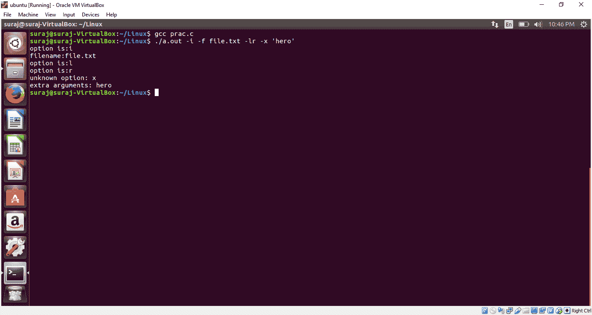

# C 中的 getopt()函数解析命令行参数

> 原文:[https://www . geeksforgeeks . org/getopt-function-in-c-parse-命令行参数/](https://www.geeksforgeeks.org/getopt-function-in-c-to-parse-command-line-arguments/)

getopt()函数是 C 语言中的内置函数，用于解析命令行参数。

**语法**:

```
getopt(int argc, char *const argv[], const char *optstring)

optstring is simply  a list of characters, 
each representing a single character option.

```

**返回值**:getopt()函数返回不同的值:

*   如果选项取值，该值是指向外部变量 **optarg 的指针。**
*   -1 '如果没有更多可处理的选项。
*   '?'当有一个无法识别的选项并且它存储到外部变量 **optopt 中时。**
*   如果一个选项需要一个值(比如我们例子中的-f)，但没有给出值，getopt 通常会返回？。
    通过将冒号作为选项字符串的第一个字符，getopt 返回:而不是？当没有给出值时。

通常，getopt()函数是从循环的条件语句内部调用的。当 getopt()函数返回-1 时，循环终止。然后使用 getopt()函数返回的值执行 switch 语句。

第二个循环用于处理第一个循环中无法处理的剩余额外参数。

下面的程序说明了 C 语言中的 getopt()函数:

```
// Program to illustrate the getopt()
// function in C

#include <stdio.h> 
#include <unistd.h> 

int main(int argc, char *argv[]) 
{
    int opt;

    // put ':' in the starting of the
    // string so that program can 
    //distinguish between '?' and ':' 
    while((opt = getopt(argc, argv, “:if:lrx”)) != -1) 
    { 
        switch(opt) 
        { 
            case ‘i’: 
            case ‘l’: 
            case ‘r’: 
                printf(“option: %c\n”, opt); 
                break; 
            case ‘f’: 
                printf(“filename: %s\n”, optarg); 
                break; 
            case ‘:’: 
                printf(“option needs a value\n”); 
                break; 
            case ‘?’: 
                printf(“unknown option: %c\n”, optopt);
                break; 
        } 
    } 

    // optind is for the extra arguments
    // which are not parsed
    for(; optind < argc; optind++){     
        printf(“extra arguments: %s\n”, argv[optind]); 
    }

    return 0;
}
```

**输出** :
