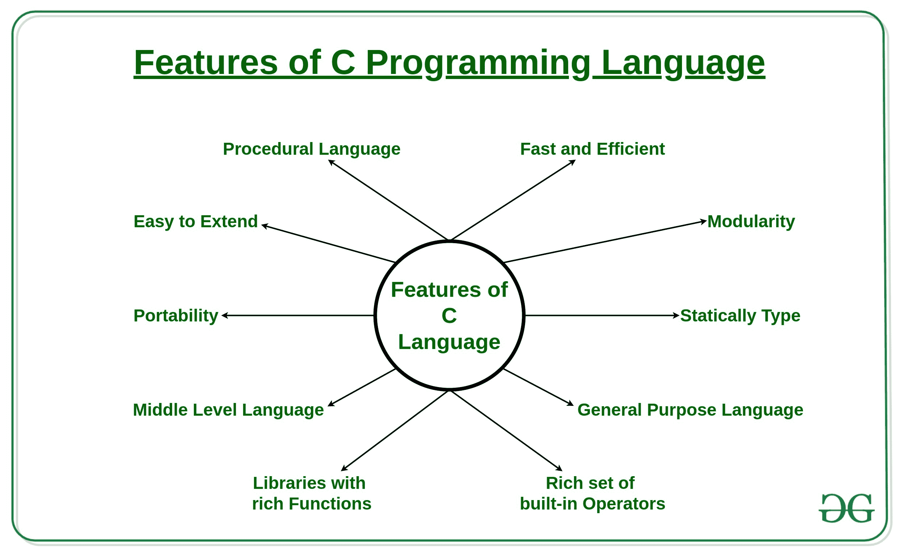
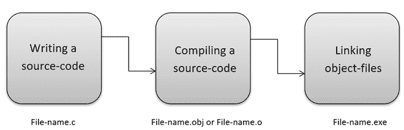
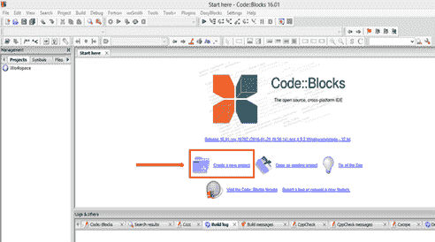
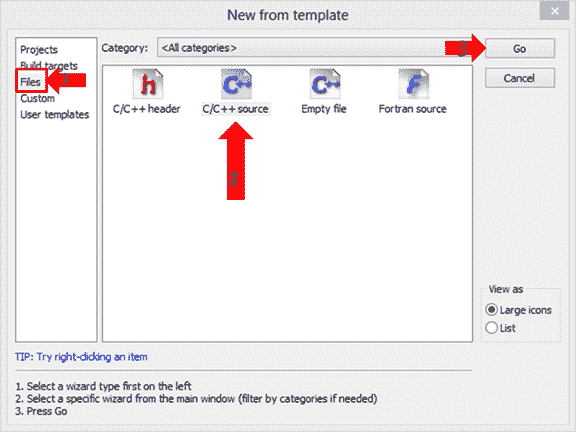
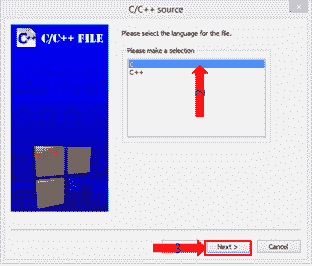
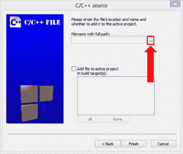
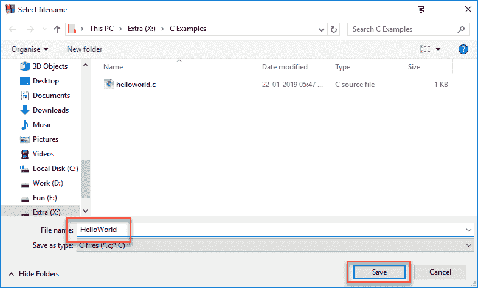
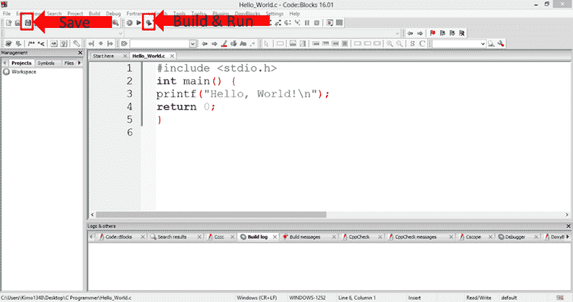

# C

入门

> 原文:[https://www.geeksforgeeks.org/getting-started-with-c/](https://www.geeksforgeeks.org/getting-started-with-c/)

**<u>什么是 C</u> :**

*   在 **1972** 年，一位伟大的计算机科学家[丹尼斯·里奇](https://www.geeksforgeeks.org/features-of-c-programming-language/)在**贝尔实验室**创造了一种新的[编程语言](https://www.geeksforgeeks.org/c-programming-language/)叫做 **C** 。
*   它是由 **ALGOL** 、 **BCL** 和 **B** 编程语言创建的。
*   它包含了这些语言的所有特性和许多其他的概念，使它与其他编程语言不同。
*   这是一种功能强大的编程语言，与 [UNIX 操作系统](https://www.geeksforgeeks.org/introduction-to-unix-system/)有很强的关联，大多数 [UNIX](https://www.geeksforgeeks.org/introduction-to-unix-system/) 操作系统都是用 **C 语言**编码的。
*   最初，它仅限于 UNIX [操作系统](https://www.geeksforgeeks.org/operating-systems/)，但随着它开始在世界范围内传播，它变得商业化，并且为[跨平台系统](https://www.geeksforgeeks.org/top-5-free-cross-platform-and-open-source-database-system-in-2020/)发布了许多编译器。
*   如今 **C** 运行在多种操作系统和硬件平台下。
*   随着它的发展，该语言的许多版本被发布。
*   有时，开发人员很难跟上最新版本，因为系统是在旧版本下运行的。
*   为确保 **C 语言**保持标准， [**美国国家标准协会(ANSI)**](https://www.geeksforgeeks.org/the-three-level-ansi-sparc-architecture/) 在 **1989** 中定义了 C 语言的商业标准。
*   后来，它在 1990 年被国际标准组织(ISO)批准。 **C 编程语言**也叫 **ANSI C** 。

**<u>C</u>的应用:**

*   它被广泛用于开发桌面应用程序和开发浏览器及其扩展。
*   谷歌的 Chromium 是使用 C 语言编程构建的。
*   广泛应用于[嵌入式系统](https://www.geeksforgeeks.org/introduction-of-embedded-systems-set-1/)。
*   它用于开发数据库。MySQL 是最流行的数据库软件，它是用 c 语言构建的。
*   用于开发[操作系统](https://www.geeksforgeeks.org/operating-systems-set-1/)，如**苹果的 OS X** 、**微软的 Windows** 、**塞班**都是使用 **C 语言**开发的。
*   它用于开发桌面和移动[手机的操作系统](https://www.geeksforgeeks.org/difference-between-windows-and-android/)。
*   它用于编译器生产。
*   广泛应用于[物联网应用](https://www.geeksforgeeks.org/top-applications-of-iot-in-the-world/)。

[**<u>C</u>**](https://www.geeksforgeeks.org/features-of-c-programming-language/)**:**

*   **C** 是一种[结构化编程语言](https://www.geeksforgeeks.org/structured-programming-approach-with-advantages-and-disadvantages/)，其中程序被划分为各个模块。
*   每个模块可以单独编写，一起组成一个单独的 **C 程序**。这种结构使得测试、维护和调试过程变得容易。
*   c 包含 **32 个关键词**，各种数据类型，以及一套强大的内置函数，使得编程非常高效。
*   **C 程序**包含各种功能，这些功能是库的一部分。程序员可以将自己的特性和功能添加到库中。
*   这些功能可以在程序中随时访问和使用。该特性使其在处理复杂编程时变得简单。

[](https://media.geeksforgeeks.org/wp-content/uploads/20200214125122/Features-of-C-Programming-Language.jpg)

[**<u>工作的 C</u>:**T5】](https://www.geeksforgeeks.org/how-does-a-c-program-executes/)

*   c 是一种编译语言。
*   编译器是一种特殊的工具，它编译程序并将其转换成机器可读的目标文件。
*   编译过程结束后，[链接器](https://www.geeksforgeeks.org/linker/)会组合不同的目标文件，创建一个单独的可执行文件来运行程序。
*   下图显示了“C”程序的执行情况:



如今，各种编译器都可以在网上找到。功能永远不会不同，大多数编译器将提供执行“C”和“C++”程序所需的功能。下面是这些编译器的名称:

*   叮当编译器
*   MinGW 编译器
*   便携式 C 编译器
*   涡轮增压 c

**程序 1:**
下面是用 C 打印 Hello World 的程序:

## C

```cpp
// C program printing Hello World

// Pre-processor directive
#include <stdio.h>

// Driver Code
void main()
{
    // Print on the screen
    printf("Hello World");

    // Terminating function
    getch();
}
```

**Output:** 

```cpp
Hello World
```

**输出**


**说明:**

*   预处理器指令
    *   #include 是 c 语言中的一个预处理器指令。
    *   #include，stdio 是定义函数 [printf()](https://www.geeksforgeeks.org/puts-vs-printf-for-printing-a-string/) 的库。
    *   它用于生成输出。在使用该功能之前，首先包含所需的文件，也称为[头文件](https://www.geeksforgeeks.org/write-header-file-c/)(。h)。
*   主要功能:主要功能是每个 C 程序的一部分。它可以以各种形式表示，例如:
    *   main()
    *   int main()
    *   void main()
    *   主(空)
    *   主空隙
    *   int main(空)
*   空括号表示该函数不接受任何参数、值或参数。
*   关键字 void 表示函数不返回值，在这种情况下，最后一条语句总是 [getch()](https://www.geeksforgeeks.org/getch-function-in-c-with-examples/) 。

**程序二:**
下面是 C 程序打印的《你好世界》:

## C

```cpp
// C program printing Hello World

// Pre-processor directive
#include <stdio.h>

// Driver Code
int main()
{
    // Prints Hello World
    printf("Hello World");

    // Terminating function
    return 0;
}
```

**Output:** 

```cpp
Hello World
```

**说明:**

*   在上例中，[关键字](https://www.geeksforgeeks.org/variables-and-keywords-in-c/) **int** 表示函数将返回一个整数值。在这种情况下，最后一条语句应该总是返回 0。
*   在源代码中，声明主函数后，指定左括号和右括号。花括号{ }，表示程序的开始和结束。
*   这些括号必须总是放在主函数之后。
*   所有的程序代码都写在这些括号内，比如声明性和可执行部分。
*   [**打印**](https://www.geeksforgeeks.org/return-values-of-printf-and-scanf-in-c-cpp/) 功能生成输出，控制台上显示“你好世界”。
*   **分号；**决定语句结束。在 C 语言中，每个语句必须以分号结束。

**在代码块中运行 C 程序的步骤:**

*   创建一个新项目，如下所示:



*   在弹出的界面中，首先选择文件，然后选择**“C/c++源码”**，点击【执行】，如下图:



*   点击“下一步”继续。


*   要创建新文件，选择一个**“C”**文件，然后点击**“下一步”**按钮继续。



*   通过点击“…”按钮设置文件路径，浏览器窗口允许创建 C 文件。



*   选择新的 C 文件的路径，然后选择扩展名为. C 的名称并保存。



*   最后，要确认 C 文件的创建，请单击“完成”。


*   输入代码，保存并通过点击“构建和运行”按钮进行编译。



**C 程序中的注释及其类型:**

**评论:** A [评论](https://www.geeksforgeeks.org/comments-in-c-c/)是对程序源代码的解释或描述。它帮助开发人员解释代码的逻辑，并提高程序的可读性。在运行时，编译器会忽略注释。

**评论类型:**

1.  **单行注释:**单行注释，使用双斜线//专用于注释单行
2.  **多行注释:**以斜线星号/*开头，以星号斜线*/结尾的注释，可以放在代码中的任意位置，同一行或多行。

**程序 1:**

下面是说明单行注释使用的 C 程序:

## C

```cpp
// C program illustrating the
// use of single-line comment

#include <stdio.h>

// Driver Code
int main(void)
{
    // Single line comment
    printf("Geeks for Geeks");

    return 0;
}
```

**Output:** 

```cpp
Geeks for Geeks
```