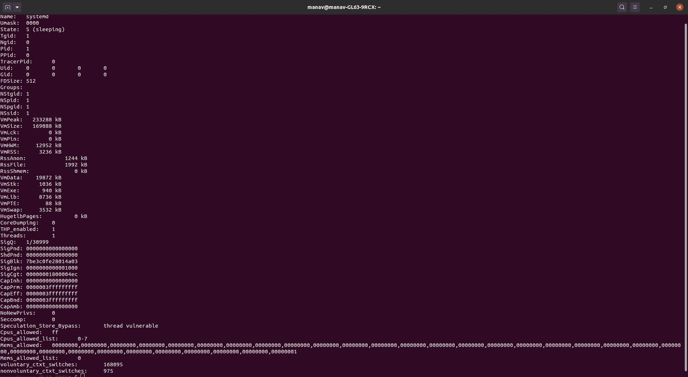
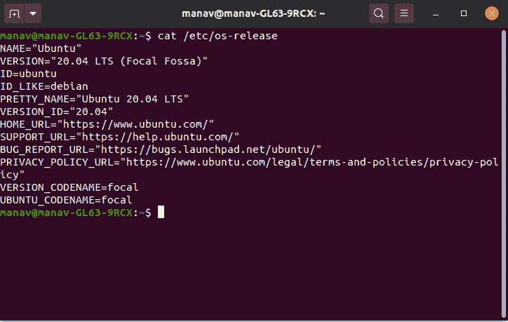
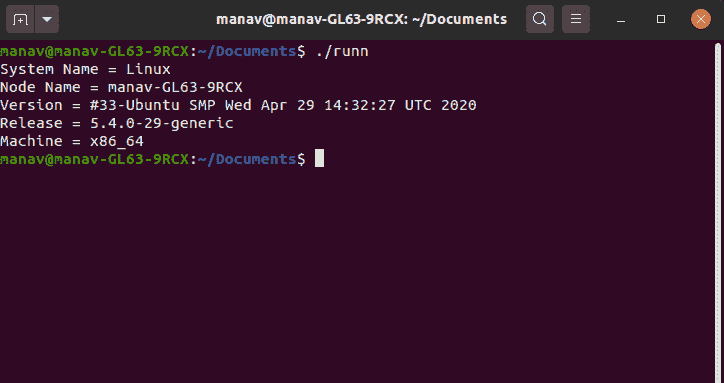

# 在 Linux 中使用 C 编程和 Shell 获取系统和进程信息

> 原文:[https://www . geesforgeks . org/get-system-and-process-information-use-c-programming-and-shell-in-Linux/](https://www.geeksforgeeks.org/getting-system-and-process-information-using-c-programming-and-shell-in-linux/)

每当您在 Linux 中启动一个新的进程时，它都会在/proc/文件夹中创建一个与该进程的进程 id 同名的文件。在该文件夹中，有一个名为“status”的文件，其中包含了该过程的所有细节。我们可以通过 shell 获取那些**过程信息，如下所示:**

```
cat /proc/1/status

```



可以看到，它显示了关于流程的大部分信息。

**注意:**，这种情况下，进程 id 为 1，可以根据需要进行更改。

您可以通过外壳获取**系统信息。基本系统信息存储在名为 os-release in /etc/ folder 的文件中。**

```
cat /etc/os-release

```



也可以使用 C 编程获取**系统信息。下面的代码用于获取系统的详细信息。在这段代码中， *utsname* 维护一个包含系统细节的结构，如 sysname nodename、发行版、版本等。**

```
#include<stdio.h>
#include<stdlib.h>
#include<errno.h>
#include<sys/utsname.h>
int main()
{
   struct utsname buf1;
   errno =0;
   if(uname(&buf1)!=0)
   {
      perror("uname doesn't return 0, so there is an error");
      exit(EXIT_FAILURE);
   }
   printf("System Name = %s\n", buf1.sysname);
   printf("Node Name = %s\n", buf1.nodename);
   printf("Version = %s\n", buf1.version);
   printf("Release = %s\n", buf1.release);
   printf("Machine = %s\n", buf1.machine);
}
```

在执行时，上述代码将给出以下输出:



要使用 C 编程获取过程信息，请使用下面的代码。在这段代码中，我们通过一个 c 程序来执行 Linux 命令，以获得这个过程的细节。

```
#include<stdio.h>
#include<stdlib.h>
int main()
{
   int r=system("cat /proc/1/status");
}
```

在执行时，上述代码将给出以下输出:

