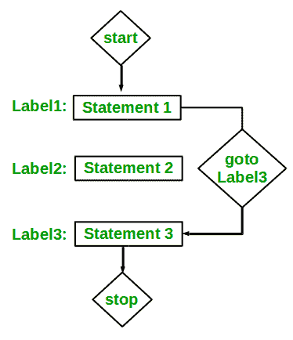

# C/c++ 中的 goto 语句

> 原文:[https://www.geeksforgeeks.org/goto-statement-in-c-cpp/](https://www.geeksforgeeks.org/goto-statement-in-c-cpp/)

goto 语句是一个跳转语句，有时也被称为无条件跳转语句。goto 语句可以用来从函数中的任何地方跳转到任何地方。
**语法**:

```cpp
Syntax1      |   Syntax2
----------------------------
goto label;  |    label:  
.            |    .
.            |    .
.            |    .
label:       |    goto label;

```

在上面的语法中，第一行告诉编译器转到或跳转到标记为标签的语句。这里的标签是用户定义的标识符，表示目标语句。紧跟在“label:”后面的语句是目标语句。“label:”也可以出现在“goto label 之前语句。

下面是一些如何使用 goto 语句的例子:
**例子:**

*   **类型 1** :在这种情况下，我们会看到类似于上面的 Syntax1 所示的情况。假设我们需要编写一个程序，我们需要检查一个数字是否为偶数，并使用 goto 语句进行相应的打印。下面程序解释了如何做到这一点:

    ## C

    ```cpp
    // C program to check if a number is
    // even or not using goto statement
    #include <stdio.h>

    // function to check even or not
    void checkEvenOrNot(int num)
    {
        if (num % 2 == 0)
            // jump to even
            goto even; 
        else
            // jump to odd
            goto odd; 

    even:
        printf("%d is even", num);
        // return if even
        return; 
    odd:
        printf("%d is odd", num);
    }

    int main() {
        int num = 26;
        checkEvenOrNot(num);
        return 0;
    }
    ```

    ## c++

    ```cpp
    // C++ program to check if a number is
    // even or not using goto statement
    #include <iostream>
    using namespace std;

    // function to check even or not
    void checkEvenOrNot(int num)
    {
        if (num % 2 == 0)
        // jump to even
            goto even; 
        else
        // jump to odd
            goto odd; 

    even:
        cout << num << " is even";
        // return if even
        return; 
    odd:
        cout << num << " is odd";
    }

    // Driver program to test above function
    int main()
    {
        int num = 26;
        checkEvenOrNot(num);
        return 0;
    }
    ```

    **输出:**

```cpp
26 is even

```