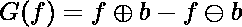
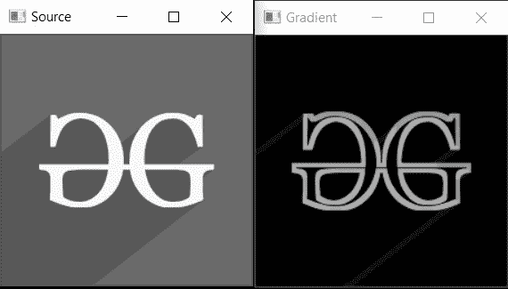

# c++中 OpenCV 的渐变|形态变换

> 原文:[https://www . geesforgeks . org/gradient-形态学-transformations-in-opencv-in-c/](https://www.geeksforgeeks.org/gradient-morphological-transformations-in-opencv-in-c/)

本文讨论了一种叫做**梯度**的[形态算子](https://www.geeksforgeeks.org/python-morphological-operations-in-image-processing-opening-set-1/)。渐变定义为图像的[膨胀](https://www.geeksforgeeks.org/difference-between-dilation-and-erosion/)和[侵蚀](https://www.geeksforgeeks.org/erosion-dilation-images-using-opencv-python/)之间的差异。渐变图像中的每个像素都代表像素附近的对比度强度。用于[图像分割](https://www.geeksforgeeks.org/image-segmentation-using-k-means-clustering/)和[边缘检测](https://www.geeksforgeeks.org/image-edge-detection-operators-in-digital-image-processing/)。它有两种类型:

*   [**【内部渐变】**](https://www.geeksforgeeks.org/python-morphological-operations-in-image-processing-gradient-set-3/) **:** 它增强了比背景亮的物体的内部边界，并为二值图像生成了前景图像物体内部边界的遮罩。
*   [**【外部渐变】**](https://www.geeksforgeeks.org/python-morphological-operations-in-image-processing-gradient-set-3/) **:** 增强了比背景暗的物体的外部边界。

**语法:**

> *morphologyEx (src、dst、op、内核、锚点、迭代、borderType、borderValue)*

**参数:**

*   **src:** 是输入图像。
*   **dst:** 是输出图像。
*   **op:** 形态操作类型。
*   **内核:**用于关闭的结构元素。
*   **锚:**结构元素内部的锚位置。默认值为[-1，-1}表示位置为结构元素的中心。
*   **迭代:**应用关闭的次数。
*   **边框类型:**边框的类型(BORDER_CONSTANT、BORDER_REPLICATE 等。)
*   **边框值:**边框值
*   **返回:**输出图像(Mat 对象)

梯度算子给出如下表达式:

> 

下面是演示渐变形态操作的 C++程序:

## C++

```cpp
// C++ program to demonstrate the
// above approach
#include <iostream>
#include <opencv2/core/core.hpp>

// Include this library
// for drawing shapes
#include <opencv2/highgui/highgui.hpp>
#include <opencv2/imgproc.hpp>
using namespace cv;
using namespace std;

// Driver Code
int main(int argc, char** argv)
{
    // Reading the Image
    Mat image = imread(
        "C:/Users/harsh/Downloads/opencv/sources/samples/data/gfglogo.jpg",
        IMREAD_GRAYSCALE);

    // Check if the image is created
    // successfully or not
    if (!image.data) {
        cout << "Could not open or "
             << "find the image" << '\n';
        return 0;
    }

    // Create a structuring element
    int morph_size = 2;
    Mat element = getStructuringElement(
        MORPH_RECT,
        Size(2 * morph_size + 1,
             2 * morph_size + 1),
        Point(morph_size,
              morph_size));
    Mat output;

    // Gradient
    morphologyEx(image, output,
                 MORPH_GRADIENT, element,
                 Point(-1, -1), 1);

    // Display the image
    imshow("Source", image);
    imshow("Gradient", output);
    waitKey();

    return 0;
}
```

**输出:**
[](https://media.geeksforgeeks.org/wp-content/uploads/20210204195231/gg.jpg)