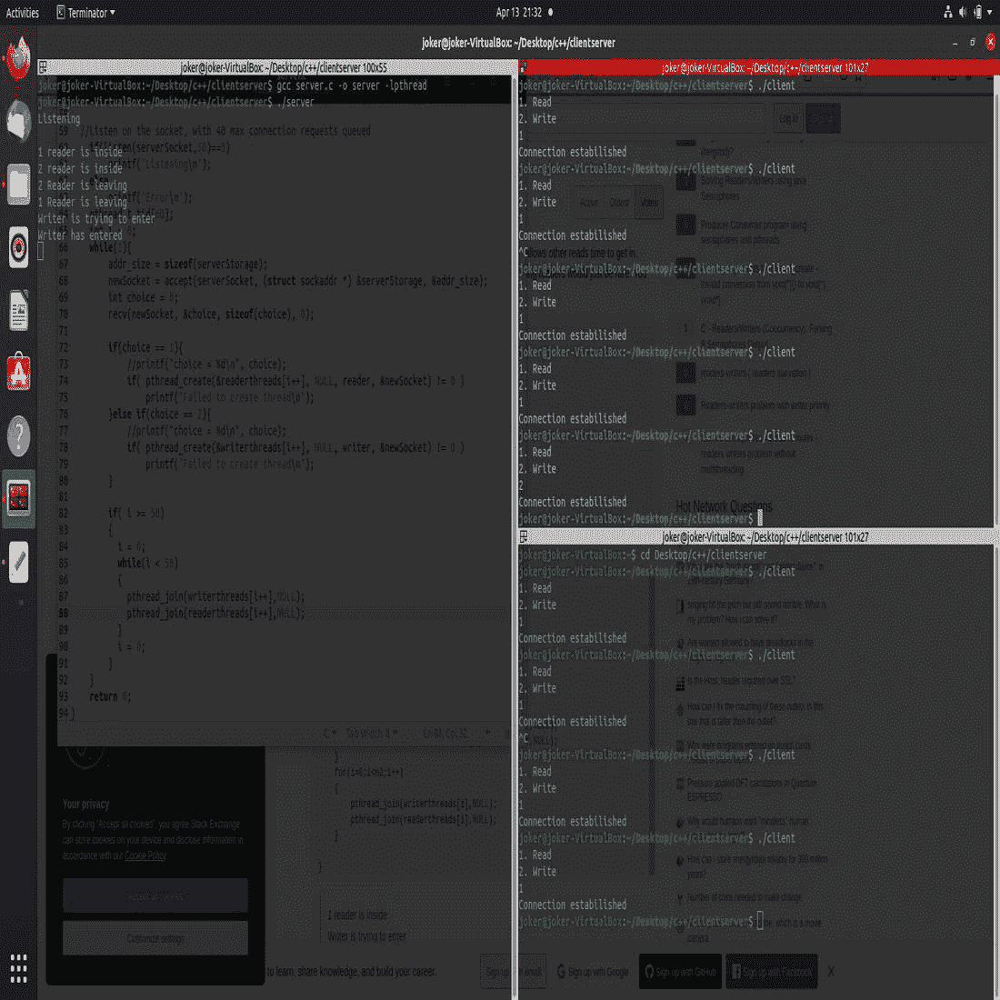

# 在 C/C++

中使用 Socket 编程处理服务器上的多个客户端多线程

> 原文:[https://www . geesforgeks . org/handling-多客户端-服务器端-多线程-使用 c-cpp 中的套接字编程/](https://www.geeksforgeeks.org/handling-multiple-clients-on-server-with-multithreading-using-socket-programming-in-c-cpp/)

本教程假设读者对 [socket 编程](https://www.geeksforgeeks.org/socket-programming-cc/)有基本的了解，即熟悉基本的[服务器和客户端模型](https://www.geeksforgeeks.org/client-server-model/)。在基本模型中，服务器一次只处理一个客户端，如果想要开发任何可伸缩的服务器模型，这是一个很大的假设。处理多个客户端的简单方法是为连接到服务器的每个新客户端生成一个新线程。

[**信号量:**](https://www.geeksforgeeks.org/semaphores-in-process-synchronization/) 信号量只是一个非负变量，在[线程](https://www.geeksforgeeks.org/thread-in-operating-system/)之间共享。该变量用于解决[临界区问题](https://www.geeksforgeeks.org/g-fact-70/)，并在[多处理环境](https://www.geeksforgeeks.org/difference-between-multiprocessing-and-multithreading/)中实现[进程同步](https://www.geeksforgeeks.org/introduction-of-process-synchronization/)。

**sem_post:** sem_post()递增(解锁)sem 指向的信号量。如果信号量的值因此变得大于零，则在 sem_wait(3)调用中被阻塞的另一个进程或线程将被唤醒并继续锁定信号量。

```cpp
#include <semaphore.h>
int sem_post(sem_t *sem);
```

**sem_wait:** sem_wait()递减(锁定)sem 指向的信号量。如果信号量的值大于零，则减量继续，函数立即返回。如果信号量当前的值为零，则调用会阻塞，直到有可能执行减量(即信号量值升至零以上)，或者信号处理程序中断调用。

```cpp
#include <semaphore.h>
int sem_wait(sem_t *sem);
```

在本文中，[读写器](https://www.geeksforgeeks.org/readers-writers-problem-set-1-introduction-and-readers-preference-solution/)算法在服务器端实现。

**实现:**对于服务器端，创建两个不同的线程；一个读取器线程和一个写入器线程。首先，声明一个**服务器套接字**，一个整数，一个变量来保存套接字函数的返回。

```cpp
int serverSocket = socket(domain, type, protocol);
```

*   **服务器套接字:** [套接字描述符](https://www.geeksforgeeks.org/socket-programming-cc/)，一个整数(像文件句柄)。
*   **域:**整数，通信域，如 AF_INET ( [IPv4 协议](https://www.geeksforgeeks.org/introduction-and-ipv4-datagram-header/))、AF_INET6 ( [IPv6 协议](https://www.geeksforgeeks.org/internet-protocol-version-6-ipv6/))。
*   **类型**:交流型。
*   **SOCK_STREAM** : [TCP](https://www.geeksforgeeks.org/tcp-ip-model/) (可靠，面向连接)。
*   **SOCK_DGRAM** : [UDP](https://www.geeksforgeeks.org/user-datagram-protocol-udp/) (不可靠，无连接)。
*   **协议**:互联网协议(IP)的协议值，为 0。这是出现在数据包的 [IP 报头](https://www.geeksforgeeks.org/introduction-and-ipv4-datagram-header/)的协议字段中的相同号码。(更多细节请参考 man 协议)。

然后，初始化所有必要的变量[后，绑定套接字](https://www.geeksforgeeks.org/socket-programming-cc/)。

**绑定:**创建套接字后，绑定功能将套接字绑定到 **addr** (自定义数据结构)中指定的地址和端口号。在示例代码中，我们将服务器绑定到本地主机，因此 INADDR _ ANY 用于指定 IP 地址。

```cpp
int bind(int sockfd, const struct sockaddr *addr, 
         socklen_t addrlen);
```

**监听:**它将服务器套接字置于被动模式，等待客户端靠近服务器进行连接。backlog 定义 sockfd 的挂起连接队列可能增长到的最大长度。如果连接请求在队列已满时到达，客户端可能会收到一个错误，并显示为“已恢复”。

```cpp
int listen(int sockfd, int backlog);
```

有关本文中使用的更多连接函数，请参考本文，了解 c 语言中的套接字编程。

**进场:**

*   接受到所需端口的连接后，从客户端接收一个整数，该整数定义了读取或写入的选择。选择 1 表示读者，选择 2 表示作者。
*   成功接收数据后，调用 pthread_create 创建读取器线程和写入器线程。
*   成功连接到服务器-客户端后，会要求用户输入选项变量。
*   从用户那里获得选择后，客户端将此选择发送给服务器，通过为请求创建客户端线程来调用读取器或写入器线程。

下面是上述方法的实现:

**服务器端代码:**

## C

```cpp
// C program for the Server Side

// inet_addr
#include <arpa/inet.h>

// For threading, link with lpthread
#include <pthread.h>
#include <semaphore.h>
#include <stdio.h>
#include <stdlib.h>
#include <string.h>
#include <sys/socket.h>
#include <unistd.h>

// Semaphore variables
sem_t x, y;
pthread_t tid;
pthread_t writerthreads[100];
pthread_t readerthreads[100];
int readercount = 0;

// Reader Function
void* reader(void* param)
{
    // Lock the semaphore
    sem_wait(&x);
    readercount++;

    if (readercount == 1)
        sem_wait(&y);

    // Unlock the semaphore
    sem_post(&x);

    printf("\n%d reader is inside",
           readercount);

    sleep(5);

    // Lock the semaphore
    sem_wait(&x);
    readercount--;

    if (readercount == 0) {
        sem_post(&y);
    }

    // Lock the semaphore
    sem_post(&x);

    printf("\n%d Reader is leaving",
           readercount + 1);
    pthread_exit(NULL);
}

// Writer Function
void* writer(void* param)
{
    printf("\nWriter is trying to enter");

    // Lock the semaphore
    sem_wait(&y);

    printf("\nWriter has entered");

    // Unlock the semaphore
    sem_post(&y);

    printf("\nWriter is leaving");
    pthread_exit(NULL);
}

// Driver Code
int main()
{
    // Initialize variables
    int serverSocket, newSocket;
    struct sockaddr_in serverAddr;
    struct sockaddr_storage serverStorage;

    socklen_t addr_size;
    sem_init(&x, 0, 1);
    sem_init(&y, 0, 1);

    serverSocket = socket(AF_INET, SOCK_STREAM, 0);
    serverAddr.sin_addr.s_addr = INADDR_ANY;
    serverAddr.sin_family = AF_INET;
    serverAddr.sin_port = htons(8989);

    // Bind the socket to the
    // address and port number.
    bind(serverSocket,
         (struct sockaddr*)&serverAddr,
         sizeof(serverAddr));

    // Listen on the socket,
    // with 40 max connection
    // requests queued
    if (listen(serverSocket, 50) == 0)
        printf("Listening\n");
    else
        printf("Error\n");

    // Array for thread
    pthread_t tid[60];

    int i = 0;

    while (1) {
        addr_size = sizeof(serverStorage);

        // Extract the first
        // connection in the queue
        newSocket = accept(serverSocket,
                           (struct sockaddr*)&serverStorage,
                           &addr_size);
        int choice = 0;
        recv(newSocket,
             &choice, sizeof(choice), 0);

        if (choice == 1) {
            // Creater readers thread
            if (pthread_create(&readerthreads[i++], NULL,
                               reader, &newSocket)
                != 0)

                // Error in creating thread
                printf("Failed to create thread\n");
        }
        else if (choice == 2) {
            // Create writers thread
            if (pthread_create(&writerthreads[i++], NULL,
                               writer, &newSocket)
                != 0)

                // Error in creating thread
                printf("Failed to create thread\n");
        }

        if (i >= 50) {
            // Update i
            i = 0;

            while (i < 50) {
                // Suspend execution of
                // the calling thread
                // until the target
                // thread terminates
                pthread_join(writerthreads[i++],
                             NULL);
                pthread_join(readerthreads[i++],
                             NULL);
            }

            // Update i
            i = 0;
        }
    }

    return 0;
}
```

**客户端代码:**

## C

```cpp
// C program for the Client Side
#include <stdio.h>
#include <stdlib.h>
#include <string.h>
#include <sys/socket.h>

// inet_addr
#include <arpa/inet.h>
#include <unistd.h>

// For threading, link with lpthread
#include <pthread.h>
#include <semaphore.h>

// Function to send data to
// server socket.
void* clienthread(void* args)
{

    int client_request = *((int*)args);
    int network_socket;

    // Create a stream socket
    network_socket = socket(AF_INET,
                            SOCK_STREAM, 0);

    // Initialise port number and address
    struct sockaddr_in server_address;
    server_address.sin_family = AF_INET;
    server_address.sin_addr.s_addr = INADDR_ANY;
    server_address.sin_port = htons(8989);

    // Initiate a socket connection
    int connection_status = connect(network_socket,
                                    (struct sockaddr*)&server_address,
                                    sizeof(server_address));

    // Check for connection error
    if (connection_status < 0) {
        puts("Error\n");
        return 0;
    }

    printf("Connection established\n");

    // Send data to the socket
    send(network_socket, &client_request,
         sizeof(client_request), 0);

    // Close the connection
    close(network_socket);
    pthread_exit(NULL);

    return 0;
}

// Driver Code
int main()
{
    printf("1\. Read\n");
    printf("2\. Write\n");

    // Input
    int choice;
    scanf("%d", &choice);
    pthread_t tid;

    // Create connection
    // depending on the input
    switch (choice) {
    case 1: {
        int client_request = 1;

        // Create thread
        pthread_create(&tid, NULL,
                       clienthread,
                       &client_request);
        sleep(20);
        break;
    }
    case 2: {
        int client_request = 2;

        // Create thread
        pthread_create(&tid, NULL,
                       clienthread,
                       &client_request);
        sleep(20);
        break;
    }
    default:
        printf("Invalid Input\n");
        break;
    }

    // Suspend execution of
    // calling thread
    pthread_join(tid, NULL);
}
```

**输出:**

