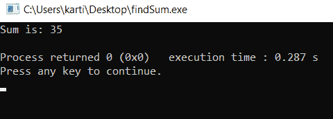

# C/c++头文件，带示例

> 原文:[https://www . geesforgeks . org/header-files-in-c-c-with-examples/](https://www.geeksforgeeks.org/header-files-in-c-c-with-examples/)

[C++](https://www.geeksforgeeks.org/c-plus-plus/) 为其用户提供了多种功能，其中一种包含在头文件中。在 C++中，所有的头文件可能以**结尾，也可能不以【】结尾。h"** 扩展名但是在 C 语言中，所有的头文件都必须以**结尾。h"** 分机。
头文件包含:

1.  [功能定义](https://www.geeksforgeeks.org/functions-in-c/)
2.  [数据类型定义](https://www.geeksforgeeks.org/c-data-types/)
3.  [宏](https://www.geeksforgeeks.org/cc-preprocessors/)

它在预处理器指令**“# include”**的帮助下将上述特性导入程序，从而提供上述特性。这些预处理器指令用于指示编译器在编译之前需要处理这些文件。
在 [C](https://www.geeksforgeeks.org/c/) 程序中应该必然包含头文件，该头文件代表标准输入和输出，分别用于借助 [**scanf()**](https://www.geeksforgeeks.org/scanf-and-fscanf-in-c-simple-yet-poweful/) **和**[**printf()**](https://www.geeksforgeeks.org/return-values-of-printf-and-scanf-in-c-cpp/)功能进行输入。
在[中，C++](https://www.geeksforgeeks.org/c-plus-plus/) 程序有头文件，代表输入和输出流，分别用于借助[“CIN”和](https://www.geeksforgeeks.org/basic-input-output-c/)进行输入。
头文件有两种类型:

1.  **预先存在的头文件:**已经在 C/C++编译器中可用的文件我们只需要导入它们。
2.  **自定义头文件:**这些文件由用户定义，可以使用**“# include”**导入。

**语法:**

```cpp
#include <filename.h>
or
#include "filename.h"
```

无论头文件是预定义的还是用户定义的，我们都可以通过使用上述两种语法之一在程序中包含头文件。“#include”预处理器负责指导编译器编译前需要处理头文件，并包括所有必要的数据类型和函数定义。
**注意:**我们不能在任何程序中两次包含同一个头文件。
**<u>创建自己的头文件:</u>**
我们可以创建自己的头文件，并将其包含在我们的程序中，以便随时使用，而不是编写庞大而复杂的代码。它增强了代码的功能和可读性。下面是创建我们自己的头文件的步骤:

*   自己写 C/C++代码，用**保存那个文件。h"** 分机。下图是头文件:

## 卡片打印处理机（Card Print Processor 的缩写）

```cpp
// Function to find the sum of two
// numbers passed
int sumOfTwoNumbers(int a, int b)
{
    return (a + b);
}
```

*   在 C/C++程序中包含带有**“# include”**的头文件，如下所示:

## 卡片打印处理机（Card Print Processor 的缩写）

```cpp
// C++ program to find the sum of two
// numbers using function declared in
// header file
#include "iostream"

// Including header file
#include "sum.h"
using namespace std;

// Driver Code
int main()
{

    // Given two numbers
    int a = 13, b = 22;

    // Function declared in header
    // file to find the sum
    cout << "Sum is: "
         << sumOfTwoNumbers(a, b)
         << endl;
}
```

*   以下是上述程序的输出:



下面是 C/C++中的一些内置头文件:

1.  **#包括<**[**stdio . h**](https://www.geeksforgeeks.org/whats-difference-between-and/)**>:**用于使用功能 **scanf()** 和 **printf()** 执行输入输出操作。
2.  **#包括<输出流> :** 使用 cin 和 cout 作为输入输出流。
3.  **#包括< string.h > :** 用于执行各种与字符串操作相关的功能，如 [strlen()](https://www.geeksforgeeks.org/strlen-function-in-c/) 、 [strcmp()](https://www.geeksforgeeks.org/strcmp-in-c-cpp/) 、 [strcpy()](https://www.geeksforgeeks.org/strcpy-in-c-cpp/) 、size()等。
4.  **#包含< math.h > :** 用于进行 [sqrt()](https://www.geeksforgeeks.org/sqrt-sqrtl-sqrtf-cpp/) 、 [log2()](https://www.geeksforgeeks.org/log2-function-in-c-with-examples/) 、 [pow()](https://www.geeksforgeeks.org/power-function-cc/) 等数学运算。
5.  **#包含< iomanip.h > :** 用于访问 set()和 setprecision()函数，限制变量的小数位数。
6.  **#包含<信号. h > :** 用于执行**信号()**和**提升()**等信号处理功能。
7.  **#包含< stdarg.h > :** 用于执行标准参数函数，如 **va_start()** 和 **va_arg()** 。它还用于指示可变长度参数列表的开始，并分别从程序中的可变长度参数列表中获取参数。
8.  **#包括< errno.h > :** 用于执行 **errno()** 、 **strerror()** 、 **perror()** 等[错误处理](https://www.geeksforgeeks.org/error-handling-c-programs/)操作。
9.  **#包含< fstream.h > :** 用于控制从文件中读取的数据作为输入，写入文件的数据作为输出。
10.  **#包括< time.h > :** 用于执行与日期()和 [time()](https://www.geeksforgeeks.org/time-function-in-c/) 相关的功能，如 [setdate()和 getdate()](https://www.geeksforgeeks.org/getdate-and-setdate-function-in-c-with-examples/) 。它还用于分别修改系统日期和获取 CPU 时间。