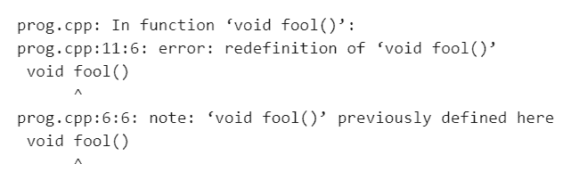
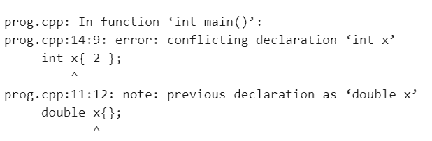
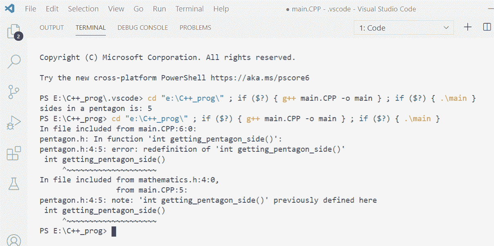
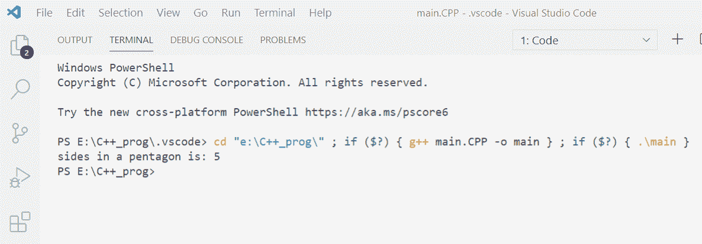

# c++ 中的头部保护

> 原文:[https://www.geeksforgeeks.org/header-guard-in-c/](https://www.geeksforgeeks.org/header-guard-in-c/)

[C++ ](https://www.geeksforgeeks.org/c-plus-plus/) 中的 Header Guards 是[条件编译指令](https://www.geeksforgeeks.org/cpp-preprocessor-directives-set-2/)，有助于避免[错误](https://www.geeksforgeeks.org/errors-in-cc/)，当同一[函数](https://www.geeksforgeeks.org/functions-in-c/)或变量被程序员的错误定义了不止一次时，就会出现这种错误。根据 [C++ ](https://www.geeksforgeeks.org/c-plus-plus/) 的说法，当一个函数或变量被定义多次时，会产生一个错误。下面是同样的程序来说明:

**程序 1:**

## C++

```cpp
// C++ program to illustrate error
// caused due to defining same
// function more than once
#include <iostream>
using namespace std;

// Function 1
void fool()
{
    cout << "hello";
}

// Function 2
void fool()
{
    cout << "hello maddy";
}

// Driver Code
int main()
{
    // Function Call
    fool();

    return 0;
}
```

**输出:**



**说明:**
在上面的程序中，一个函数 fool()被定义了两次，导致致命错误。

**程序 2:**

## C++

```cpp
// C++ program to illustrate error
// caused due to defining same
// variable more than once
#include <iostream>
using namespace std;

// Driver Code
int main()
{
    // error: note: 'double x' previously
    double x{};

    // declared here
    int x{ 2 };

    return 0;
}
```

**输出:**



**说明:**
在上面的程序中，变量 x 被定义了两次，导致了致命的错误。

这些都是最常出现的错误，只要掌握非常基本的编程知识就可以修复。但是如果出现这样的情况，其中[](https://www.geeksforgeeks.org/write-header-file-c/)头文件被包括在程序中，并且无意中完成了**函数**的正向声明，该函数已经是已经包括的头文件的一部分。在这种情况下，头文件的内容不会被记住，无论它是用户定义的还是预定义的。

所以更进一步，会遇到致命的错误，这种错误有时会变得无法解决。为此， **C++** 配备了一些避免此错误的预处理器指令。

*   假设有一个名为**五边形的头文件，如下所示:**

## C++

```cpp
// Function to get the side of
// the pentagon
int getting_pentagon_side()
{
    // Return the side
    return 5;
}
```

*   让另一个头文件名为**“数学. h”**包含头文件**“五角大楼. h”**。

## C++

```cpp
// Including another header file
// "pentagon.h" in the current program
#include "pentagon.h"
```

*   现在，创建了一个名为**“Pentagon . CPP”**的 C++ 程序，如下所示:

**程序 3:**

## C++

```cpp
// C++ program to illustrate the error
// discussed above
#include <iostream>

// Include header files created
#include "mathematics.h"
#include "pentagon.h"
using namespace std;

// Driver Code
int main()
{

    return 0;
}
```

**输出:**



解决以上造成的错误，思路是使用**“Header Guard”**的概念，避免程序员的错误导致同一函数变量定义不止一次时出现的错误。

报头保护可以通过使用 [**条件编译指令**](https://www.geeksforgeeks.org/cpp-preprocessor-directives-set-2/) 来避免这种错误。它是条件编译指令的组合，可以多次保护您的头文件不被包含在程序中。

**语法:**

```cpp
#ifndef HEADER_H_NAME
#define HEADER_H_NAME /*...
...*/
#endif

```

现在，让我们回到前面的例子，看看如何解决错误冲突:

*   首先将**“五边形. h”**头文件修改为:

```cpp
***<u>#</u>***ifndef PENTAGON_H
#define PENTAGON_H

int getting_pentagon_side()
{ 
return 5;
}
#endif

```

*   现在包含**【五边形】**的**【数学. h】**头文件修改为:

```cpp
#ifndef MATHEMATICS_H
#define MATHEMATICS_H
#include "pentagon.h"
#endif

```

下面是程序经过上述修改后避免的错误:

## C++

```cpp
// C++ program to illustrate how to
// avoid errors using Header Guard
#include <iostream>

// Include header guards in both
// the header files
#include "mathematics.h"

// Now, the error will not occur
#include "pentagon.h"

using namespace std;

// Driver Code
int main()
{
    // Function Call to find the
    // sides of the pentagon
    int i{ getting pentagon side() };

    // Print the sides
    cout << "sides in a pentagon is: "
         << i;

    return 0;
}
```

**输出:**

