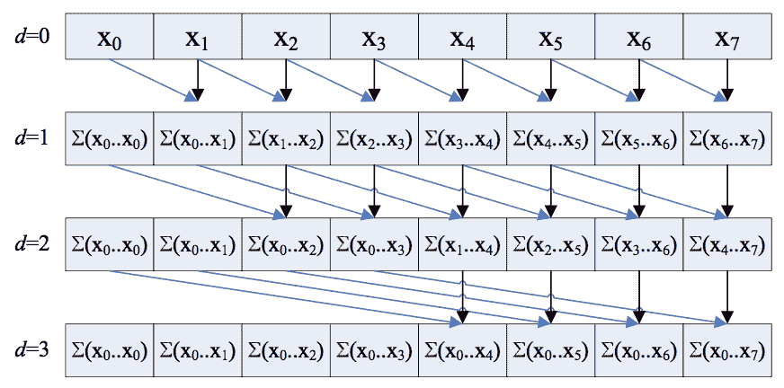

# 希利斯斯蒂尔扫描(并行前缀扫描算法)

> 原文:[https://www . geesforgeks . org/Hillis-Steele-scan-parallel-prefix-scan-algorithm/](https://www.geeksforgeeks.org/hillis-steele-scan-parallel-prefix-scan-algorithm/)

本文讨论了一种称为希利斯-斯蒂尔扫描的扫描算法，也称为并行前缀扫描算法。本文中的**扫描操作**本质上是指计算数组的[前缀和。希利斯-斯蒂尔扫描是一种并行运行的扫描操作算法。以下是大小为 **N** 的](https://www.geeksforgeeks.org/prefix-sum-array-implementation-applications-competitive-programming/)[数组](https://www.geeksforgeeks.org/introduction-to-arrays/)、**x[**的算法方法:

*   [使用变量 **d** 在范围](https://www.geeksforgeeks.org/range-based-loop-c/)**【1】内迭代，使用变量**d**记录<sub>2</sub>**，对于所有并行的 **k** ，检查 **k** 的值是否至少为**2<sup>d</sup>**。如果发现为真，则将**x【k–2】<sup>d–1</sup>**的值加到**x【k】**的值上。

**视觉表现:**

> 

当深度 **d** 达到 **log <sub>2</sub> N** 时，计算终止，结果计算为数组的前缀和。所有单独的附加操作并行运行，每一层 **(d = 1，d = 2，…)，**线性进行。

下面是算法在 CUDA C++ 中的实现:

## C++

```cpp
// C++ program for the above approach

#include "cuda_runtime.h"
#include "device_launch_parameters.h"
#include <chrono>
#include <cstdio>
#include <ctime>
#include <iostream>
using namespace std::chrono;
using namespace std;

// Function to handle error
static void HandleError(cudaError_t err,
                        const char* file,
                        int line)
{
    // If the error occurs then print
    // that error
    if (err != cudaSuccess) {
        printf("\n%s in %s at line %d\n",
               cudaGetErrorString(err),
               file, line);

        // Exit
        exit(EXIT_FAILURE);
    }
}

#define HANDLE_ERROR(err) (
HandleError(err, __FILE__, __LINE__))

template <typename T>
__global__ void
Hillis_Steele_Scan_Kernel(T* arr,
 __int64 space,
                          __int64 step,
 __int64 steps)
{
    __int64 x = threadIdx.x
                + blockDim.x * blockIdx.x;

    __int64 y = threadIdx.y
                + blockDim.y * blockIdx.y;

    // 2D Kernel Launch parameters
    __int64 tid = x + (y * gridDim.x
                       * blockDim.x);

    // Kernel runs in the parallel
    // TID is the unique thread ID
    if (tid >= space)
        arr[tid] += arr[tid - space];
}

template <typename T>
T* Hillis_Steele_Scan(T* input, __int64 N)
{
    __int64* out;
    HANDLE_ERROR(
        cudaMallocManaged(&out,
                          (sizeof(__int64) * N)));

    // 2D Kernel Launch Parameters
    dim3 THREADS(1024, 1, 1);
    dim3 BLOCKS;
    if (N >= 65536)
        BLOCKS = dim3(64, N / 65536, 1);
    else if (N <= 1024)
        BLOCKS = dim3(1, 1, 1);
    else
        BLOCKS = dim3(N / 1024, 1, 1);

    __int64 space = 1;

    // Begin with a stride of 2^0
    __int64 steps = __int64(log2(float(N)));

    // Log2N depth dependency of scan
    HANDLE_ERROR(cudaMemcpy(
        out, input, sizeof(__int64) * N,
        cudaMemcpyDeviceToDevice));

    // Copy Input Array to Output Array
    for (size_t step = 0;
         step < steps; step++) {
        Hillis_Steele_Scan_Kernel<<<BLOCKS, THREADS> > >(
            out, space, step, steps);

        // Calls the parallel operation
        space *= 2;

        // A[i] += A[i - stride]
        // log N times where N
        // is array size
    }

    cudaDeviceSynchronize();

    return out;
}

// Driver Code
int main()
{
    __int64* inputArr;
    __int64 arraysize = 10;

    // Size of the input array
    __int64 N = __int64(1)
                << (__int64(log2(float(arraysize))) + 1);

    // N is the nearest power of 2
    // to the array size
    cout << "\n\nELEMS --> 2^" << N
         << " >= " << arraysize;

    // Allocate memory on the GPU
    HANDLE_ERROR(cudaMallocManaged(&inputArr,
                                   (sizeof(__int64) * N)));

    HANDLE_ERROR(cudaDeviceSynchronize());

    // INIT Test Data
    for (__int64 i = 0; i < N; i++) {
        inputArr[i] = 1;
    }

    // An array with only 1s was chosen
    // as test data so the result is
    // 1, 2, 3, 4, ..., N
    high_resolution_clock::time_point tg1
        = high_resolution_clock::now();

    __int64* out = Hillis_Steele_Scan(
        inputArr, N);

    // Function Call
    high_resolution_clock::time_point tg2
        = high_resolution_clock::now();

    duration<double> time_span
        = duration_cast<duration<double> >(tg2 - tg1);

    cout << "\nTime Taken : "
         << time_span.count() * 1000
         << " ms";

    cout << endl;
    for (__int64 i = 0; i < arraysize; i++)
        std::cout << '\t' << out[i];
    std::cout << std::endl;

    cudaFree(out);

    // Free allocated memory from GPU
    cudaFree(inputArr);

    return 0;
}
```

***复杂度分析:** O(log N)时间和 O(N)处理器*