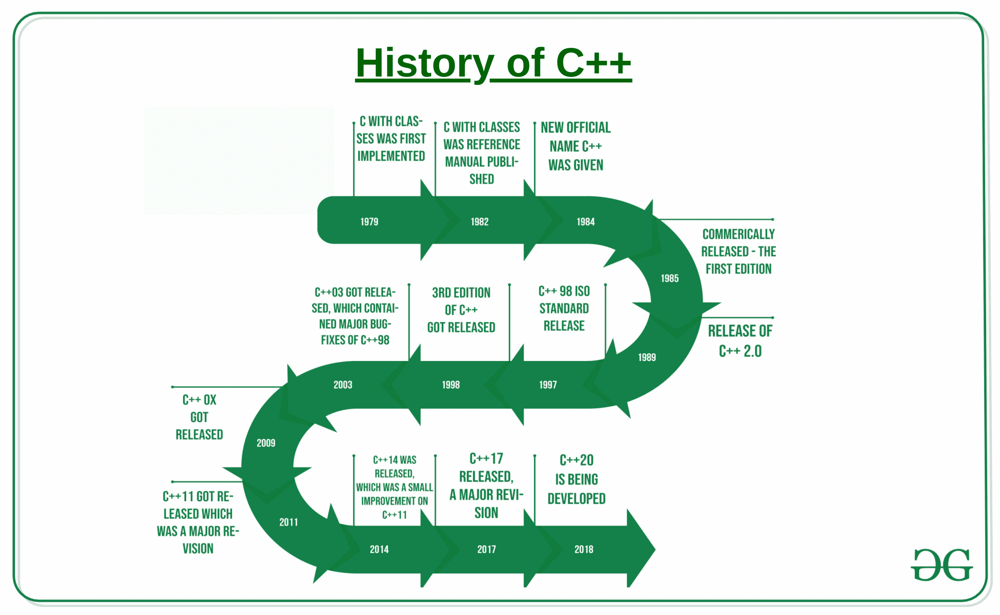

# c++历史

> 原文:[https://www.geeksforgeeks.org/history-of-c/](https://www.geeksforgeeks.org/history-of-c/)

[C++语言](https://www.geeksforgeeks.org/c-plus-plus/)是一种[面向对象编程语言](https://www.geeksforgeeks.org/object-oriented-programming-in-cpp/) &是一种低级&高级语言的组合——一种中级语言。编程语言是由丹麦计算机科学家比雅尼·斯特劳斯特鲁普在新泽西州默里山的贝尔电话实验室(现在被称为诺基亚贝尔实验室)创造、设计和开发的。因为他想要一种灵活的&一种动态语言，它类似于 C 语言，具有所有的特性，但是具有额外的活动类型检查、基本继承、默认功能参数、类、内联等。因此，有类的 C(c++)被推出。

**C++最初被称为“带类的 C”，1983 年更名为 C++。++是编程多样性的简写；因此 C++大致意思是“比 C 高一级”**

*   编程语言 C++的踪迹可以追溯到 **1979** 年**比雅尼·斯特劳斯特鲁普**为博士论文做一些开发的时候。Stroustrup 有机会想到的所有单词中，有一个被称为 **Simula** 的语言，因为顾名思义，它可能是一种主要为模拟而设计的语言。Simula 六十七语言——这是 Stroustrup 使用的变体，被认为是支持面向对象编程范式的主要语言。Stroustrup 发现这种范式有助于包开发；但是，Simula 语言对于实际应用来说太慢了。
*   随后不久，他开始研究带有类的“ **C”，因为顾名思义，它是 C 语言的超集。他的主要梦想是通过不牺牲速度或低级实用性的方式，将自己创建的高级面向对象编程引入 C 语言，在他那个时代，C 语言仍然是因其可移动性、可移植性&和紧凑性而广受推崇的编程语言。他的编程语言包括内联、基本继承、默认函数参数、类别和可靠排序，此外还检查了 C 语言的所有或任何选项。**
*   第一个带有类别编译器的 C 被称为 **Cfront** ，它是从一个被称为 **CPre** 的 C 编译器派生而来的。这是一个旨在将带有类别代码的 C 语言翻译成通用 C 语言的程序。一个相当引人注目的目的是值得注意的是，Cfront 主要是用带有类的 C 语言编写的，这使它成为了一个自托管编译器(一个会自己编译的编译器)。后来，Cfront 在 1993 年被放弃，因为在其中集成新选项变得很麻烦，主要是 C++异常。即便如此，Cfront 还是对未来编译器的实现以及操作系统 UNIX 产生了重大影响。
*   1983 年，这种语言的名字从带有类别的 C 修改为 C++。C 语言中的++运算符是递增变量的关联运算符，这提供了一些关于 Stroustrup 如何看待编程语言的见解。几个新的选项在这一点上获得了额外的东西，最值得注意的是区域单元虚函数，执行重载，使用 const 关键字的引用，以及使用两个正斜杠的单行注释(这可能是从语言 **BCPL** 中获得的一个特性)。
*   1985 年，Stroustrup 与名为**c++编程语言**的语言的关系被打印出来并发布。就在同一年，C++作为一个广告产品被强制执行，因此开始作为一个商业元素。编程语言没有正式标准化，尽管如此，这本书还是成为了一个重要的参考。编程语言在 1989 年再次更新，加入了受保护的静态成员，仍然作为许多类别&类的关联继承。
*   1990 年，作为参考的**注释 C++手册**全面发布。仅在 1990 年，也就是同一年的&，博兰的 **Turbo C++编译器**也将作为广告产品进行商业发布。Turbo C++增加了大量的其他库，这可能会对 C++的发展产生实质性的影响。虽然 Turbo C++上一次稳定的不运行是在 2006 年，但是编译器仍然得到了广泛的应用。
*   1998 年，C++习惯咨询和标准委员会为 **C++ ISO/IEC 14882:1998** 印刷了第一个国际标准，它可能非正式地被称为 C++98。注释的 C++手册在质量发展中有着重要的影响。1979 年开始智能构建的质量模板库(也称为[标准模板库](https://www.geeksforgeeks.org/cpp-stl-tutorial/))额外包含在其中。2003 年，委员会熟悉了符合其 1998 年惯例的多个问题，并随后对其进行了修订。修改后的语言被戏称为 **C++03** 。
*   2005 年，同一个 C++委员会发布了一份技术报告(称为 **TR1** )，列举了他们旨在推动最新 C++标准的各种选项。这项新规定被非正式地命名为 **C++0x** ，因为它有望在第一个十年结束前的某一天被解除。然而具有讽刺意味的是，新的惯例直到 2011 年年中才得以实现。到那时为止，许多技术报告已经发布，一些编译器开始为新的选项和特性添加实验性支持。
*   2011 年年中，新的 C++惯例(被称为 **C++11** )完成了。 [Boost 库](https://www.geeksforgeeks.org/advanced-c-boost-library/)项目对新规则产生了实质性的影响，一些新模块直接来自相应的 Boost 库。包括的一些新选项有:
    1.  新的循环语法提供了实用性，就像特定不同语言中的每个循环一样
    2.  习惯线程库(直到 2011 年，C 和 C++都没有这种库)
    3.  可变模板
    4.  汽车(自动)关键词
    5.  新仪器类别和等级
    6.  新的 C++时间库，原子支持
    7.  综合组织库
    8.  正则表达式支持
    9.  对联合和数组初始化列表的更高支持
*   [C++17](https://www.geeksforgeeks.org/c-17-new-ways-to-assign-values-to-variables/) 是 C++的最新版本。一个更新的&高级版本的 C++正在发布，即 C++20。
*   **根据 TIOBE Index 2019 年的最新研究**，通过淘汰 Python，C++仍然是仅次于 Java & C 的第三大最受欢迎的编程语言。这一切都归功于新发布的 C++11 版本，根据用户的说法，该版本使其更加健壮、安全、简单和富有表现力。

比雅尼·斯特劳斯特鲁普用 C++创造了优秀的作品。c 可能是一种低级编程语言，因此，它没有任何类。它不包含几个选项，这将创造更好的编程，然而，是最快的语言(汇编更快；然而，在构造中编程不是你会考虑的一件事)，比雅尼·斯特劳斯特鲁普所做的是通过把代码当作生命对象来增加面向对象的一半。C++之所以如此可爱，是因为它具有 C 语言的速度，另外它还是一种高级编程语言，因此允许我们说每个世界中最有效的。然而，另一方面，对于新手来说，C++很难被注意到，对于你在 C++上编写的等价代码，你将能够在四分之一的时间里用 Python 编写。

**c++的特性:**T2【c++最好的五个特性是:-

1.  就事实而言，它是竞争编程中最主要使用的语言。大多数评分极高的程序员通常使用 C++进行加密。你会在任何在线网站上看到它。
2.  [STL](https://www.geeksforgeeks.org/the-c-standard-template-library-stl/) (标准指南库):对于识别 C 语言，还在为冒泡类型写代码的人来说，这是一个极其节省时间的工具。
3.  [操作员超载](https://www.geeksforgeeks.org/operator-overloading-c/)
4.  [多重继承](https://www.geeksforgeeks.org/multiple-inheritance-in-c/)。浩如烟海的语言没有这种能力。
5.  模块化代码的能力，[封装](https://www.geeksforgeeks.org/encapsulation-in-c/)，毕竟[多态](https://www.geeksforgeeks.org/polymorphism-in-c/)。

**各种 C++版本历史汇总表:**

<figure class="table">T22】c++ 03(ISO/IEC 14882:2003)

| version | Release date  | Major change |
| --- | --- | --- |
| c++ 98(ISO/IEC 14882:1998) | October 1998 | the front page |
| February 2003 | Introduce value initialization. |
| c++ 11 | August 2011 | Introduction of Lambda expression, delegate constructor, unified initialization syntax, nullptr, automatic type deduction and decltype, Rvalue reference, etc. |
| c++ 14 | August 2014 | Introduce polymorphic lambda, numeric separator, generalized lambda capture, variable template, binary integer literal, quoted string, etc. |
| c++ 17 | December 2017 | Introduce fold expression, hexadecimal floating-point literal, a u8 character literal, selection statement with initializer, inline variable, etc. |
| c++ 20 | 2020-2021 | Coming soon |

</figure>