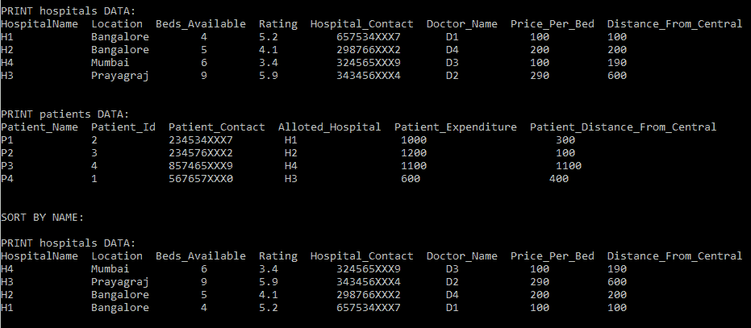
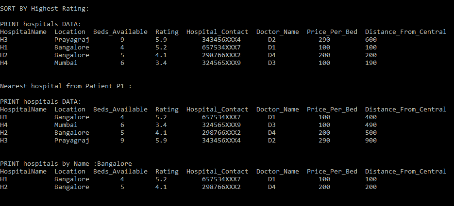
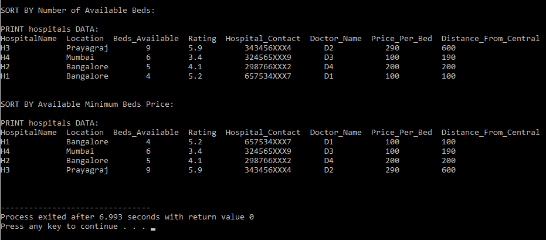

# c++中的医院管理系统

> 原文:[https://www . geesforgeks . org/hospital-management-system-in-c/](https://www.geeksforgeeks.org/hospital-management-system-in-c/)

本文讨论了一个管理医院管理系统的 C++程序。给定带有医院名称、联系人、医生和患者的医院数据，以下是需要实现的功能:

**支持的功能:**

*   打印医院数据
*   打印患者数据
*   按床位价格排序
*   按可用床位排序
*   按名称排序
*   按评级和评论排序
*   打印任何特定城市的医院

**程序中的重要功能:**

1.  **打印医院数据():**它将打印所有医院的数据。
2.  **打印患者数据():**将打印所有医院的数据。
3.  **排序医院名称():**从名称排序所有医院
4.  **排序医院排名():**根据等级对医院进行排序
5.  **Sort by bed available():**根据可用床位对医院进行排序
6.  **sortbybeprice():**按照最低价格对医院进行排序。

**进场:**

*   为**医院数据集**和**患者数据**创建[类](https://www.geeksforgeeks.org/c-classes-and-objects/)。
*   初始化存储医院数据集和患者数据的变量。
*   为访问医院数据集和患者数据的医院和患者类别创建[对象](https://www.geeksforgeeks.org/object-oriented-programming-in-cpp/)。
*   使用两个保存医院数据集和患者数据的[数组](https://www.geeksforgeeks.org/introduction-to-arrays/)。
*   实现如下所示的给定功能。

下面是上述方法的实现。

## C++

```
// C++ program to implement the Hospital
// Management System
#include <bits/stdc++.h>
using namespace std;

// Store the data of Hospital
class Hospital {
public:
    string H_name;
    string location;
    int available_beds;
    float rating;
    string contact;
    string doctor_name;
    int price;
};

// Stores the data of Patient
class Patient : public Hospital {
public:
    string P_name;
    int P_id;
};

// Hospital Data
void PrintHospitalData(
    vector<Hospital>& hospitals)
{
    cout << "PRINT hospitals DATA:"
         << endl;

    cout << "HospitalName     "
         << "Location     "
         << "Beds_Available     "
         << "Rating     "
         << "Hospital_Contact     "
         << "Doctor_Name     "
         << "Price_Per_Bed     \n";

    for (int i = 0; i < 4; i++) {
        cout << hospitals[i].H_name
             << "                 "
             << "        "
             << hospitals[i].location
             << "           "
             << hospitals[i].available_beds
             << "                    "
             << hospitals[i].rating
             << "            "
             << hospitals[i].contact
             << "             "
             << hospitals[i].doctor_name
             << "                  "
             << "        "
             << hospitals[i].price
             << "            "
             << endl;
    }

    cout << endl
         << endl;
}

// Function to print the patient
// data in the hospital
void PrintPatientData(
    vector<Patient>& patients,
    vector<Hospital>& hospitals)
{
    cout << "PRINT patients DATA:"
         << endl;
    cout << "Patient_Name     "
         << "Patient_Id     "
         << "Patient_Contact     "
         << "Alloted_Hospital     "
         << "Patient_Expenditure     \n";

    for (int i = 0; i < 4; i++) {
        cout << patients[i].P_name
             << "                "
             << "          "
             << patients[i].P_id
             << "              "
             << "          "
             << patients[i].contact
             << "                   "
             << hospitals[i].H_name
             << "                   "
             << patients[i].price
             << "            "
             << endl;
    }

    cout << endl
         << endl;
}

// Comparator function to sort the
// hospital data by name
bool name(Hospital& A, Hospital& B)
{
    return A.H_name > B.H_name;
}

// Function to sort the hospital
// data by name
void SortHospitalByName(
    vector<Hospital> hospitals)
{
    // Sort the date
    sort(hospitals.begin(),
         hospitals.end(),
         name);

    cout << "SORT BY NAME:"
         << endl
         << endl;
    PrintHospitalData(hospitals);
}

// Comparator function to sort the
// hospital data by rating
bool rating(Hospital& A, Hospital& B)
{
    return A.rating > B.rating;
}

// Function to sort the hospital
// data by namerating
void SortHospitalByRating(vector<Hospital> hospitals)
{
    sort(hospitals.begin(),
         hospitals.end(),
         rating);

    cout << "SORT BY Rating:"
         << endl
         << endl;

    PrintHospitalData(hospitals);
}

// Comparator function to sort the
// hospital data by Bed Available
bool beds(Hospital& A, Hospital& B)
{
    return A.available_beds > B.available_beds;
}

// Function to sort the hospital
// data by Bed Available
void SortByBedsAvailable(
    vector<Hospital> hospitals)
{
    sort(hospitals.begin(),
         hospitals.end(),
         beds);

    cout << "SORT BY Available Beds:"
         << endl
         << endl;

    PrintHospitalData(hospitals);
}

// Comparator function to sort the
// hospital data by Bed Price
bool beds_price(Hospital& A, Hospital& B)
{
    return A.price < B.price;
}

// Function to sort the hospital
// data by Bed Price
void SortByBedsPrice(
    vector<Hospital> hospitals)
{
    sort(hospitals.begin(),
         hospitals.end(),
         beds_price);

    cout << "SORT BY Available Beds Price:"
         << endl
         << endl;

    PrintHospitalData(hospitals);
}

// Comparator function to sort the
// hospital data by City
void PrintHospitalBycity(
    string city, vector<Hospital> hospitals)
{
    cout << "PRINT hospitals by Name :"
         << city << endl;

    cout << "HospitalName     "
         << "Location     "
         << "Beds_Available     "
         << "Rating     "
         << "Hospital_Contact     "
         << "Doctor_Name     "
         << "Price_Per_Bed     \n";

    for (int i = 0; i < 4; i++) {

        if (hospitals[i].location != city)
            continue;
        cout << hospitals[i].H_name
             << "                  "
             << "       "
             << hospitals[i].location
             << "           "
             << hospitals[i].available_beds
             << "                    "
             << hospitals[i].rating
             << "            "
             << hospitals[i].contact
             << "             "
             << hospitals[i].doctor_name
             << "                "
             << "          "
             << hospitals[i].price
             << "            "
             << endl;
    }
    cout << endl
         << endl;
}

// Function to implement Hospital
// Management System
void HospitalManagement(
    string patient_Name[], int patient_Id[],
    string patient_Contact[], int bookingCost[],
    string hospital_Name[], string locations[], int beds[],
    float ratings[], string hospital_Contact[],
    string doctor_Name[], int prices[])
{
    // Stores the Hospital data
    // and user data
    vector<Hospital> hospitals;

    // Create Objects for hospital
    // and the users
    Hospital h;

    // Initialize the data
    for (int i = 0; i < 4; i++) {
        h.H_name = hospital_Name[i];
        h.location = locations[i];
        h.available_beds = beds[i];
        h.rating = ratings[i];
        h.contact = hospital_Contact[i];
        h.doctor_name = doctor_Name[i];
        h.price = prices[i];
        hospitals.push_back(h);
    }

    // Stores the patient data
    vector<Patient> patients;
    Patient p;

    // Initialize the data
    for (int i = 0; i < 4; i++) {
        p.P_name = patient_Name[i];
        p.P_id = patient_Id[i];
        p.contact = patient_Contact[i];
        p.price = bookingCost[i];
        patients.push_back(p);
    }

    cout << endl;

    // Call the various operations
    PrintHospitalData(hospitals);
    PrintPatientData(patients, hospitals);

    SortHospitalByName(hospitals);
    SortHospitalByRating(hospitals);
    PrintHospitalBycity("Bangalore", hospitals);
    SortByBedsAvailable(hospitals);
    SortByBedsPrice(hospitals);
}

// Driver Code
int main()
{
    // Stores hospital data and
    // the user data
    string patient_Name[] = { "P1", "P2", "P3", "P4" };
    int patient_Id[] = { 2, 3, 4, 1 };
    string patient_Contact[]
        = { "234534XXX7", "234576XXX2", "857465XXX9",
            "567657XXX0" };
    int bookingCost[] = { 1000, 1200, 1100, 600 };

    string hospital_Name[] = { "H1", "H2", "H4", "H3" };
    string locations[] = { "Bangalore", "Bangalore",
                           "Mumbai   ", "Prayagraj" };
    int beds[] = { 4, 5, 6, 9 };
    float ratings[] = { 5.2, 4.1, 3.4, 5.9 };
    string hospital_Contact[]
        = { "657534XXX7", "298766XXX2", "324565XXX9",
            "343456XXX4" };
    string doctor_Name[] = { "D1", "D4", "D3", "D2" };
    int prices[] = { 100, 200, 100, 290 };

    // Function Call
    HospitalManagement(
        patient_Name, patient_Id, patient_Contact,
        bookingCost, hospital_Name, locations, beds,
        ratings, hospital_Contact, doctor_Name, prices);

    return 0;
}
```

**输出:**

  