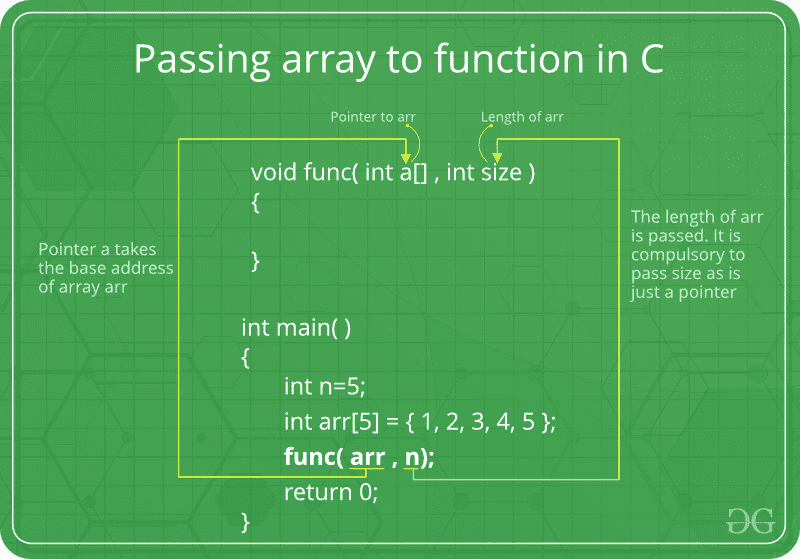

# 数组如何传递给 C/C++中的函数

> 原文:[https://www . geesforgeks . org/数组如何传递给 cc 中的函数/](https://www.geeksforgeeks.org/how-arrays-are-passed-to-functions-in-cc/)

在 C 语言中，当我们将数组传递给函数 fun()时，fun()总是将其视为指针。下面的例子演示了同样的情况。

## C++

```
#include <iostream>
using namespace std;

// Note that arr[] for fun is just a pointer even if square
// brackets are used
void fun(int arr[])  // SAME AS void fun(int *arr)
{
   unsigned int n = sizeof(arr)/sizeof(arr[0]);
   cout <<"\nArray size inside fun() is "<< n;
}

// Driver program
int main()
{
   int arr[] = {1, 2, 3, 4, 5, 6, 7, 8};
   unsigned int n = sizeof(arr)/sizeof(arr[0]);
   cout <<"Array size inside main() is "<< n;
   fun(arr);
   return 0;
}

// This code is contributed by shivanisinghss2110
```

## C

```
#include <stdio.h>
#include <stdlib.h>
// Note that arr[] for fun is just a pointer even if square
// brackets are used
void fun(int arr[])  // SAME AS void fun(int *arr)
{
   unsigned int n = sizeof(arr)/sizeof(arr[0]);
   printf("\nArray size inside fun() is %d", n);
}

// Driver program
int main()
{
   int arr[] = {1, 2, 3, 4, 5, 6, 7, 8};
   unsigned int n = sizeof(arr)/sizeof(arr[0]);
   printf("Array size inside main() is %d", n);
   fun(arr);
   return 0;
}
```

**输出:**

```
Array size inside main() is 8
Array size inside fun() is 1
```

因此在 C 语言中，我们必须传递数组的大小作为参数。只有在以“\0”结尾的字符数组的情况下才可能不需要大小，大小可以通过检查字符串的结尾来确定。
**下面是一个简单的例子，展示了数组在 C.**
中是如何传递的



## C++

```
#include <iostream>
using namespace std;

void fun(int *arr, unsigned int n)
{
   int i;
   for (i = 0; i < n; i++)
     cout <<" "<< arr[i];
}

// Driver program
int main()
{
   int arr[] = {1, 2, 3, 4, 5, 6, 7, 8};
   unsigned int n = sizeof(arr)/sizeof(arr[0]);
   fun(arr, n);
   return 0;
}

// This code is contributed by shivanisinghss2110
```

## C

```
#include <stdio.h>

void fun(int *arr, unsigned int n)
{
   int i;
   for (i=0; i<n; i++)
     printf("%d  ", arr[i]);
}

// Driver program
int main()
{
   int arr[] = {1, 2, 3, 4, 5, 6, 7, 8};
   unsigned int n = sizeof(arr)/sizeof(arr[0]);
   fun(arr, n);
   return 0;
}
```

**输出:**

```
1  2  3  4  5  6  7  8
```

### 练习:
**预测下面 C 程序的输出** :

1.

## C++

```
#include <iostream>
using namespace std;
void fun(int arr[], unsigned int n)
{
  int i;
  for (i = 0; i < n; i++)
    cout<< arr[i] << " ";
}

// Driver program
int main()
{
  int arr[] = {1, 2, 3, 4, 5, 6, 7, 8};
  unsigned int n = sizeof(arr)/sizeof(arr[0]);
  fun(arr, n);
  return 0;
}

// This code is contributed by shivanisinghss2110
```

## C

```
#include <stdio.h>
void fun(int arr[], unsigned int n)
{
int i;
for (i=0; i<n; i++)
    printf("%d ", arr[i]);
}

// Driver program
int main()
{
int arr[] = {1, 2, 3, 4, 5, 6, 7, 8};
unsigned int n = sizeof(arr)/sizeof(arr[0]);
fun(arr, n);
return 0;
}
```

2.

## C++

```
#include <iostream>
using namespace std;
void fun(int *arr)
{
   int i;
   unsigned int n = sizeof(arr)/sizeof(arr[0]);
   for (i=0; i<n; i++)
     cout <<" "<< arr[i];
}

// Driver program
int main()
{
   int arr[] = {1, 2, 3, 4, 5, 6, 7, 8};
   fun(arr);
   return 0;
}

// This code is contributed by shivanisinghss2110
```

## C

```
#include <stdio.h>
void fun(int *arr)
{
   int i;
   unsigned int n = sizeof(arr)/sizeof(arr[0]);
   for (i=0; i<n; i++)
     printf("%d  ", arr[i]);
}

// Driver program
int main()
{
   int arr[] = {1, 2, 3, 4, 5, 6, 7, 8};
   fun(arr);
   return 0;
}
```

3.

## C++

```
#include <iostream>
#include <string.h>
using namespace std;
void fun(char *arr)
{
   int i;
   unsigned int n = strlen(arr);
   cout << "n = "<< n<<endl;
   for (i=0; i<n; i++)
     cout << arr[i] <<" ";
}

// Driver program
int main()
{
   char arr[] = "geeksquiz";
   fun(arr);
   return 0;
}

// This code is contributed by shivanisinghss2110
```

## C

```
#include <stdio.h>
#include <string.h>

void fun(char *arr)
{
   int i;
   unsigned int n = strlen(arr);
   printf("n = %d\n", n);
   for (i=0; i<n; i++)
     printf("%c  ", arr[i]);
}

// Driver program
int main()
{
   char arr[] = "geeksquiz";
   fun(arr);
   return 0;
}
```

4.

## C++

```
#include <iostream>
#include <bits/stdc++.h>
using namespace std;

void fun(char *arr)
{
   int i;
   unsigned int n = strlen(arr);
   cout<<"n = "<<n<<"\n";
   for (i=0; i<n; i++)
     cout<<" "<< arr[i];
}

// Driver program
int main()
{
   char arr[] = {'g', 'e', 'e', 'k', 's', 'q', 'u', 'i', 'z'};
   fun(arr);
   return 0;
}

// this code is contributed by shivanisinghss2110
```

## C

```
#include <stdio.h>
#include <string.h>

void fun(char *arr)
{
   int i;
   unsigned int n = strlen(arr);
   printf("n = %d\n", n);
   for (i=0; i<n; i++)
     printf("%c  ", arr[i]);
}

// Driver program
int main()
{
   char arr[] = {'g', 'e', 'e', 'k', 's', 'q', 'u', 'i', 'z'};
   fun(arr);
   return 0;
}
```

请注意，上述程序中的字符数组不是以“\0”结尾的。详见[本](https://www.geeksforgeeks.org/g-fact/)。

这些是我们使用的一些常见方法，但是您知道吗，有一种非常酷的方法可以做到这一点，这样您就可以保留数组的身份。我们过一会儿将简短地谈论那件事。

为此，我们首先需要了解上述所有建议方法的缺点-

**缺点:**

*   上述方法的一个主要缺点是编译器不知道您正在传递什么。我在这里的意思是，对于编译器，我们只是传递一个 int*并且我们知道它指向数组，但是编译器不知道这个。
*   为了验证我的说法，您可以对数组中的每个循环调用。您肯定会得到一个错误，说没有找到可调用的开始、结束函数。
    这是因为传递数组实际上就像传递整数指针，它本身没有关于底层数组的信息，因此没有提供迭代器。

#### 模板方法(引用数组):

此方法保留有关基础数组的所有信息。
该方法主要基于对数组的引用，但将其与模板一起使用优化了我们的方法。模板依赖实际上是在函数调用时自动计算数组的长度，这样就可以用来创建引用，因为对数组的引用必须知道数组的大小。

查看我关于数组引用的帖子

*此处模板用于模板参数推演。*

## C++

```
#include <iostream>
using namespace std;

template<size_t N>
void print(int (&a)[N]){
    for(int e: a){
        cout << e << endl;
    }
}

int main(){
    int a[] {1, 2, 3, 4, 5};
    print(a);
}
```

**Output**

```
1
2
3
4
5
```

在这里，您可以看到为什么我们需要模板参数推导——为 base 创建对数组的引用，以便我们可以将数组作为参数。

请访问我上面的链接，了解以下信息-

*   双编译器对数组的看法。
*   引用数组。
*   如何使用引用？
*   数组是类型还是仅仅是指向第一个元素的指针？
*   从编译器的角度来看，两个不同长度的数组是否相同？
*   数组和指针的区别。

由 **mohdatishanx** 改进的物品。

**相关文章:**

*   [不要对数组参数使用 sizeof。](https://www.geeksforgeeks.org/using-sizof-operator-with-array-paratmeters/)
*   [C 语言中指针和数组的区别？](https://www.geeksforgeeks.org/difference-pointer-array-c/)

如果您发现任何不正确的地方，或者您想分享更多关于这里讨论的主题的信息，请写评论。