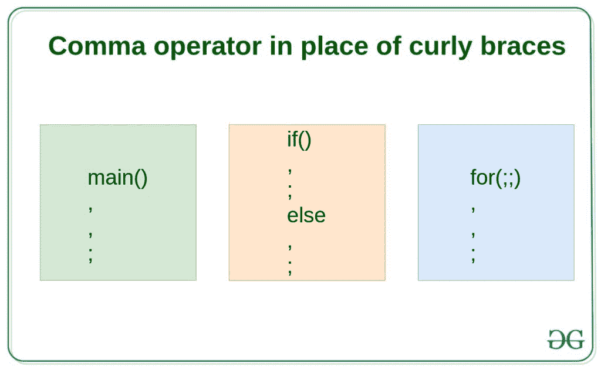
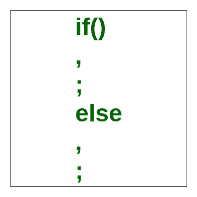
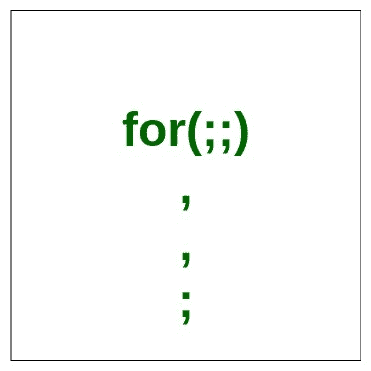

# 如何用逗号运算符代替花括号？

> 原文:[https://www . geesforgeks . org/我们如何使用逗号运算符代替大括号/](https://www.geeksforgeeks.org/how-can-we-use-comma-operator-in-place-of-curly-braces/)

在 C 和 C++中，逗号(，)可以用在两个上下文中:

1.  [逗号作为运算符](https://www.geeksforgeeks.org/comna-in-c-and-c/)
2.  [逗号作为分隔符](https://www.geeksforgeeks.org/comna-in-c-and-c/)

但是在本文中，我们将讨论**逗号如何用作花括号**。

大括号用于定义函数的主体和控制语句的范围。左花括号({)表示起始范围，右花括号(})表示范围的结束。也可以在控制语句中使用逗号运算符来定义范围，而不是使用大括号。

[](https://media.geeksforgeeks.org/wp-content/uploads/20190610174339/Comma-operator-in-place-of-curly-braces.jpg)

### 在 [if-else 语句](https://www.geeksforgeeks.org/decision-making-c-c-else-nested-else/)中用逗号运算符代替大括号:

[](https://media.geeksforgeeks.org/wp-content/uploads/20190610174335/Comma-operator-in-place-of-curly-braces-for-if-else.jpg)

**示例:**

```
// C++ program to show how to use
// comma in place of curly braces
// for if-else statements

#include <iostream>
using namespace std;

void func(int num)
{
    if (num < 10)
        cout << "It shows how we can use "
             << "comma operator in place of curly braces.\n",
            cout << "Entered number is less than 10\n",
            cout << "end of if block is encountered\n\n";
    else
        cout << "Now we are in else part\n",
            cout << "Entered number is greater than 10\n",
            cout << "End of else is encountered\n\n";
}

int main()
{
    int num = 5;
    func(num);

    num = 20;
    func(num);

    return 0;
}
```

**Output:**

```
It shows how we can use comma operator in place of curly braces.
Entered number is less than 10
end of if block is encountered

Now we are in else part
Entered number is greater than 10
End of else is encountered

```

### 在[循环](https://www.geeksforgeeks.org/c-language-2-gq/loops-control-structure-gq/)中用逗号运算符代替大括号:

[](https://media.geeksforgeeks.org/wp-content/uploads/20190610174336/Comma-operator-in-place-of-curly-braces-for-loop.jpg)

**示例:**

```
// C++ program to show how to use
// comma in place of curly braces
// for loops

#include <iostream>
using namespace std;

void func(int num)
{
    for (int i = 0; i < num; i++)
        cout << "It shows how we can use ",
            cout << "comma operator in place of curly braces.\n",
            cout << "Loop traversal number: ",
            cout << i << "\n\n ";
}

int main()
{
    int num = 5;
    func(num);

    return 0;
}
```

**Output:**

```
It shows how we can use comma operator in place of curly braces.
Loop traversal number: 0

 It shows how we can use comma operator in place of curly braces.
Loop traversal number: 1

 It shows how we can use comma operator in place of curly braces.
Loop traversal number: 2

 It shows how we can use comma operator in place of curly braces.
Loop traversal number: 3

 It shows how we can use comma operator in place of curly braces.
Loop traversal number: 4

```

**注意:**块的最后一条语句必须以**分号**结束。