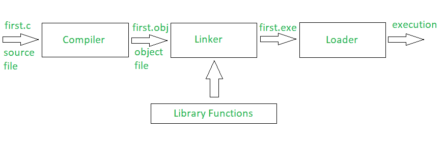
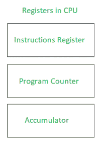

# 一个 C 程序是如何执行的？

> 原文:[https://www . geeksforgeeks . org/a-c-program-execution/](https://www.geeksforgeeks.org/how-does-a-c-program-executes/)

每当编译和执行 C 程序文件时，编译器都会生成一些与 C 程序文件同名但扩展名不同的文件。那么，这些文件是什么，它们是如何创建的？

下图显示了编译过程，在编译过程的每一步都创建了文件:

每个包含 C 程序的文件都必须用'保存。c '分机。这对于编译器理解这是一个 C 程序文件是必要的。假设一个程序文件被命名为 first.c .这个文件 first.c 被称为保存程序代码的源文件。现在，当我们编译文件时，C 编译器会查找错误。如果 C 编译器没有报告错误，那么它将文件存储为同名的. obj 文件，称为目标文件。所以，这里它将创建第一个。obj 文件不可执行。链接器继续这个过程，最后给出一个可执行的. exe 文件。

**链接器**:首先让我们知道库函数不是任何 C 程序的一部分，而是 C 软件的一部分。因此，编译器不知道任何函数的操作，无论是 printf 还是 scanf。这些函数的定义存储在各自的库中，编译器应该能够链接这些库。这就是链接器所做的。所以，当我们写#include 的时候，它包含了标准输入和输出的标准库。链接器将目标文件链接到库函数，程序变成. exe 文件。在这里，first.exe 将被创建为可执行格式。

**加载器**:每当我们给出执行特定程序的命令，加载器就开始工作。装载机将装载。并以加载该程序的地址的起始点通知 CPU。

中央处理器寄存器

**指令寄存器**:保存当前需要 CPU 执行的指令。
**程序计数器**:包含 CPU 要执行的下一条指令的地址。
**累加器**:存储与计算相关的信息。

加载程序通知程序计数器第一条指令并开始执行。然后，程序计数器开始处理任务。

**链接器和加载器的区别**

| 连接物 | 装货设备 |
| --- | --- |
| 链接器生成源程序的可执行模块。 | 加载程序将可执行模块加载到主内存中执行。 |
| 链接器将汇编程序生成的目标代码作为输入。 | 加载程序将链接器生成的可执行模块作为输入。 |
| 链接器将源代码的所有目标模块组合在一起，生成一个可执行模块。 | 加载程序将地址分配给主内存中的可执行模块来执行。 |
| 链接器的类型有链接编辑器、动态链接器。 | 加载程序的类型有绝对加载、可重定位加载和动态运行时加载。 |

**Related Articles**:

*   [https://www . geesforgeks . org/编译-a-c-程序-幕后/](https://www.geeksforgeeks.org/compiling-a-c-program-behind-the-scenes/)
*   [https://www.geeksforgeeks.org/memory-layout-of-c-program/](https://www.geeksforgeeks.org/memory-layout-of-c-program/)
*   [https://www . geesforgeks . org/write-c-program-不会-compiler-c/](https://www.geeksforgeeks.org/write-c-program-wont-compiler-c/)