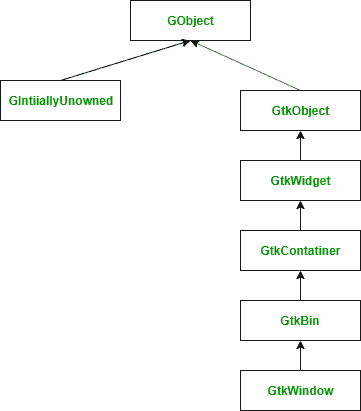
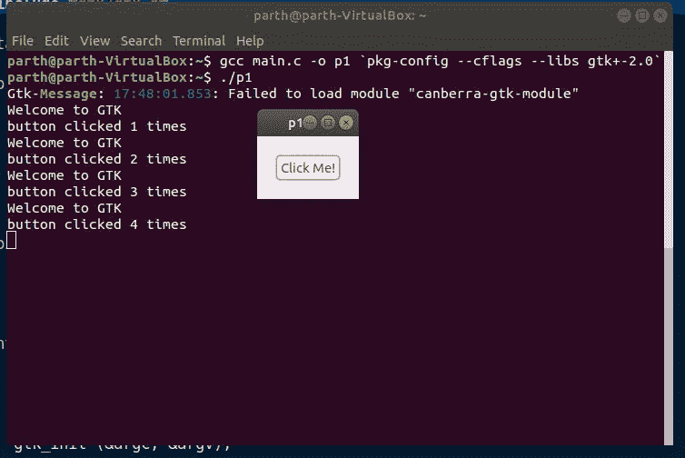

# 如何使用 GTK 工具包

在 C 语言编程中创建 GUI

> 原文:[https://www . geesforgeks . org/how-create-GUI-in-c-programming-use-GTK-toolkit/](https://www.geeksforgeeks.org/how-to-create-gui-in-c-programming-using-gtk-toolkit/)

### GTK 简介

许多编程语言支持图形用户界面的改进，这是其语言亮点之一。c 没有像字符串库、IO 库等这样的库与之相连，我们时不时会用到它们。这个弱点为工程师打开了天际线，让他们可以从 c 语言中可访问的各种图形用户界面库工具箱中进行选择。它代表 **GIMP (GNU 图像处理程序)工具包**，可以用来编程当前的 GUI 界面。

GTK+的好处是**稳了**、**开发了**，它的起点可以追溯到构成今天 Linux 中心 GUI 排列的 X Windows 的过去时代。GTK 完全是用 C 写的，我们在 Linux 中经常使用的 GTK+编程也是用 C 写的。工作区管理员，例如 **GNOME 和 XFCE** ，同样是利用 GTK 制造的。

一个 GTK+应用程序并不局限于 Linux 阶段，而是；它也可以移植到非 UNIX/Linux 阶段。

在这里，我们将坚持 GTK+的基本类型，这是它在 Linux 舞台上的 C 化身。下载 GTK+的官方网页是[https://www.gtk.org](https://www.gtk.org)。该网站包含应用编程接口文档、教学练习和其他经常与 GTK 一起使用的 Gnome 库。说实话，例如，GTK 是以图书馆为基础的，

*   **ATK:** 这个库提供了创建辅助工具的帮助，如粘滞键、屏幕阅读器等。
*   **Glib:** 它是一个通用的实用程序库，为线程、动态加载、事件循环、低级数据结构等提供帮助。
*   **GObject:** 这个库在 C 语言中给出了全功能的面向对象的帮助，没有利用 C++。这个库鼓励为不同的语言进行语言绑定，让您可以简单地访问 C 语言应用编程接口。
*   **GdkPixBuf:** 该库提供图片控制能力。
*   **GDK (GIMP 绘图工具包):**这是一个设计库，提供 Xlib 的低级绘图能力。
*   **Pango:** 这个库有助于内容和设计渲染
*   **Xlib:** 该库为 Linux 系统提供低级图形支持

当用 GTK 编写代码时，我们经常发现大量的原始数据类型以“ **g** 作为前缀，如

*   金特，
*   gchar，
*   gshort，
*   gpointer，
*   等等。

这些数据类型保证了代码可以在任何平台上重新编译，而无需进行任何改进。这些数据类型在这些库中被特征化，以帮助使其**独立于平台**。

图形用户界面编程固有的面向对象性是它的主要问题。在这种情况下，程序世界观并不完全适合这个方案。因此，不管 GTK 是用 C 写的，它都通过 GObject 给出了**面向对象的帮助。请注意，此项排列的帮助与 C++无关。C++有自己的 GTK 库，叫做 **gtkmm** 。GObject 鼓励一部分面向对象的原则，类似于宏辅助下的多态和继承。下图说明了层次关系。**

[](https://media.geeksforgeeks.org/wp-content/uploads/20191217124409/GUI4.png)

GtkWindow 继承 **GtkBin** ，本身就是 **GtkContainer** 的孩子；通过这种方式，GtkWindow 的一个对象可以调用 GtkBin 或 GtkContainer 中定义的函数。这是 GTK 用 C 语言实现面向对象的一个例子。

### 桂与 GTK

让我们从 c 语言的第一个 GTK 代码中理解一些事情

*   首先，我们合并**头文件**。这包含了制作图形用户界面所需的所有文件，包括 Glib 库。

    ```cpp
    #include <gtk/gtk.h>
    ```

*   现在，我们声明一个指向 GtkWidget 的**指针，这只是我们情况的一个窗口。此外，另一个 GtkWidget 指针将是按钮。请注意，GtkWidget 是层次结构中小部件的顶级存储类型。

    ```cpp
    GtkWidget *window;
    GtkWidget *button;
    ```** 
*   接下来，我们调用 **gtk_init 函数**通过传递主函数的命令行参数来初始化 GTK+库。

    ```cpp
    gtk_init(&argc, &argv);
    ```

*   所有 GTK+应用程序都是这样安装的；这是一个“**绝对必要**”的说法。它解析命令行参数并返回给应用程序。因此，这些参数可以用来改变应用程序的运行时行为。
*   现在，我们创建窗口和按钮。

    ```cpp
    window = gtk_window_new(GTK_WINDOW_TOPLEVEL);
    button = gtk_button_new_with_label
       ("Click Me!");
    ```

*   窗口类型值“GTK _ 窗口 _ 顶层”意味着制作的窗口将是一个标准的框架窗口。其他排序值可能是 GTK _ 窗口 _ 弹出窗口，这意味着将创建一个无框架的对话窗口。
*   当我们创建一个窗口时，它必须是可关闭的，目标是客户端无论如何都应该准备好关闭应用程序，因为客户端点击右上角关闭窗口。这意味着窗口必须有对事件(关闭事件)做出反应的选项。
*   像所有的窗口系统一样，GTK+另外执行事件和事件处理程序。由于传输信号的代码在特定对象的内部，我们必须编写一个接口回调函数。
*   常规回调函数的组织是:

    ```cpp
    void my_callback_function(GtkWidget *widget, gpointer data);
    ```

*   主要参数表示产生信号的小部件，后续参数是一个空指针，可以出于任何原因使用。按照这些思路，处理窗口关闭事件的回调函数如下:

    ```cpp
    void destroy( GtkWidget *widget, gpointer   data )
    {
       gtk_main_quit ();
    }

    ```

*   函数 gtk_main_quit()关闭应用程序。现在，我们应该用回调函数来连接窗口对象。

    ```cpp
    g_signal_connect (window, "destroy",
                      G_CALLBACK (destroy),
                      NULL);
    ```

*   同样，我们使用回调函数来处理按钮事件，并将其与按钮小部件相关联。

    ```cpp
    void greet( GtkWidget *widget, gpointer data )
    {
       g_print ("Welcome to GTK\n");
       g_print ("%s clicked %d times\n",
          (char*)data, ++counter);
    }
    g_signal_connect (GTK_OBJECT(button), "clicked",
       G_CALLBACK (greet), "button");
    ```

*   由于按钮小部件包含在窗口中，我们应该显式地将其添加到容器中。

    ```cpp
    gtk_container_add (GTK_CONTAINER (window), button);
    ```

*   最后，我们用 gtk_widget_show_all()函数展示了内存中制作的小部件，该函数引用了我们制作的窗口。
*   最后，调用 gtk_main()函数开始交互过程。

    ```cpp
    gtk_widget_show_all(window);
    gtk_main();
    ```

*   这是一个关键函数，因为通常 C 程序在执行最后一条语句后结束。在这里，它将程序的控制权传递给 GTK+并在无限期的未来保持不动，直到 gtk_main_quit 事件被客户端为我们的情况点击关闭按钮激活。

下面是上述步骤的实现:

```cpp
#include <gtk/gtk.h>

static int counter = 0;

void greet(GtkWidget* widget, gpointer data)
{
    // printf equivalent in GTK+
    g_print("Welcome to GTK\n");
    g_print("%s clicked %d times\n",
            (char*)data, ++counter);
}

void destroy(GtkWidget* widget, gpointer data)
{
    gtk_main_quit();
}

int main(int argc, char* argv[])
{

    GtkWidget* window;
    GtkWidget* button;
    gtk_init(&argc, &argv);

    window = gtk_window_new(GTK_WINDOW_TOPLEVEL);

    g_signal_connect(window, "destroy",
                     G_CALLBACK(destroy), NULL);
    /* Let's set the border width of the window to 20.
    * You may play with the value and see the
    * difference. */
    gtk_container_set_border_width(GTK_CONTAINER(window), 20);

    button = gtk_button_new_with_label("Click Me!");

    g_signal_connect(GTK_OBJECT(button),
                     "clicked", G_CALLBACK(greet),
                     "button");

    gtk_container_add(GTK_CONTAINER(window), button);

    gtk_widget_show_all(window);

    gtk_main();

    return 0;
}
```

*   对于编译，编写以下命令(在 Linux 中使用 GCC)

    ```cpp
    gcc main.c -o p1
       `pkg-config --cflags --libs gtk+-2.0`
    ```

*   要运行它，编写以下命令

    ```cpp
    ./p1
    ```

[](https://media.geeksforgeeks.org/wp-content/uploads/20191217175022/GUI.jpg)

**结论**
GTK+拥有制作专家外观界面所需的所有 GUI 片段。用 GTK+进行图形用户界面场景驱动编程的基本思想与模型中出现的思想没有太大区别。包括几个更多的部分，利用各种各样的隔间，玩设计，显然永远记得咨询 GTK+文档。熟练的开发人员经常使用 RAD 工具，例如，Glade 来快速规划图形用户界面。尽管如此，首先，在没有任何准备的情况下，试着编写代码，以了解代码的去向以及如何真正完成。以后会补偿你的。