# 如何在崇高文本中创建片段

> 原文:[https://www . geeksforgeeks . org/如何创建高级文本片段/](https://www.geeksforgeeks.org/how-to-create-snippets-in-sublime-text/)

在本文中，我们将讨论如何在[竞技编程](https://www.geeksforgeeks.org/how-to-begin-with-competitive-programming/)的[崇高文本](https://www.geeksforgeeks.org/how-to-install-sublime-text-3-in-windows/)中创建片段。在竞争性编程中，时间是最重要的关键，代码片段为我们提供了不再反复编写相同代码的功能，并提高了我们在现场比赛中的表现。

安装崇高文字，参考[本文](https://www.geeksforgeeks.org/how-to-install-sublime-text-3-in-windows/)。

**<u>在崇高文本中制作片段的步骤</u> :**

*   **打开崇高文本:**

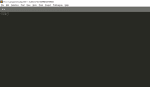

*   **转到工具:**转到工具选项并点击它。

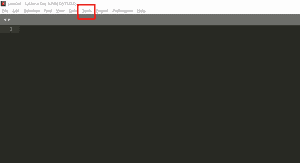

*   **转到开发人员选项:**转到开发人员选项，然后单击新建片段。一个文件将会用一些预先写好的代码打开。

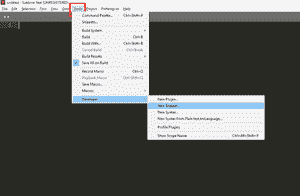

*   **编辑文件:**点击“新建片段”后会打开一个文件。现在，从这个打开的文件中删除如下所示的注释。

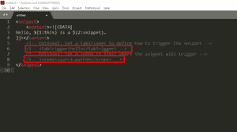

*   **添加代码:**现在，删除一些预先编写的代码，并在其中编写自己的代码。

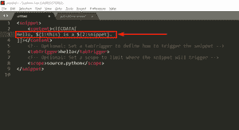

*   **比如**，你可以在上面的窗口写任意代码。下图说明了这一点:

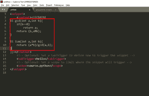

*   **设置 TabTrigger:** 它显示任何人想要用于此代码的关键字。当该关键字被触发时，在上述步骤中被改变的默认代码将出现在那里。因此，首先删除预先写好关键字:

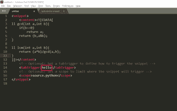

*   为这段代码写一个关键字。在我的例子中，关键字是 gcd():

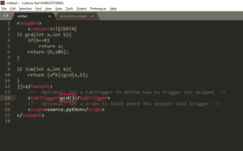

*   **设置范围:**现在，设置范围，即使用哪个语言的这个片段。要设置范围，首先删除预先写入的范围:

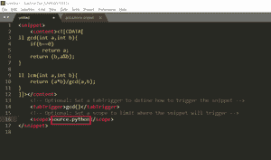

*   写下任何人想要使用这个片段的范围。在下面的情况下，范围是 [C++ ](https://www.geeksforgeeks.org/c-plus-plus/) :

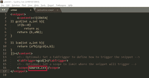

*   **保存片段:**现在，保存扩展名为**的片段。崇高-片段:**

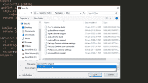

*   这个片段已经可以使用了。
*   现在打开文件，键入代码片段的关键字。在我的例子中，它是 gcd()，所以只需写 gcd 并输入:

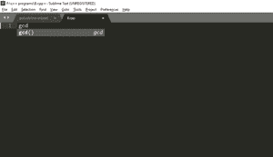

*   我们的代码在这里:

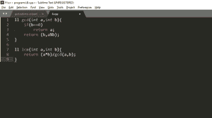