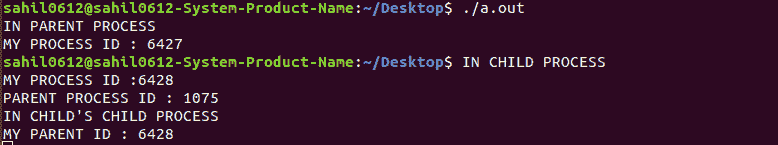

# 如何在单个程序中执行僵尸和孤儿进程？

> 原文:[https://www . geesforgeks . org/如何在单个程序中执行僵尸和孤儿进程/](https://www.geeksforgeeks.org/how-to-execute-zombie-and-orphan-process-in-a-single-program/)

**先决条件:**[C](https://www.geeksforgeeks.org/zombie-and-orphan-processes-in-c/)中的僵尸和孤儿进程

**僵尸进程:**
僵尸进程是指已经完成执行，但在进程表中仍有条目的进程。仍然需要这个条目来允许父进程读取其子进程的退出状态。
终止的进程在其父进程接受其返回代码之前不能离开系统。如果它的父进程已经死了，它将已经被“init”进程采用，该进程总是接受其子进程的返回代码。但是，如果一个进程的父进程是活动的，但从未执行过等待( )，那么该进程的返回代码将永远不会被接受，并且该进程将保持僵尸状态。

**孤儿进程:**
孤儿进程是一个仍在执行，但其父进程已经死亡的进程。它们不会变成僵尸进程；相反，它们被 init(进程 ID 1)采用，init 等待它的子进程。
当父母先于孩子死亡时，孩子自动被 PID 为 1 的原“init”进程收养。

**方法:**
在下面的代码中，我们做了一个场景，有一个家长，它有一个孩子，那个孩子也有一个孩子，首先如果我们的进程进入子进程，我们让我们的系统休眠 5 秒钟，这样我们就可以结束父进程，这样它的孩子就会变成孤儿，然后我们把孩子的孩子变成僵尸进程， 子代的子代在父代(即子代)睡眠 1 秒时完成执行，因此子代的子代不会调用终止，它的条目仍然存在于进程表中。

下面是上述方法的实现:

```cpp
// C program to execute zombie and
// orphan process in a single program
#include <stdio.h>
int main()
{

    int x;
    x = fork();

    if (x > 0)
        printf("IN PARENT PROCESS\nMY PROCESS ID 
                              : %d\n", getpid());

    else if (x == 0) {
        sleep(5);
        x = fork();

        if (x > 0) {
   printf("IN CHILD PROCESS\nMY PROCESS ID :%d\n
           PARENT PROCESS ID : %d\n", getpid(), getppid());

   while(1)
     sleep(1);

   printf("IN CHILD PROCESS\nMY PARENT PROCESS ID 
                               : %d\n", getppid());
        }

        else if (x == 0)
            printf("IN CHILD'S CHILD PROCESS\n
                  MY PARENT ID : %d\n", getppid());
    }

    return 0;
}
```

**输出:**

**注意:**由于 fork()被禁用，上述代码可能无法与在线编译器一起工作。