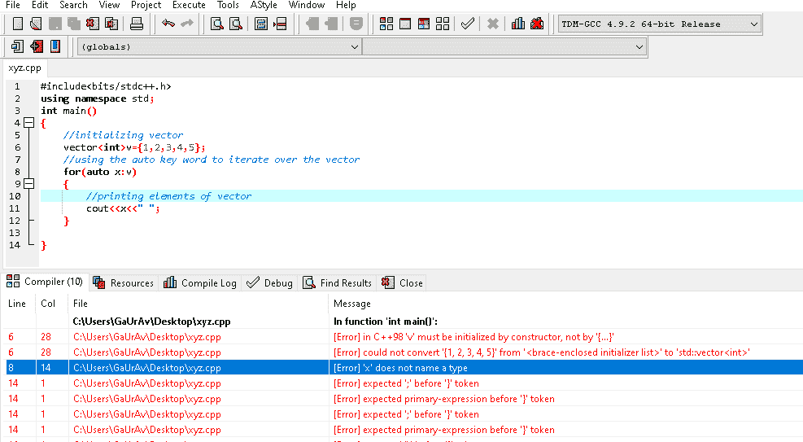
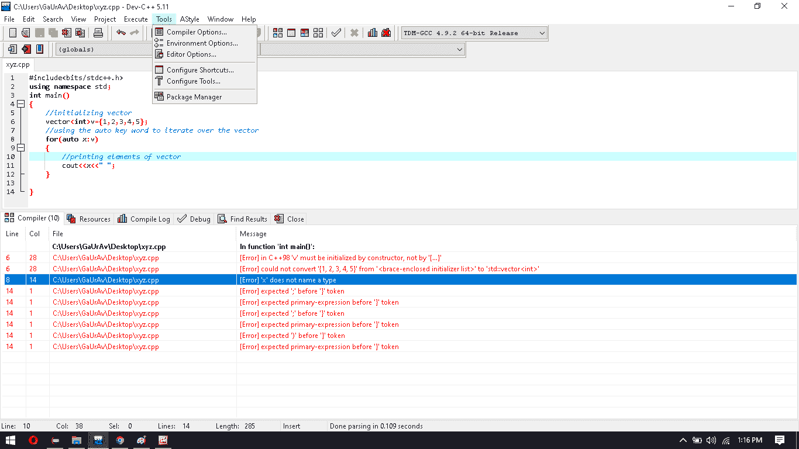
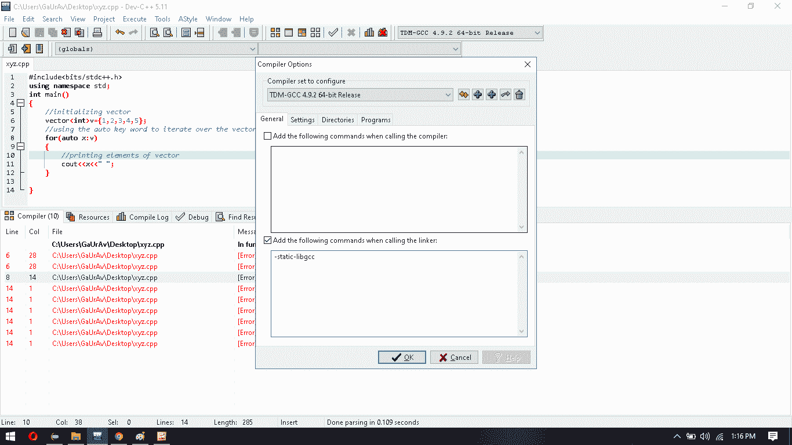
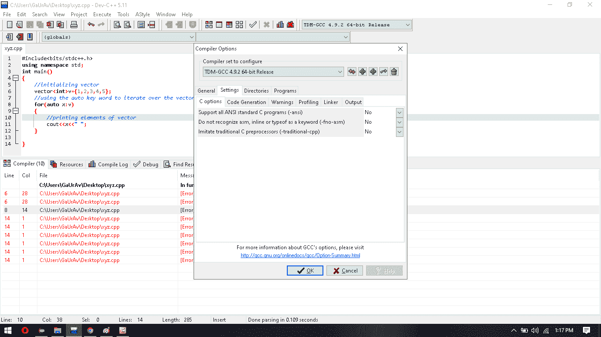
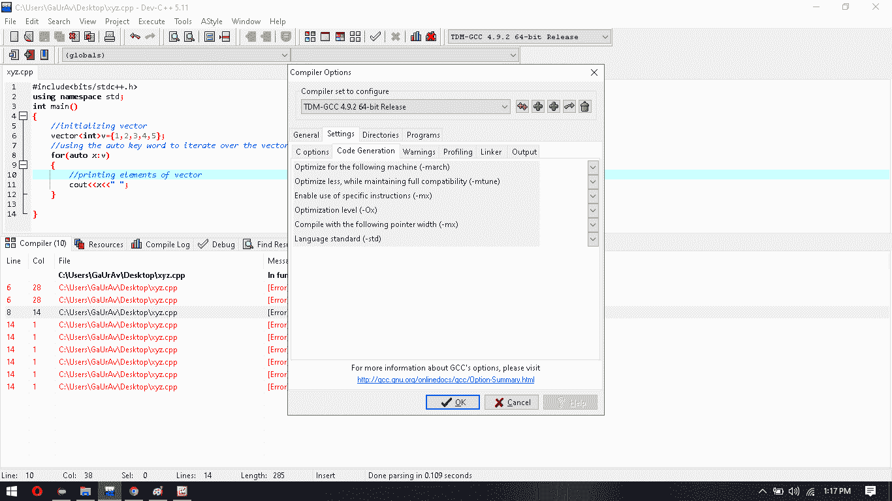

# 如何修复 Dev-C++ 中的 auto 关键字错误

> 原文:[https://www . geesforgeks . org/how-fix-auto-keyword-error-in-dev-CPP/](https://www.geeksforgeeks.org/how-to-fix-auto-keyword-error-in-dev-cpp/)

C++ 中的 [auto 关键字](https://www.geeksforgeeks.org/type-inference-in-c-auto-and-decltype/)指定正在声明的变量的类型将自动从其初始值中扣除。在函数的情况下，如果它们的返回类型是自动的，那么它将在运行时由返回类型表达式来计算。

```cpp
// C++ program to illustrate the auto
// keyword in DevC++ compiler
#include <bits/stdc++.h>
using namespace std;

// Driver Code
int main()
{
    // Initialize vector
    vector<int> v = { 1, 2, 3, 4, 5 };

    // Traverse vector using auto
    for (auto x : v) {

        // Print elements of vector
        cout << x << " ";
    }
}
```

**Output:**

```cpp
1 2 3 4 5

```

### 相同的代码会在 Dev-C++ 中产生错误:

如果您想使用 auto 关键字遍历一个向量(如上面的代码所示)，那么它将显示如下错误:

[](https://media.geeksforgeeks.org/wp-content/uploads/20200706131111/error13.png)

### 为什么在 Dev-C++ 中会出现这个错误:

[C++ 11](https://www.geeksforgeeks.org/c-tricks-competitive-programming-c-11/) 中引入了 auto [关键字](https://www.geeksforgeeks.org/variables-and-keywords-in-c/)，允许用户将类型演绎留给编译器自己。但是当在 Dev-C++ 中运行一个程序时，它会显示错误，因为在 Dev-C++ 中内置了 C++ 98 编译器，所以那个错误就发生了。

### 如何修复此错误:

以下是解决错误的步骤:

1.  打开 Dev C++ 转到->工具。
    [](https://media.geeksforgeeks.org/wp-content/uploads/20200706132047/Screenshot-956.png)
2.  单击->编译器选项(第一个选项)。
    [](https://media.geeksforgeeks.org/wp-content/uploads/20200706132148/Screenshot-965.png)
3.  将会打开一个新窗口，在该窗口中点击->设置:
    [](https://media.geeksforgeeks.org/wp-content/uploads/20200706132246/Screenshot-978.png)
4.  转到->代码生成:
    [](https://media.geeksforgeeks.org/wp-content/uploads/20200706132324/Screenshot-9810.png)
5.  在语言标准栏(std)中选择->ISO C++ 11:
    [](https://media.geeksforgeeks.org/wp-content/uploads/20200706132415/Screenshot-9910.png)
6.  单击确定，然后代码将执行，不会出现错误。

现在代码运行良好，并输出了预期的输出。