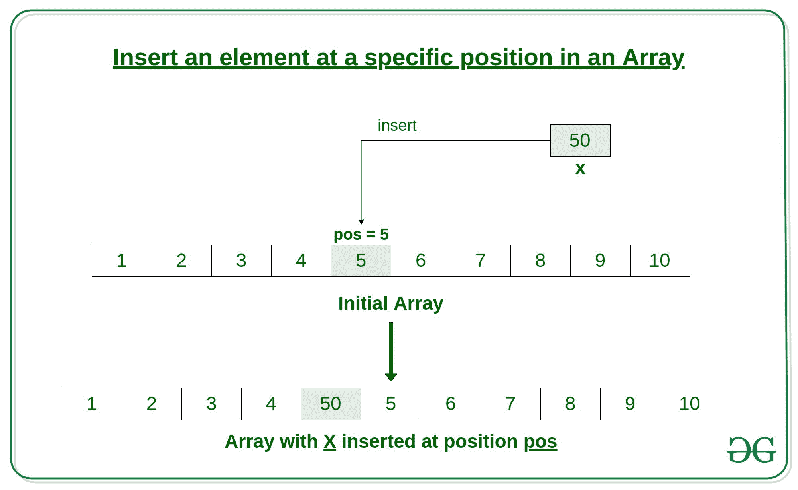

# 如何在 C++中在数组的特定位置插入元素

> 原文:[https://www . geesforgeks . org/如何在 c 数组中特定位置插入元素/](https://www.geeksforgeeks.org/how-to-insert-an-element-at-a-specific-position-in-an-array-in-c/)

[数组](https://www.geeksforgeeks.org/arrays-in-c-cpp/)是存储在连续存储位置的项目的集合。在本文中，我们将看到**如何在 C++** 中的数组中插入一个元素。

给定一个大小为 **n** 的数组 **arr** ，本文讲述如何在这个数组 **arr** 中的特定位置 **pos** 插入一个元素 **x** 。

[](https://media.geeksforgeeks.org/wp-content/uploads/20190826133603/Insert-an-element-at-a-specific-position-in-an-Array.jpg)

**进场:**
下面是怎么做的。

1.  首先获取要插入的元素，比如 x
2.  然后得到这个元素要插入的位置，比如 pos
3.  然后将数组元素从这个位置向前移动一个位置，并对 pos 旁边的所有其他元素执行此操作。
4.  现在在位置位置插入元素 x，因为这个位置现在是空的。

下面是上述方法的实现:

```cpp
// C++ Program to Insert an element
// at a specific position in an Array

#include <iostream>
using namespace std;

// Function to insert x in arr at position pos
int* insertX(int n, int arr[],
             int x, int pos)
{
    int i;

    // increase the size by 1
    n++;

    // shift elements forward
    for (i = n; i >= pos; i--)
        arr[i] = arr[i - 1];

    // insert x at pos
    arr[pos - 1] = x;

    return arr;
}

// Driver Code
int main()
{
    int arr[100] = { 0 };
    int i, x, pos, n = 10;

    // initial array of size 10
    for (i = 0; i < 10; i++)
        arr[i] = i + 1;

    // print the original array
    for (i = 0; i < n; i++)
        cout << arr[i] << " ";
    cout << endl;

    // element to be inserted
    x = 50;

    // position at which element is to be inserted
    pos = 5;

    // Insert x at pos
    insertX(n, arr, x, pos);

    // print the updated array
    for (i = 0; i < n + 1; i++)
        cout << arr[i] << " ";
    cout << endl;

    return 0;
}
```

**Output:**

```cpp
1 2 3 4 5 6 7 8 9 10 
1 2 3 4 50 5 6 7 8 9 10

```