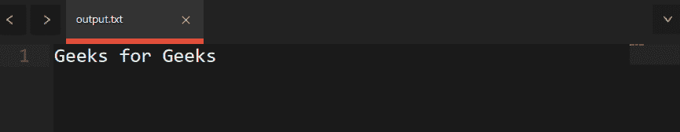

# 如何在 C++中迭代 std::tuple 的元素

> 原文:[https://www . geeksforgeeks . org/如何迭代 c 语言中的元素/](https://www.geeksforgeeks.org/how-to-iterate-over-the-elements-of-an-stdtuple-in-c/)

一个 [C++元组](https://www.geeksforgeeks.org/tuples-in-c/)是一个可以在其中存储多种类型的多个值的容器。我们可以使用 **std::get()** 来访问元组的元素，但是 **std::get()** 总是采用一个常量变量参数，所以我们不能简单地使用循环来迭代它。对于需要遍历元组所有元素的任务。比如打印所有元素。

下面是说明元素元组迭代的程序:

## CPP14

```
// C++ program to iterate over the
// elements of an std::tuple
// using std:get()
#include <iostream>
#include <string>
#include <tuple>

// Driver Code
int main()
{
    // Declare a tuple and initialize
    // it using its constructor
    std::tuple<std::string, std::string,
               std::string>
        tup("Geeks", "for", "Geeks");
    std::cout << "Values of tuple: ";

    // std::get is used to access
    // the value of tuple.
    std::cout << std::get<0>(tup)
              << " " << std::get<1>(tup)
              << " " << std::get<2>(tup)
              << std::endl;

    // Make the tuple using
    // std::make_tuple function
    tup = std::make_tuple("Hey", "Welcome to",
                          "Geeksforgeeks");

    // Print tuple
    std::cout << "Values of tuple(Modified): ";
    std::cout << std::get<0>(tup) << " "
              << std::get<1>(tup) << " "
              << std::get<2>(tup)
              << std::endl;

    return 0;
}
```

**Output:** 

```
Values of tuple: Geeks for Geeks
Values of tuple(Modified): Hey Welcome to Geeksforgeeks
```

当我们试图遍历整个元组时，问题就出现了。因此，我们这里有两种方法，迭代元组的值:

1.  使用变量模板和元编程(不使用 std::apply)。
2.  使用变量模板和标准::应用。

**<u>使用</u>** [**<u>可变模板</u>**](https://www.geeksforgeeks.org/variadic-function-templates-c/) **<u>和</u>** [**<u>模板</u>**](https://www.geeksforgeeks.org/templates-cpp/) **:**

变量模板用于传递打包在一个模板参数中的多个参数，这些参数可以稍后在函数中扩展。下面是我们如何遍历元组的所有元素。
下面是同样的实现:

## 卡片打印处理机（Card Print Processor 的缩写）

```
// C++ program to  iterated thorough
// all values. I equals number
// of values in tuple
#include <iostream>
#include <string>
#include <tuple>

using namespace std;

// Function to iterate through all values
// I equals number of values in tuple
template <size_t I = 0, typename... Ts>
typename enable_if<I == sizeof...(Ts),
                   void>::type
printTuple(tuple<Ts...> tup)
{
    // If iterated through all values
    // of tuple, then simply return.
    return;
}

template <size_t I = 0, typename... Ts>
typename enable_if<(I < sizeof...(Ts)),
                   void>::type
printTuple(tuple<Ts...> tup)
{

    // Print element of tuple
    cout << get<I>(tup) << " ";

    // Go to next element
    printTuple<I + 1>(tup);
}

// Driver Code
int main()
{
    // Creating the tuple
    tuple<string, string, string> tup("Geeks",
                                      "for",
                                      "Geeks");

    // Function call
    printTuple(tup);
    return 0;
}
```

**Output:** 

```
Geeks for Geeks
```

使用 [constexpr()函数](https://www.geeksforgeeks.org/understanding-constexper-specifier-in-c/)和 if constexpr 表达式，这种情况得到了极大的简化，但这些表达式只能从 C++17 开始使用。我也是简化代码，你可以在 C++17 中运行。

以下是上述方法的实现:

## 卡片打印处理机（Card Print Processor 的缩写）

```
// C++ program to  iterated thorough
// all values. I equals number
// of values in tuple
#include <iostream>
#include <string>
#include <tuple>

using namespace std;

// WARNING: C++17 or above required
template <size_t I = 0, typename... Ts>
contexpr void printTuple(tuple<Ts...> tup)
{
    // If we have iterated through all elements
    if
        constexpr(I == sizeof...(Ts))
        {
            // Last case, if nothing is left to
            // iterate, then exit the function
            return;
        }
    else {
        // Print the tuple and go to next element
        cout << get<I>(tup) << " ";

        // Going for next element.
        printTuple<I + 1>(tup);
    }
}

// Driver Code
int main()
{
    // Initialize the tuple
    tuple<string, string, string> tup("Geeks",
                                      "for",
                                      "Geeks");

    // Function call
    printTuple(tup);

    return 0;
}
```

**输出:**
下面是上面代码的输出:



**说明:**

**std::get()** 的要求是常量指标，没有变量。我们总是可以为模板函数指定一个常数，这里的“I”是函数的常数。因此，我们将有 n+1 个实例化的 **print_num()** 函数，其中 n 是元组的大小，每个元组都有“I”作为自身的常数。所以这些函数的实例化就像 print_tuple，print_tuple，…，和 print_tuple，所有这些函数都将被依次调用。这是 [**模板元编程**](https://www.geeksforgeeks.org/template-metaprogramming-in-c/)

**注意:**所以，不能在 Geeksforgeeks IDE 上运行上述代码，需要在另一个编译器上运行。如果您想使用 C++14 或 C++11，您可以使用第一种方法。元组和模板只能从 C++11 中获得，因此不能使用旧版本。

**<u>使用变量模板和标准::应用()</u> :**

1.  首先，简单介绍一下 **std::get()** 是什么。 **std::get()** 在元组的元素上实现一些函数，将元组的元素视为该函数的值。它需要一个函数 f(x，y，z…)和一个元组(x，y，z…)作为函数的参数，并返回 f 返回的值。
2.  还有一点，关于变量展开，如果我们需要在变量模板的所有值上应用某个函数，那么我们就像 foo(Ts)…，其中 Ts 是我们的变量模板，而 foo()是需要在 Ts 中打包的所有值上应用的函数。这里，函数“…”后面的三个点表示该函数应用于变量模板的扩展。
3.  [Lambda 函数](https://www.geeksforgeeks.org/lambda-expression-in-c/)是匿名函数，可以轻松声明和应用。它们的实现方式如下:

```
[&a, b, c] (int x, float &y) {

     // Function Body
}
```

1.  这里 x 和 y 是函数的参数，其中 x 通过值传递，y 通过引用传递。x、y 和 z 是变量，出于某种目的将在函数内部使用，因此它们被馈送给函数，这意味着它们将在函数范围内可用。
    下面是同样的实现:

## 卡片打印处理机（Card Print Processor 的缩写）

```
// C++ program to  iterated thorough
// all values. I equals number
// of values in tuple
#include <iostream>
#include <string>
#include <tuple>

template <typename... Ts>
void printTuple(std::tuple<Ts...> tup)
{

    // Getting size of tuple
    std::size_t length = sizeof...(Ts);

    // Using std::apply to print elements
    std::apply(

        // A lambda function
        [length](auto const&... ps) {
            std::cout << "[ ";
            int k = 0;

            // Variadic expansion used.
            ((std::cout << ps
                        << (++k == length ? "" : "; ")),
             ...);

            std::cout << " ]";
        },
        tuple);
}

// Driver Code
int main()
{
    // Initialize the tuple
    std::tuple<std::string,
               std::string, std::string>
        tup("Geeks", "for", "geeks");

    // Function call
    printTuple(tup);
    return 0;
}
```

1.  **输出:**
    下面是上面代码的输出:


**注意:** **std::apply()** 仅在 C++17 中提供。所以，你不能在 Geeksforgeeks IDE 上运行这段代码，你需要在另一个编译器上运行它。如果您想使用 C++14 或 C++11，您可以使用第一种方法。元组和模板只能从 C++11 中获得，因此不能使用旧版本。