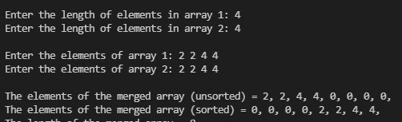

# 如何在 C++中使用 STL 连接两个向量？

> 原文:[https://www . geesforgeks . org/如何使用-stl-in-c/](https://www.geeksforgeeks.org/how-to-join-two-vectors-using-stl-in-c/) 连接两个向量

给定两个向量，用 C++中的 STL 连接这两个向量。
**例:**

> **输入:**
> vec1 = {1，45，54，71，76，12}，
> vec2 = {1，7，5，4，6，12}
> **输出:** {1，4，5，6，7，12，45，54，71，76}
> **输入:**
> vec1 = {1，7，5，4，6，12}，
> vec1

**方法:**连接可以借助 STL 中提供的 set_union()函数来完成。
**语法:**

```
set_union (InputIterator1 first1, InputIterator1 last1,
           InputIterator2 first2, InputIterator2 last2,
           OutputIterator result);
```

## 卡片打印处理机（Card Print Processor 的缩写）

```
// C++ program to join two Vectors
// using set_union() in STL

#include <bits/stdc++.h>
using namespace std;

int main()
{
    // Get the vector
    vector<int> vector1 = { 1, 45, 54, 71, 76, 12 };
    vector<int> vector2 = { 1, 7, 5, 4, 6, 12 };

    // Sort the vector
    sort(vector1.begin(), vector1.end());
    sort(vector2.begin(), vector2.end());

    // Print the vector
    cout << "First Vector: ";
    for (int i = 0; i < vector1.size(); i++)
        cout << vector1[i] << " ";
    cout << endl;

    cout << "Second Vector: ";
    for (int i = 0; i < vector2.size(); i++)
        cout << vector2[i] << " ";
    cout << endl;

    // Initialise a vector
    // to store the common values
    // and an iterator
    // to traverse this vector
    vector<int> v(vector1.size() + vector2.size());
    vector<int>::iterator it, st;

    it = set_union(vector1.begin(),
                   vector1.end(),
                   vector2.begin(),
                   vector2.end(),
                   v.begin());

    cout << "\nAfter joining:\n";
    for (st = v.begin(); st != it; ++st)
        cout << *st << ", ";
    cout << '\n';

    return 0;
}
```

**Output:** 

```
First Vector: 1 12 45 54 71 76 
Second Vector: 1 4 5 6 7 12 

After joining:
1, 4, 5, 6, 7, 12, 45, 54, 71, 76,
```

请注意，向量不应两次包含 1 个元素:



如果您输入相同的元素，set_union 函数将只考虑元素的一个实例，默认情况下其余为 0。