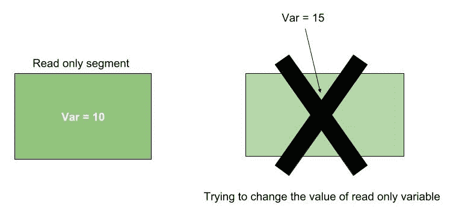
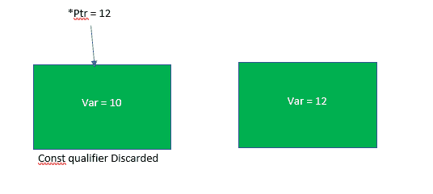

# 如何修改 C 中的一个常量变量？

> 原文:[https://www . geesforgeks . org/如何修改-a-const-variable-in-c/](https://www.geeksforgeeks.org/how-to-modify-a-const-variable-in-c/)

每当我们使用带有变量名的 [**const 限定符**](https://www.geeksforgeeks.org/const-qualifier-in-c/) 时，它就变成了一个只读变量并被存储在。rodata 部分。任何修改此只读变量的尝试都会导致编译错误:“分配只读变量”。



在下面的程序中，试图修改使用 const 限定符声明的只读变量:

```
#include<stdio.h>
int main()
{
    const int var = 10;
    var = 15;
    printf("var = %d\n", var);
    return 0;
}
```

**输出**:

```
prog.c: In function 'main':
prog.c:5:9: error: assignment of read-only variable 'var'

```

**通过指针**改变常量变量的值

使用 const 关键字声明的变量存储在。但是我们仍然可以通过指针访问变量并更改该变量的值。通过将变量的地址分配给非常数指针，我们将常数变量转换为非常数指针。在类型转换时，编译器将给出警告，并将放弃 const 限定符。编译器优化对于变量和指针是不同的。这就是为什么我们能够通过一个非常量指针来改变常量变量的值。


下面的程序说明了这一点:

```
//Write C code here
#include<stdio.h>
#include<stdlib.h>
int main()
{
    const int var = 10;

    int *ptr = &var;
    *ptr = 12;

    printf("var = %d\n", var);

    return 0;
}
```

**输出**:

```
prog.c: In function 'main':
prog.c:6:16: warning: initialization discards 'const' qualifier 
from pointer target type [-Wdiscarded-qualifiers]
     int *ptr = &var;
var = 12

```

**注意**:如果我们试图通过常量指针改变值，那么我们会得到一个错误，因为我们试图改变只读段。