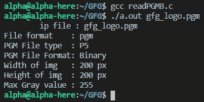

# 如何在 C

中读取 PGMB 格式的图像

> 原文:[https://www . geesforgeks . org/how-read-a-pgmb-format-image-in-c/](https://www.geeksforgeeks.org/how-to-read-a-pgmb-format-image-in-c/)

[PGM](https://www.geeksforgeeks.org/c-program-to-write-an-image-in-pgm-format/) 或便携式灰度地图文件是一个[灰度图像](https://www.geeksforgeeks.org/matlab-display-histogram-of-a-grayscale-image/)，其中每个像素用 1 或 2 字节编码。它以矩阵形式包含标题信息和像素灰度值。

**方法:**读取 PGMB 格式图像的思路如下:

*   打开一个 PGMB(二进制格式的 PGM 图像)。
*   提取像素信息，然后用于进一步处理。
*   标题信息以 ASCII 格式存储，可以使用任何文本编辑器读取，但像素信息以二进制格式存储，文本编辑器会将其显示为一些乱码文本。

下面是 pgm 图像示例。

[ ](https://media.geeksforgeeks.org/wp-content/uploads/20201219090246/gfg200x200min.png) 

**<u>表头信息</u> :**

*   **识别文件类型的神奇数字**:
    *   二进制 PGM 文件(PGMB):“P5”
    *   ASCII PGM 文件:“P2”
*   **ASCII 十进制格式的宽度**
*   **高度**ASCII 十进制格式
*   **最大灰度值**，ASCII 十进制格式，介于 0-255 之间
*   可以包含注释，以“#”开头
*   全部用空格分隔(空格、制表符、CRs、LFs)

gfg_logo.pgm 中的标题信息:

```cpp
P5
# sample PGMB image
# gfg_logo.pgm
200 200
255
```

在标题信息之后，有一个尺寸高度*重量的网格，包含二进制格式图像的灰度像素值。

**<u>读取 PGMB 图像</u> :**

*   在读取二进制 **rb 模式**下打开图像。
*   检查是否有任何注释，并忽略它们。
*   阅读**幻数**。
*   阅读任何注释/空行/空白。
*   读取由空格分隔的宽度和高度。
*   读取任何空白/注释前后的最大灰度值。
*   读取像素值的网格**(宽*高)**，中间用空格隔开。

以下是上述方法的程序:

## C

```cpp
// C Program to read a PGMB image
// and print its parameters
#include <ctype.h>
#include <stdbool.h>
#include <stdio.h>
#include <stdlib.h>
#include <string.h>

// Structure for storing the
// image data
typedef struct PGMImage {
    char pgmType[3];
    unsigned char** data;
    unsigned int width;
    unsigned int height;
    unsigned int maxValue;
} PGMImage;

// Function to ignore any comments
// in file
void ignoreComments(FILE* fp)
{
    int ch;
    char line[100];

    // Ignore any blank lines
    while ((ch = fgetc(fp)) != EOF
           && isspace(ch))
        ;

    // Recursively ignore comments
    // in a PGM image commented lines
    // start with a '#'
    if (ch == '#') {
        fgets(line, sizeof(line), fp);
        ignoreComments(fp);
    }
    else
        fseek(fp, -1, SEEK_CUR);
}

// Function to open the input a PGM
// file and process it
bool openPGM(PGMImage* pgm,
             const char* filename)
{
    // Open the image file in the
    // 'read binary' mode
    FILE* pgmfile
        = fopen(filename, "rb");

    // If file does not exist,
    // then return
    if (pgmfile == NULL) {
        printf("File does not exist\n");
        return false;
    }

    ignoreComments(pgmfile);
    fscanf(pgmfile, "%s",
           pgm->pgmType);

    // Check for correct PGM Binary
    // file type
    if (strcmp(pgm->pgmType, "P5")) {
        fprintf(stderr,
                "Wrong file type!\n");
        exit(EXIT_FAILURE);
    }

    ignoreComments(pgmfile);

    // Read the image dimensions
    fscanf(pgmfile, "%d %d",
           &(pgm->width),
           &(pgm->height));

    ignoreComments(pgmfile);

    // Read maximum gray value
    fscanf(pgmfile, "%d", &(pgm->maxValue));
    ignoreComments(pgmfile);

    // Allocating memory to store
    // img info in defined struct
    pgm->data
        = malloc(pgm->height
                 * sizeof(unsigned char*));

    // Storing the pixel info in
    // the struct
    if (pgm->pgmType[1] == '5') {

        fgetc(pgmfile);

        for (int i = 0;
             i < pgm->height; i++) {
            pgm->data[i]
                = malloc(pgm->width
                         * sizeof(unsigned char));

            // If memory allocation
            // is failed
            if (pgm->data[i] == NULL) {
                fprintf(stderr,
                        "malloc failed\n");
                exit(1);
            }

            // Read the gray values and
            // write on allocated memory
            fread(pgm->data[i],
                  sizeof(unsigned char),
                  pgm->width, pgmfile);
        }
    }

    // Close the file
    fclose(pgmfile);

    return true;
}

// Function to print the file details
void printImageDetails(PGMImage* pgm,
                       const char* filename)
{
    FILE* pgmfile = fopen(filename, "rb");

    // Retrieving the file extension
    char* ext = strrchr(filename, '.');

    if (!ext)
        printf("No extension found"
               "in file %s",
               filename);
    else
        printf("File format"
               "    : %s\n",
               ext + 1);

    printf("PGM File type  : %s\n",
           pgm->pgmType);

    // Print type of PGM file, in ascii
    // and binary format
    if (!strcmp(pgm->pgmType, "P2"))
        printf("PGM File Format:"
               "ASCII\n");
    else if (!strcmp(pgm->pgmType,
                     "P5"))
        printf("PGM File Format:"
               " Binary\n");

    printf("Width of img   : %d px\n",
           pgm->width);
    printf("Height of img  : %d px\n",
           pgm->height);
    printf("Max Gray value : %d\n",
           pgm->maxValue);

    // close file
    fclose(pgmfile);
}

// Driver Code
int main(int argc, char const* argv[])
{
    PGMImage* pgm = malloc(sizeof(PGMImage));
    const char* ipfile;

    if (argc == 2)
        ipfile = argv[1];
    else
        ipfile = "gfg_logo.pgm";

    printf("\tip file : %s\n", ipfile);

    // Process the image and print
    // its details
    if (openPGM(pgm, ipfile))
        printImageDetails(pgm, ipfile);

    return 0;
}
```

**输出:**



解释:

*   创建一个存储 PGMB 图像细节的结构，并为其分配内存。
*   将文件名输入作为命令行参数，或者在程序中硬编码。
*   *openPGM()* 函数处理输入的图像文件，并获取输入的内存指针和文件名。
*   *ignorepits()*函数用于跳过文件中的任何注释。注释通常出现在标题部分，因此，我们会在读取每个属性后检查它们。
*   在 *openPGM()* 功能中，读取文件头信息，即。文件类型、高度、重量等如上所述。
*   然后根据图像的高度分配内存，对于每行，根据图像的宽度分配内存。
*   *fread()* 方法读取灰度值，并将其存储在为 *pgm* 结构的 2d 字符矩阵分配的内存中。
*   *printImageDetails()* 用于打印从 PGMB 图像文件中检索到的值。