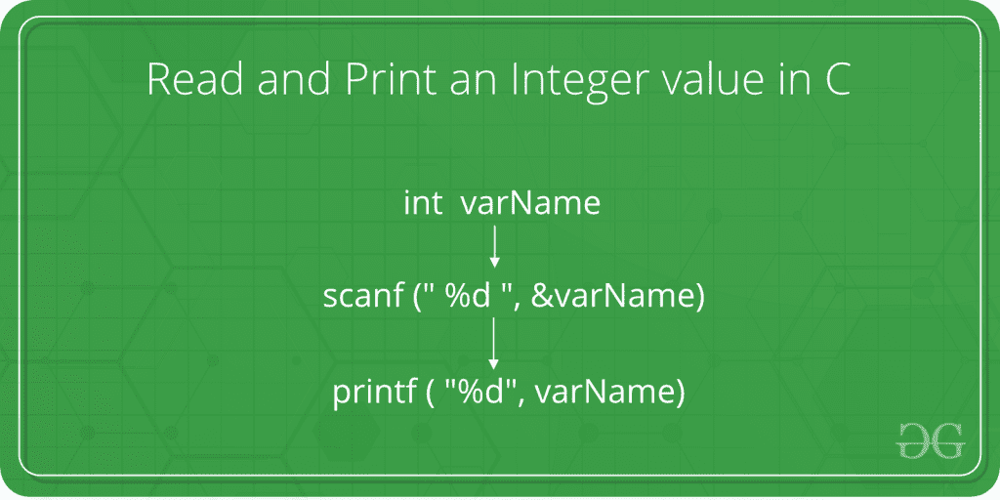

# 如何读取和打印 C 中的整数值

> 原文:[https://www . geesforgeks . org/如何读取和打印 c-2 中的整数值/](https://www.geeksforgeeks.org/how-to-read-and-print-an-integer-value-in-c-2/)

给定的任务是从用户那里获取一个整数作为输入，并用 C 语言打印该整数。



在下面的程序中，用 C 语言显示了从用户输入整数的语法和过程。

**步骤:**

1.  当被询问时，用户输入整数值。
2.  This value is taken from the user with the help of **scanf()** method. The scanf() method, in C, reads the value from the console as per the type specified.

    **语法:**

    ```cpp
    scanf("%X", &variableOfXType);

    where %X is the format specifier in C
    It is a way to tell the compiler 
    what type of data is in a variable 

    and

    & is the address operator in C,
    which tells the compiler to change the 
    real value of this variable, stored at this 
    address in the memory.

    ```

3.  For an integer value, the X is replaced with type int. The syntax of scanf() method becomes as follows then:

    **语法:**

    ```cpp
    scanf("%d", &variableOfIntType);

    ```

4.  该输入值现在存储在**变量类型**中。
5.  Now to print this value, **printf()** method is used. The printf() method, in C, prints the value passed as the parameter to it, on the console screen.

    **语法:**

    ```cpp
    printf("%X", variableOfXType);

    ```

6.  For an integer value, the X is replaced with type int. The syntax of printf() method becomes as follows then:

    **语法:**

    ```cpp
    printf("%d", variableOfIntType);

    ```

7.  因此，整数值被成功读取和打印。

**程序:**

## C

```cpp
// C program to take an integer
// as input and print it

#include <stdio.h>

int main()
{

    // Declare the variables
    int num;

    // Input the integer
    printf("Enter the integer: ");
    scanf("%d", &num);

    // Display the integer
    printf("Entered integer is: %d", num);

    return 0;
}
```

**输出:**

```cpp
Enter the integer: 10
Entered integer is: 10

```