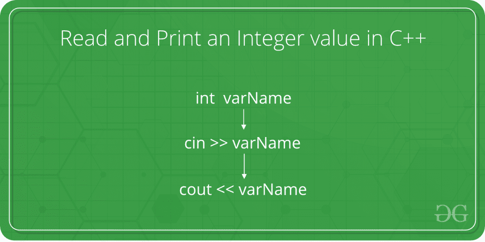

# 如何在 C++ 中读取和打印整数值

> 原文:[https://www . geesforgeks . org/如何读取和打印 c 中的整数值/](https://www.geeksforgeeks.org/how-to-read-and-print-an-integer-value-in-c/)

给定的任务是从用户那里获取一个整数作为输入，并用 C++ 语言打印该整数。



在下面的程序中，以 C++ 语言显示了从用户那里获取整数作为输入的语法和过程。

**步骤:**

1.  当被询问时，用户输入整数值。
2.  This value is taken from the user with the help of **cin** method. The cin method, in C++, reads the value from the console into the specified variable.

    **语法:**

    ```cpp
    cin >> variableOfXType;

    where >> is the extraction operator
    and is used along with the object cin
    for reading inputs. The extraction operator 
    extracts the data from the object cin
    which is entered using the keyboard.

    ```

3.  For an integer value, the X is replaced with type int. The syntax of cin method becomes as follows then:

    **语法:**

    ```cpp
    cin >> variableOfIntType;

    ```

4.  该输入值现在存储在**变量类型**中。
5.  Now to print this value, **cout** method is used. The cout method, in C++, prints the value passed as the parameter to it, on the console screen.

    **语法:**

    ```cpp
    cout << variableOfXType;

    where << is the insertion operator.
    The data needed to be displayed on the screen 
    is inserted in the standard output stream (cout)
    using the insertion operator (<
    ```

6.  For an integer value, the X is replaced with type int. The syntax of cout() method becomes as follows then:

    **语法:**

    ```cpp
    cout << variableOfIntType;

    ```

7.  因此，整数值被成功读取和打印。

**程序:**

## C++

```cpp
// C++ program to take an integer
// as input and print it

#include <iostream>
using namespace std;

int main()
{

    // Declare the variables
    int num;

    // Input the integer
    cout << "Enter the integer: ";
    cin >> num;

    // Display the integer
    cout << "Entered integer is: " << num;

    return 0;
}
```

**输出:**

```cpp
Enter the integer: 10
Entered integer is: 10

```