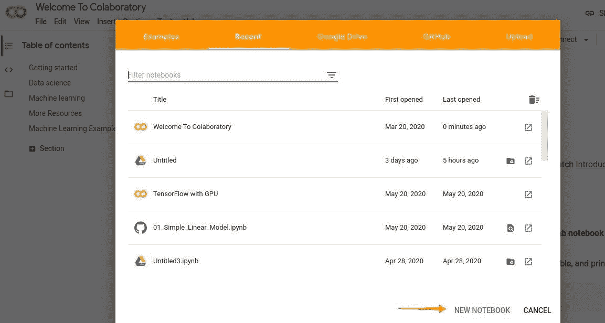
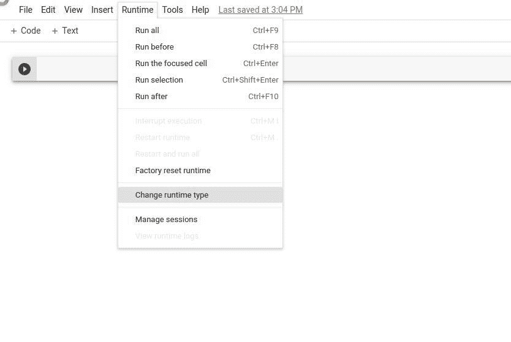
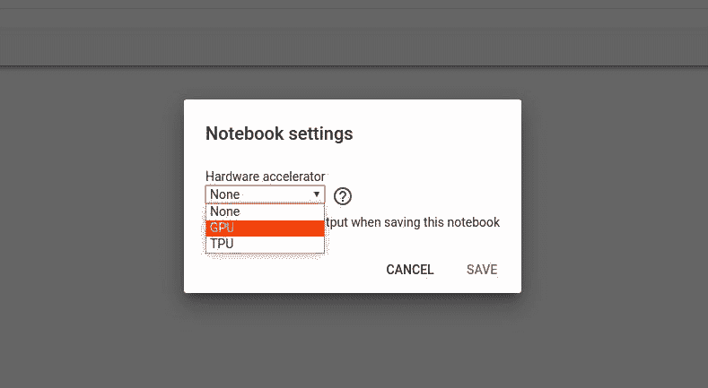

# 如何在谷歌协同实验室的 Jupyter 笔记本上运行 CUDA C/c++

> 原文:[https://www . geeksforgeeks . org/how-run-cuda-c-c-on-jupyter-notebook-in-Google-co laboratory/](https://www.geeksforgeeks.org/how-to-run-cuda-c-c-on-jupyter-notebook-in-google-colaboratory/)

**<font size="4px">什么是 CUDA？</font>**
CUDA 是英伟达为并行计算平台和应用编程接口创建的模型。CUDA 是英伟达的并行计算架构，通过利用图形处理器的能力，可以大幅提高计算性能。

**<font size="4px">什么是谷歌 Colab？</font>**
谷歌 Colab 是一款免费云服务，能够将 Colab 与其他免费云服务区分开来的最重要功能是；Colab 提供 GPU，完全免费！有了 Colab，你可以免费用 CUDA C/C++在 GPU 上工作！

CUDA 代码不会在 AMD CPU 或英特尔高清显卡上运行，除非您的机器内部有 NVIDIA 硬件。在 Colab 上，您可以利用英伟达图形处理器，以及预装 Tensorflow 和其他一些 ML/DL 工具的全功能 Jupyter 笔记本。

##### 我想，我介绍完了。让我们配置我们的学习环境。

### 第一步:在浏览器中进入[https://colab.research.google.com](https://colab.research.google.com)，点击新建笔记本。



### 第二步:我们需要将我们的运行时从中央处理器切换到图形处理器。单击运行时>更改运行时类型>硬件加速器>图形处理器>保存。





### 第三步:完全卸载任何以前的 CUDA 版本。我们需要刷新 CUDA 的云实例。

```cpp
!apt-get --purge remove cuda nvidia* libnvidia-*
!dpkg -l | grep cuda- | awk '{print $2}' | xargs -n1 dpkg --purge
!apt-get remove cuda-*
!apt autoremove
!apt-get update

```

在单独的代码块中编写代码并运行该代码。以“！”开头的每一行，它将作为命令行命令执行。

### 第四步:安装 CUDA 版本 9(你可以在单独的代码块中复制它)。

```cpp
!wget https://developer.nvidia.com/compute/cuda/9.2/Prod/local_installers/cuda-repo-ubuntu1604-9-2-local_9.2.88-1_amd64 -O cuda-repo-ubuntu1604-9-2-local_9.2.88-1_amd64.deb
!dpkg -i cuda-repo-ubuntu1604-9-2-local_9.2.88-1_amd64.deb
!apt-key add /var/cuda-repo-9-2-local/7fa2af80.pub
!apt-get update
!apt-get install cuda-9.2

```

### 步骤 5:现在您可以通过运行下面给出的命令来检查您的 CUDA 安装:

```cpp
!nvcc --version

```

输出将是这样的:

```cpp
vcc: NVIDIA (R) Cuda compiler driver
Copyright (c) 2005-2018 NVIDIA Corporation
Built on Wed_Apr_11_23:16:29_CDT_2018
Cuda compilation tools, release 9.2, V9.2.88

```

### 步骤 6:运行给定的命令，安装一个小的扩展，从笔记本单元格运行 nvcc。

```cpp
!pip install git+git://github.com/andreinechaev/nvcc4jupyter.git

```

### 步骤 7:使用下面给出的代码加载扩展:

```cpp
%load_ext nvcc_plugin

```

### 第八步:执行下面给出的代码，检查 CUDA 是否工作。

现在我们已经准备好在你的笔记本上运行 CUDA C/C++代码了。

> 重要注意事项:要检查以下代码是否正常工作，请将该代码编写在单独的代码块中，并仅在更新代码并重新运行时再次运行该代码。

要在笔记本中运行代码，请在代码开头添加%%cu 扩展名。

```cpp
% % cu
#include <iostream>
    int
    main()
{
    std::cout << "Welcome To GeeksforGeeks\n";
    return 0;
}
```

输出:

```cpp
Welcome To GeeksforGeeks
```

我建议你试试从向量中找出最大元素的程序，检查一切是否正常。

```cpp
% % cu
#include <cstdio>
#include <iostream>

    using namespace std;

__global__ void maxi(int* a, int* b, int n)
{
    int block = 256 * blockIdx.x;
    int max = 0;

    for (int i = block; i < min(256 + block, n); i++) {

        if (max < a[i]) {
            max = a[i];
        }
    }
    b[blockIdx.x] = max;
}

int main()
{

    int n;
    n = 3 >> 2;
    int a[n];

    for (int i = 0; i < n; i++) {
        a[i] = rand() % n;
        cout << a[i] << "\t";
    }

    cudaEvent_t start, end;
    int *ad, *bd;
    int size = n * sizeof(int);
    cudaMalloc(&ad, size);
    cudaMemcpy(ad, a, size, cudaMemcpyHostToDevice);
    int grids = ceil(n * 1.0f / 256.0f);
    cudaMalloc(&bd, grids * sizeof(int));

    dim3 grid(grids, 1);
    dim3 block(1, 1);

    cudaEventCreate(&start);
    cudaEventCreate(&end);
    cudaEventRecord(start);

    while (n > 1) {
        maxi<<<grids, block> > >(ad, bd, n);
        n = ceil(n * 1.0f / 256.0f);
        cudaMemcpy(ad, bd, n * sizeof(int), cudaMemcpyDeviceToDevice);
    }

    cudaEventRecord(end);
    cudaEventSynchronize(end);

    float time = 0;
    cudaEventElapsedTime(&time, start, end);

    int ans[2];
    cudaMemcpy(ans, ad, 4, cudaMemcpyDeviceToHost);

    cout << "The maximum element is : " << ans[0] << endl;

    cout << "The time required : ";
    cout << time << endl;
}
```

输出:

```cpp
The maximum element is : 1338278816
The time required : 0.003392

```

### 希望对某个人有帮助。