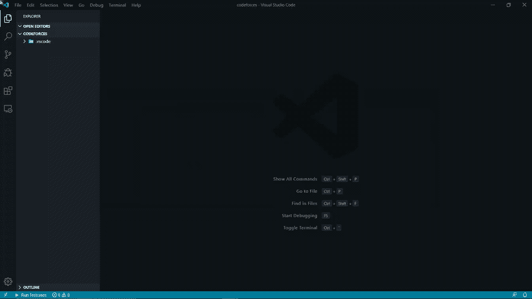
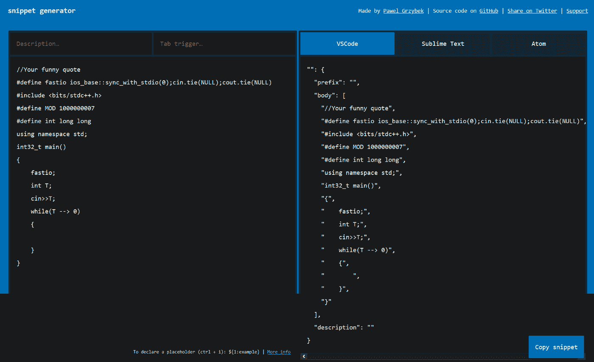
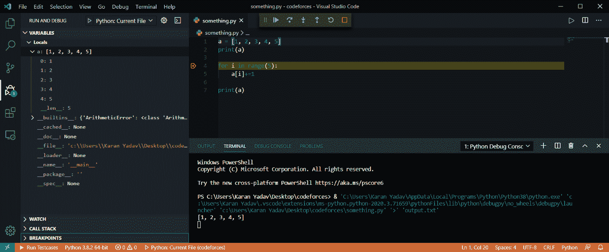
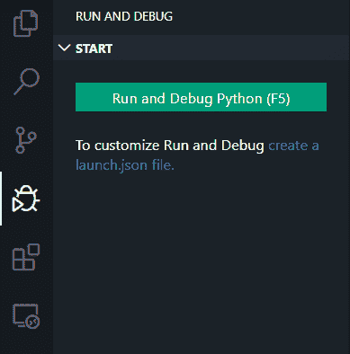
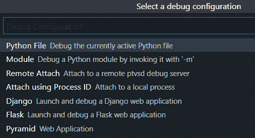
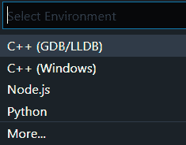
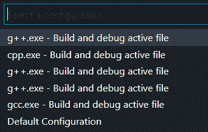

# 如何用 C、C++ 和 Python 设置 VSCode 进行竞技编程

> 原文:[https://www . geesforgeks . org/how-setup-vs code-with-c-c-和-python-for-competitive-programming/](https://www.geeksforgeeks.org/how-to-setup-vscode-with-c-c-and-python-for-competitive-programming/)

VSCode 是一个文本编辑器，为开发操作和版本控制系统提供支持。它为用户提供了构建简单代码的工具。VSCode 可以从[visualstudio.com](https://code.visualstudio.com/download)下载安装



本文将向您展示如何直接从浏览器中获取测试用例，而无需复制粘贴，只需点击 2 次即可在 VSCode 中运行它们，创建自己的 Snippets，并使用强大的调试器。

如果你一直在 GeeksforGeeks、CodeChef 和其他各种评判平台上解决问题，你可能正在使用在线编译器来解决问题。在这种情况下，复制、修改和运行测试用例变得很费力。您需要切换标签来复制粘贴测试用例并修改它们。解决问题已经具有挑战性。

一些 Ideone 用户遭遇了抄袭，因为他们提交的内容与他们甚至不认识的人匹配。他们说他们的代码是从 Ideone 复制的。正是因为默认可见性在 Ideone 上是公开的，所以任何人都可以看到你的代码。

在自己的 IDE 上编程有自己很棒的特性，比如 IntelliSense:代码完成、参数信息、快速信息和成员列表。另外没有延迟。

像有经验的程序员一样在本指南的帮助下编写代码。

#### 配置 **VSCode**

从他们的[官方网站](https://code.visualstudio.com/download)下载 VSCode 并安装。

对于 CPP 编程:

1.通过 SourceForge 网站安装 Mingw-w64。点击 [Mingw-w64](https://sourceforge.net/projects/mingw-w64/files/Toolchains%20targetting%20Win32/Personal%20Builds/mingw-builds/installer/mingw-w64-install.exe/download) 下载 Windows Mingw-w64 安装程序。

2.运行安装程序。

3.对于体系结构，选择 x86_64，然后选择下一步。

4.使用以下步骤将您的 Mingw-w64 bin 文件夹的路径添加到 Windows PATH 环境变量中:

5 通过在命令提示符下执行以下命令来检查安装。

a)g++–版本

b)gdb–版本

**添加扩展名**

你所需要做的就是安装一些扩展来启动和运行它。

*   [**【竞争伴侣】**](https://chrome.google.com/webstore/detail/competitive-companion/cjnmckjndlpiamhfimnnjmnckgghkjbl) :从网页解析编程问题并保存的浏览器扩展。可用于 chrome 和 firefox。
*   [**【竞技编程助手】**](https://marketplace.visualstudio.com/items?itemName=DivyanshuAgrawal.competitive-programming-helper):vs code 的扩展，它具有从文件运行测试用例的魔力。手动修改或添加测试用例。
*   [**C/C++ for Visual Studio 代码**](https://marketplace.visualstudio.com/items?itemName=ms-vscode.cpptools) :这是一个助手扩展。智能感知、调试和代码浏览所需。
*   [**Python for Visual Studio 代码**](https://marketplace.visualstudio.com/items?itemName=ms-python.python) :林挺、调试(多线程、远程)、Intellisense、代码格式化、代码片段等等。
*   [**代码运行器**](https://marketplace.visualstudio.com/items?itemName=formulahendry.code-runner) :(可选)不执行命令运行多种语言的代码片段或代码文件。

现在你们都准备好解决问题，没有任何麻烦。这个设置足以开始，其余的设置需要一些时间。

#### 模板

速度是竞争性编程的一个重要因素。通过创建自己的模板，将问题解决提升到一个新的水平。代码片段是一个快速编写程序的好工具。你可以非常容易地下载一个 [<u>代码片段生成器</u>](https://snippet-generator.app/) 。

[](https://media.geeksforgeeks.org/wp-content/uploads/20200705191239/15lpBArlrLfoxkZJMR6ntQ.png)

要创建或编辑您自己的片段，请在**文件>首选项**下选择用户片段(ctrl + shift + p)，然后选择语言。使用这个令人敬畏的网站将你的代码片段转换成代码片段。将代码片段粘贴到 JSON 配置文件的大括号内并保存。用逗号分隔不同的片段。为不同的算法创建你的酷片段，或者制作一个大模板。

要使用代码片段，您只需要键入 tab 触发器并点击 tab。

#### 设置调试器

调试有时会很痛苦，尤其是当程序很大并且存在运行时错误时。那样的话，印刷也帮不了多少忙。你只需要一个调试器来拯救这一天。谢天谢地，VSCode 附带了一个用于调试的内置的漂亮图形用户界面。

[](https://media.geeksforgeeks.org/wp-content/uploads/20200705192258/1mSCpifwAvxglrH7eVKM9TQ.png)

Python 自带调试器，GCC 有 gdb。转到左边的调试器选项卡，点击**运行**和**调试**。确保您已经打开了一个要调试的文件。

[](https://media.geeksforgeeks.org/wp-content/uploads/20200705192658/103nTvt5nn6SlkCw1gYJMNg.png)

#### 调试 Python 脚本

如果您正在调试 python，您应该得到这样的提示。选择 python 文件

[](https://media.geeksforgeeks.org/wp-content/uploads/20200705192752/1FIJzv0qBQOR1gdQEuB21w.png)

这将在下面创建一个 launch.json 文件。vscode 目录。看起来是这样的。不需要编辑这个文件，开始调试就够了。在这里了解更多关于编辑配置[的信息。](https://code.visualstudio.com/docs/python/debugging)

#### **调试 C/C++ 脚本**

在调试之前，您需要添加构建任务。从主菜单中，选择**终端>配置默认构建任务**。出现一个下拉列表，显示 C++ 编译器的各种预定义构建任务。选择 C/C++ : g++ 构建活动文件。

[](https://media.geeksforgeeks.org/wp-content/uploads/20200705193313/169T1huvsAPYXShC8hFlgg.png)

这将创建 tasks.json 文件，保存它。可能会提示您首先选择环境。选择 C++ (GDB/LLDB)。之后选择**调试配置**。

[ ](https://media.geeksforgeeks.org/wp-content/uploads/20200705193302/13M2gUqaETKdYBzhQc0TA.png) [ ](https://media.geeksforgeeks.org/wp-content/uploads/20200705194143/1u4aLbZN63YnNkLxSqcn17g.png)

这也将创建一个类似如下的 launch.json 文件。有关配置的更多信息，请参考本[页面](https://code.visualstudio.com/docs/cpp/launch-json-reference)。

现在你可以用 C 和 C++ 调试你的程序了。

**注意:**如果在不同的目录下工作，则需要创建这些配置。创建这些文件不需要太多时间，但是您也可以将它们复制到其他目录中。

#### 调试时提供输入

当有任何输入语句时，内部调试控制台将提示输入。有一个更聪明的方法可以做到这一点。在当前目录下创建一个名为 ***的文件*** 。将输入粘贴到文件中。在 **launch.json** 文件中，将 args 键更改为以下值:

```cpp
"args" : ["<", "input.txt"]
```

不幸的是，这对 Python 不起作用。对于 python，将控制台键更改为

```cpp
"console": "externalTerminal"
```

它打开一个外部终端，可用于粘贴输入。对于 C/C++ 来说，这可以通过将*外部变量*设置为真来实现

```cpp
"externalConsole": true
```