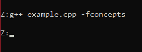
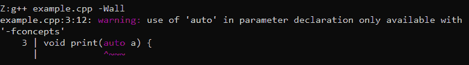

# 如何在编译时加速 g++

> 原文:[https://www . geesforgeks . org/如何在编译时加速 g/](https://www.geeksforgeeks.org/how-to-speed-up-g-during-compile-time/)

**在** [**上快速编译 g++**](https://www.geeksforgeeks.org/compiling-with-g-plus-plus/) 构建系统基本上是用于在终端编译执行 [C++](https://www.geeksforgeeks.org/c-plus-plus/) 程序。有许多选项可以加快编译速度，甚至减慢速度。其中一些如下:

### **g++ { filename . CPP }-fconcepts:**

*   用**fconpts**编译程序不会给出任何[错误](https://www.geeksforgeeks.org/errors-in-cc/)，因为**fconpts**会忽略警告。
*   如果代码执行正常，就会给出错误。
*   这样，**加快了[调试](https://www.geeksforgeeks.org/differences-between-testing-and-debugging/)的速度。**

**语法:**

> g++ <filename.cpp>-fconcepts</filename.cpp>

下面是 C++程序来说明 **-fconcepts** 的使用:

## C++

```cpp
// C++ program to illustrate the use
// of -fconcepts
#include <bits/stdc++.h>
using namespace std;

// Function to print the integer a
void print(auto a)
{
    cout << a << endl;
}

// Driver Code
int main()
{
    int a = 5;

    // Function Call
    print(a);

    return 0;
}
```

**输出:**

[](https://media.geeksforgeeks.org/wp-content/uploads/20210114145247/Untitled.png)

通常，函数不允许使用**自动**变量作为函数参数。但是使用 **-fconcepts** 这个错误可以忽略。

### **g++ {filename.cpp} -Wall:**

*   使用 **-Wall** 编译相同的代码会给出警告，因为它不会忽略它。
*   它还会提示代码哪里出错了。

**语法:**

> g++<filename.cpp>-墙</filename.cpp>

下面是 C++程序来说明 **-Wall** 的使用:

## C++

```cpp
// C++ code to illustrate the use
// of -Wall
#include <iostream>
using namespace std;

// Function to print a
void print(auto a)
{
    cout << a << endl;
}

// Driver Code
int main()
{
    int a = 5;

    // Function call
    print(a);

    return 0;
}
```

**输出:**

