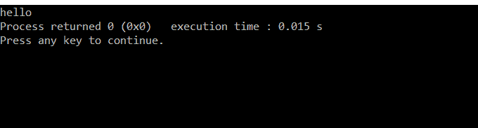

# 如何在 codeblocks 中使用 gotoxy()？

> 原文:[https://www . geeksforgeeks . org/如何使用代码块中的 gotoxy/](https://www.geeksforgeeks.org/how-to-use-gotoxy-in-codeblocks/)

[**gotoxy()**](https://www.geeksforgeeks.org/how-to-get-the-current-position-of-cursor-from-output-screen-in-c/) **功能**将光标置于屏幕上所需的位置。这意味着可以使用 **gotoxy()功能**改变光标在屏幕上的位置。它基本上用于在光标移动的地方打印文本。下面是 [C 程序](https://www.geeksforgeeks.org/c/)在不使用 gotoxy()功能的情况下在屏幕上打印“你好”信息:

## C

```
// C program for the above approach
#include <stdio.h>

// Driver Code
void main()
{
    printf("hello");
}
```

**输出:**



**说明:**默认在屏幕左上角打印“你好”的信息。因此，要在特定坐标上打印文本，请使用 gotoxy()函数。

**gotoxy() In Code::Blocks:**

代码块没有 gotoxy()预定义函数。因此，“**setconsoleucorposition()”**可以用来进行同样的程序。要使用该功能，添加一个名为**#的[头文件](https://www.geeksforgeeks.org/header-files-in-c-cpp-and-its-uses/)包括<windows . h>T5。**setconsoleucorposition()**的参数是:**

*   **句柄:**要获取句柄的值，调用预定义函数**“GetStdHandle(STD _ OUTPUT _ Handle)”。**
*   **坐标:**用于获取 X 和 Y 坐标的预定义函数。

**注:**一屏 25 行 80 列。

下面是上面讨论的在屏幕中央打印“你好”消息的功能的实现:

## C

```
// C program for the above approach

#include <stdio.h>
#include <windows.h>

// Driver Code
void main()
{
    // Input
    COORD c;
    c.X = 40;
    c.Y = 16;

    SetConsoleCursorPosition(
        GetStdHandle(STD_OUTPUT_HANDLE), c);

    printf("hello");
    getch();
}
```

**输出:**

[](https://media.geeksforgeeks.org/wp-content/uploads/20210420195156/Screenshot63.png)

**注意:**可以使用 **X** 和 **Y** 的任意值在屏幕上的任意位置打印所需的文本。这里 **X** 为纵轴， **Y** 为横轴。