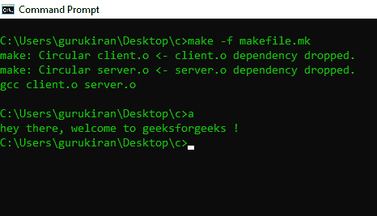

# 如何用 make 效用构建 C 项目？`

> 原文:[https://www . geesforgeks . org/如何使用-制作-实用-构建-c-project/](https://www.geeksforgeeks.org/how-to-use-make-utility-to-build-c-projects/)

当我们用 C/C++构建项目时，我们在文件之间有依赖关系。例如，可能有一个从 b.c .调用函数的文件 a.c .所以我们必须在 a.c .之前编译 b.c .一个项目中可能有许多依赖项，手动遵循这些依赖项并逐个编译文件变得困难。在本文中，我们将看到 make utility 如何帮助我们使这变得简单。首先，我们需要创建 4 个文件，其中两个是。c 文件和 1 个标题(。h)文件和 1 个 make(。mk)文件。

让我们将这些文件命名为 client.c 和 server.c 和 server.h 和 makefile.mk
**Makefile** 是一组带有变量名和目标的命令(类似于终端命令)，用于创建和删除对象文件。在一个 make 文件中，我们可以创建多个目标来编译和删除对象二进制文件。您可以使用 Makefile 编译您的项目(程序)任意多次。这个文件的主要思想是指定依赖关系。

**make utility :** 这是一个命令行实用程序，用于处理 Makefile 中编写的指令。
让我们举一个简单的例子。client.c 文件包含主函数，server.c 文件包含用户自定义函数，
第三个文件是 server.h 头文件，调用 server.c 文件中的用户自定义函数，第四个文件是 makefile.mk，包含一组所有命令及其变量名。

**这里我们编写 client.c 文件**

## C

```cpp
// This is client.c file
#include "stdio.h"

// This is header file that we have created
// in the beginning.
#include "server.h"
int main()
{
    printf("hey there, welcome to ");
    greetings();
    return 0;
}
```

这是 client.c 文件，它包含两个头文件一个是# include“stdio . h”，另一个是# include“server . h”文件，请记住这是我们在开始时创建的同一个文件，它包含 printf 语句，printf 语句打印为“嘿，欢迎光临”(不带引号)，并且 main 函数还调用另一个用户定义的函数，即 hello()。
**现在我们编写 server.c 文件**

## C

```cpp
// This is server.c file
#include "server.h"
#include "stdio.h"
void greetings()
{
    printf("geeksforgeeks !");
}
```

在这个包含两个头文件的 server.c 中，一个是# include“stdio . h ”,另一个是# include“server . h”文件，请记住，这是我们在开始时创建的同一个文件，其中包含用户定义的问候函数，该函数包含 printf 语句，该语句打印为“geeksforgeeks！”(不带引号)。

**现在我们编写 server.h 文件**

## C

```cpp
// This is server.h file
void greetings();
```

这个 server.h 文件非常简单，它调用写在那个文件中的函数，当我们把这个头文件包含到其他 c 程序中时，我们就可以使用这个头文件中定义的函数。在这里，这个 server.h 文件包含了所有的函数。

**现在我们编写 makefile.mk 文件**

## C

```cpp
// This is makefile.c file
a : client.o server.o gcc
        client.o server.o client.o : client.o server.h gcc
    - c client.c server.o : server.o server.h gcc
    - c server.c
```

现在仔细阅读这个，我会告诉你如何写 makefile，

**这是在 windows 中，所以目标文件是“a”如果您使用的是 Linux，您可以用“a . out”**(不带引号)
请参见代码的第一行，其中“a”代表包含我们到目前为止编写的所有代码的目标文件，在“a”之后还有两个目标文件，它们是 client.o 和 server.o 这些是使目标文件成为“a”所需的目标文件， 在下一行中有 gcc 命令记住这一点在编写 gcc 命令之前应该有 1 个 tab 空间(如果忘记放 Tab 这个程序将不会运行)，gcc 命令编译给它的文件并存储在其目标文件的名称中。

这个很容易理解就像这里，
**target _ name:先决条件**
**命令带 tab 空间**

其他要记住的方法是
**食物:食物物品**
**制作食物**

现在让我们移到第三行，这里需要 client.o(因为它用在第一行代码中)，所以该文件的前提是 client.o 和 server.h 文件 gcc 命令将编译 client.c 以获得 client.o 文件。
我们最后需要的是 server.o 文件获取那个文件我们需要 server.o 对象文件和 server.h 头文件
gcc 编译器会编译 server.c 文件获取 server.o 文件
现在我们需要的东西都准备好了，makefile 代码现在完成了。

现在将看到如何运行 make 文件。

> //这个用来运行 makefile
> make -f makefile.mk

这是运行 makefile 的语法。在键入该命令后，按 enter 键，代码将编译并创建一个名为“a”(在 windows 中)、“a.out”(在 linux 中)的可执行文件。

现在执行文件，它在这里

> //请记住，只有在执行 makefile 命令
> //windows 中的这个
> a
> //Linux 中的这个
> 之后，才能执行这个操作。/a.out

**示例:**

```cpp
Output : hey there, welcome to geeksforgeeks

```



**效用如何在内部发挥作用？**它创建任务的依赖图，并使用[拓扑排序](https://www.geeksforgeeks.org/topological-sorting/)算法找到遵循所有给定依赖的有效序列。