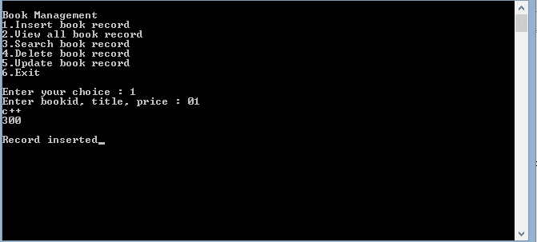
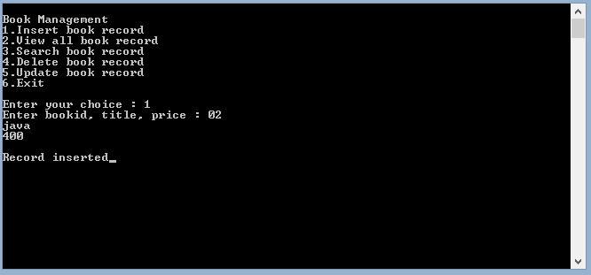
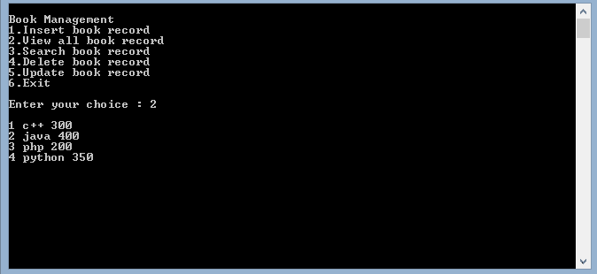
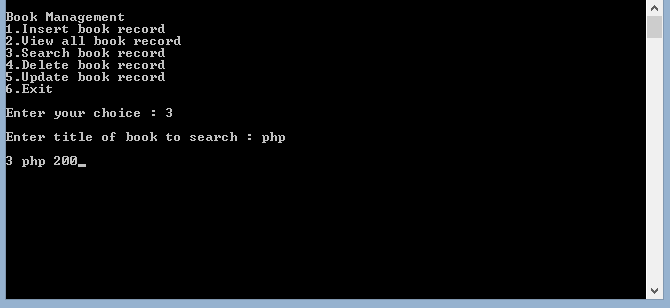
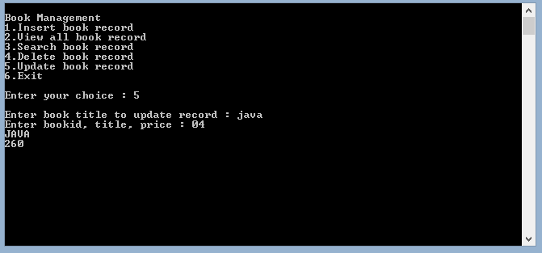
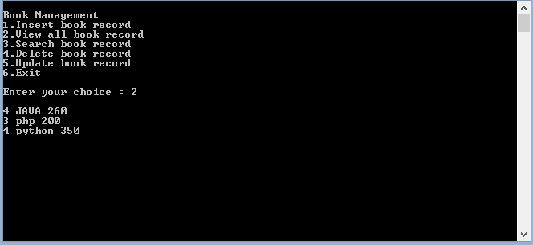

# 如何在 C++ 中处理文件

> 原文:[https://www . geesforgeks . org/如何使用 c 语言处理文件/](https://www.geeksforgeeks.org/how-to-work-with-file-handling-in-c/)

**先决条件:** [通过 C++ 类进行文件处理](https://www.geeksforgeeks.org/file-handling-c-classes/)

在 [C++ ](https://www.geeksforgeeks.org/c-plus-plus/) 中，文件主要使用 **fstream** [头文件](https://www.geeksforgeeks.org/header-files-in-c-cpp-and-its-uses/)中提供的三个类 **fstream、ifstream、ofstream** 进行处理。在这篇文章中，我们将讨论如何使用[文件处理](https://www.geeksforgeeks.org/basics-file-handling-c/)来存储数据。

这个想法是以图书数据库为例，在 C++ 中实现它。以下是使用的功能:

*   如何插入图书记录
*   如何查看所有图书记录
*   如何搜索图书记录
*   如何删除图书记录
*   如何更新图书记录

下面是文件处理操作的实现:

## C++

```cpp
// C++ program for implementing the above
// mentioned functionalities
#include <bits/stdc++.h>
#include <conio.h>
#include <fstream>
using namespace std;

// Book class
class Book {
private:
    int bookid;

    // Max book title size 20
    char title[20];
    float price;

public:
    // Default Constructor
    Book()
    {
        bookid = 0;
        strcpy(title, "no title");
        price = 0;
    }

    // Function for taking book data
    void getBookData()
    {
        cout << "Enter bookid, title, "
             << " price: ";
        cin >> bookid;
        cin.ignore();
        cin.getline(title, 19);
        cin >> price;
    }

    // Function for showing book data
    void showBookData()
    {
        cout << "\n"
             << bookid
             << " " << title << " " << price;
    }

    int storeBook();
    void viewAllBooks();
    void searchBook(char*);
    void deleteBook(char*);
    void updateBook(char*);
};

// Function for update book data
void Book::updateBook(char* t)
{
    fstream file;

    // Open the file
    file.open("myfile3.txt",
              ios::in | ios::out | ios::ate | ios::binary);
    file.seekg(0);
    file.read((char*)this, sizeof(*this));

    // Read the file
    while (!file.eof()) {
        if (!strcmp(t, title)) {
            getBookData();

            file.seekp(file.tellp() - sizeof(*this));
            file.write((char*)this, sizeof(*this));
        }
        file.read((char*)this, sizeof(*this));
    }

    // Close the file
    file.close();
}

// Function for delete book data
void Book::deleteBook(char* t)
{
    ifstream fin;
    ofstream fout;
    fin.open("myfile3.txt",
             ios::app | ios::binary);
    if (!fin)
        cout << "\n File not found";
    else {
        fout.open("tempfile.txt",
                  ios::app | ios::binary);
        fin.read((char*)this, sizeof(*this));

        // Until end of file is not reached
        while (!fin.eof()) {
            if (strcmp(title, t))
                fout.write((char*)this, sizeof(*this));
            fin.read((char*)this, sizeof(*this));
        }
        fin.close();
        fout.close();
        remove("myfile3.txt");
        rename("tempfile.txt", "myfile3.txt");
    }
}

// Function to search the Book
void Book::searchBook(char* t)
{
    int counter = 0;
    ifstream fin;
    fin.open("myfile3.txt",
             ios::in | ios::binary);

    // If file is not found
    if (!fin)
        cout << "File not found";
    else {
        fin.read((char*)this, sizeof(*this));

        // Until end of file is not reached
        while (!fin.eof()) {
            if (!strcmp(t, title)) {
                showBookData();
                counter++ ;
            }
            fin.read((char*)this, sizeof(*this));
        }
        if (counter == 0)
            cout << "No record found";
        fin.close();
    }
}

// Function to view all the Book
void Book::viewAllBooks()
{
    ifstream fin;

    // Open function open file named
    // myfile.txt
    fin.open("myfile3.txt", ios::in | ios::binary);
    if (!fin)
        cout << "File not found";

    else {
        fin.read((char*)this, sizeof(*this));

        // Until end of file is
        // not reached
        while (!fin.eof()) {
            showBookData();

            // read is object of ifstream
            // class which is used for
            // read data of file
            fin.read((char*)this, sizeof(*this));
        }
        fin.close();
    }
}

// Function to implement the store of
// all the books
int Book::storeBook()
{
    if (bookid == 0 && price == 0) {
        cout << "book data not"
             << " initialized";
        return (0);
    }
    else {
        ofstream fout;

        // In the below line open function
        // used to open files. If the file
        // does not exist then it will
        // create the file "myfile.txt"
        fout.open("myfile3.txt", ios::app | ios::binary);

        // Write function is used for
        // data to write in the file
        fout.write((char*)this, sizeof(*this));
        fout.close();
        return (1);
    }
}

// Function to display the menu of the
// current menu-driver
int menu()
{
    int choice;
    cout << "\nBook Management";
    cout << "\n1.Insert book record";
    cout << "\n2.View all book record";
    cout << "\n3.Search book record";
    cout << "\n4.Delete book record";
    cout << "\n5.Update book record";
    cout << "\n6.Exit";
    cout << "\n\nEnter your choice : ";
    cin >> (choice);
    return (choice);
}

// Driver Code
int main()
{

    // Object of the class Book
    Book b1;
    char title[20];

    while (1) {
        system("cls");
        switch (menu()) {
        case 1:
            b1.getBookData();
            b1.storeBook();
            cout << "\nRecord inserted";
            break;

        case 2:
            b1.viewAllBooks();
            break;

        case 3:
            cout << "\nEnter title of "
                 << "book to search : ";
            cin.ignore();
            cin.getline(title, 19);
            b1.searchBook(title);
            break;

        case 4:
            cout << "\nEnter book title "
                 << "for delete record : ";
            cin.ignore();
            cin.getline(title, 19);
            b1.deleteBook(title);
            break;

        case 5:
            cout << "\nEnter book title "
                 << "to update record : ";
            cin.ignore();
            cin.getline(title, 19);
            b1.updateBook(title);
            break;

        case 6:
            cout << "\n Thanks for using";
            cout << "\n Press any key to exit";
            getch();
            exit(0);

        default:
            cout << "Invalid input";
        }
        getch();
    }
}
```

**输出:**

*   使用选项 1 插入图书记录的输出:



*   使用选项 1 再次插入图书记录后输出:



*   用于插入记录 3、4 的输出，我们可以使用选项 2 显示记录。查看所有图书记录。如果**“0”**被追加为 bookid 的前缀，那么它将被忽略，如下图所示:



*   使用选项 3，使用书名输出搜索书籍:



*   更新先前插入数据的输出如下所示:



*   现在终于可以在下图中看到“java”更新为“JAVA”，图书 id 更新为 **4** ，价格更新为**“350”**。第三张图片中可以看到 java book 以前的数据。C++ 的记录被删除，这就是为什么它没有显示在下面的原因:

