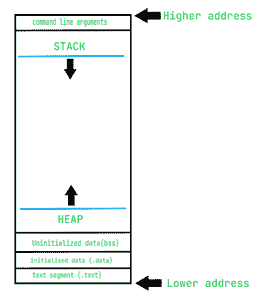

# 变长自变量是如何工作的？

> 原文:[https://www . geesforgeks . org/how-可变长度参数-工作原理/](https://www.geeksforgeeks.org/how-variable-length-argument-works/)

在本文中，我们将讨论可变长度参数是如何工作的。

*   变量函数
*   呼叫惯例
*   [C/c++ 程序的内存布局](https://www.geeksforgeeks.org/memory-layout-of-c-program/)
*   [负下标](https://www.geeksforgeeks.org/overloading-subscript-or-array-index-operator-in-c/)

**变量函数:**一个[变量函数](https://www.geeksforgeeks.org/variadic-function-templates-c/)是接受可变长度参数的模板。可变长度参数是允许函数接收任意数量参数的特性。在某些情况下，函数会根据需求处理可变数量的参数，例如:

*   给定数字的总和。
*   给定数量的最小值和更多。

可变数量的参数由三个点(…)表示。

**程序 1:**

## C

```cpp
// C program to demonstrate the use of
// variable number of arguments
#include <stdarg.h>
#include <stdio.h>

// Function to find the minimum of integer
// numbers passed, ftrst argument is count
// of numbers
int min(int arg_count, ...)
{
    int i;
    int min, a;

    // va_list is a type that holds the
    // information about variable arguments
    va_list ap;

    // va_start must be called before
    // accessing variable argument list
    va_start(ap, arg_count);

    // Now arguments can be accessed one
    // by one using va_arg macro.

    // Initialize min as the first
    // argument in list
    min = va_arg(ap, int);

    // Traverse the rest of arguments
    // to find out minimum
    for (i = 2; i <= arg_count; i++)
        if ((a = va_arg(ap, int)) < min)
            min = a;

    // va_end should be executed before
    // the function returns whenever
    // va_start has been previously
    // used in that function
    va_end(ap);

    return min;
}

// Driver Code
int main()
{
    int count = 5;
    printf("Minimum value is %d",
           min(count, 12, 67, 6, 7, 100));

    return 0;
}
```

**Output**

```cpp
Minimum value is 6
```

**调用约定:**调用约定是指函数如何被调用，参数如何传递，栈如何被清理。 [C](https://www.geeksforgeeks.org/c-programming-language/) / [C++ ](https://www.geeksforgeeks.org/c-plus-plus/) 有多种调用约定，但我们只关心 ***__cdecl*** 和 ***__stdcall** 。*

两者非常相似，但也有一些不同。

*   __cdecl 是 C/C++ 的默认调用约定。
*   __stdcall 是默认调用约定 [Windows API 函数](https://www.geeksforgeeks.org/web-window-api-window-locationbar-property/)。

现在两种调用约定都从右向左传递参数。C/C++ 开发人员选择从右向左，而不是从左向右。

**内存布局:**[内存布局](https://www.geeksforgeeks.org/memory-layout-of-c-program/)讨论如下:



唯一需要注意的是堆栈和堆段向相反的方向增长。

1.  堆向更高的地址增长。
2.  堆栈向较低的地址增长。这意味着堆栈中较高的地址较低。当我们在堆栈上推某个东西时，它会得到堆栈中最低的直接地址。

让我们通过函数来理解这一点:

> 在 main()中，我们有一个函数 func(arg1，arg2，arg3)
> 当 func 被调用时，main()被称为“调用者”，func()被称为“被调用者”
> 让我们看看它的堆栈
> **调用者局部变量** - >在堆栈上低一点在地址上高一点
> --(其他东西)
> **arg3** (最右边)
> **arg 2**
> T13】arg 1
> ——
> 
> **被调用方本地变量** - >在堆栈上较高，在地址^上较低，新堆栈在此创建，而不是在顶部

在上面的部分中，您可以清楚地看到第一个参数得到了最低的地址。这就是开发人员选择从右到左而不是从左到右的原因，因为从左到右的调用约定会给第一个参数最高的地址，这可能会导致问题。

> 第一个参数获取最低地址，所有参数在堆栈中都有一个连续的地址。

**负下标:****【】**为下标运算符。以下是下标操作符需要注意的一些要点:

*   如果下标操作符在指针上操作，那么它的行为是不同的。即 ptr[x]表示*(ptr + x)，即 ptr 前面 x*sizeof(data_type_of_pointer)处的值。
*   同样，ptr[-x]表示*(ptr–x)，即 ptr 后面 x*sizeof(data_type_of_pointer)处的值。

下面是一个展示<stdarg.h>如何工作的例子:</stdarg.h>

## C++

```cpp
// C++ program to implement stdarg.h
#include <iostream>
#include <stdarg.h>
using namespace std;

// Function to find the sum of numbers
int sum(int num, ...)
{
    int res = 0;
    va_list ap;
    va_start(ap, num);
    for (int i = 0; i < num; i++) {
        res += va_arg(ap, int);
    }

    // Return the resultant sum
    return res;
}

// Driver Code
int main()
{
    // First argument is the number
    // of arguments
    cout << sum(4, 6, 89, 34, 26);

    return 0;
}
```

**Output**

```cpp
155
```

**说明:**
内置实现有一些限制，我们来看看，看看如何克服。其中之一是有必要强制通过第一个参数，让我们看看为什么它是强制的，以及如何避免它。

<stdarg.h>使用 va_list、va_start、va_arg、va_end。这个问题可以分为两部分:</stdarg.h>

*   他们是做什么的？
*   我们如何复制它？

**va_list:** 它是 **char*** 的一个 **typedef** ，但这是完全不同的，因为当它被用作一种 C-string 类型时，我们会得到不可预测的结果。这是因为不常见 **typedef** 。它是内置定义的。

```cpp
// arg.h
typedef char* va_list;
```

**va_start:** 这是一个宏，它做的是初始化 ap，实际上是 **va_list** 类型( **char*** )第一个参数前面有一个地址，就是 **arg1** 。这就是为什么需要强制通过第一个参数的原因。它可以是任何数据类型的任何值，但为了简单起见，通常会传递参数的数量。它用于标识堆栈上参数连续的地址。

**va_arg:** 这个宏相当复杂。它做两件事。

*   返回所需的参数
*   前进到下一个参数

> //arg . h
> #定义 va_get(ap，type) ((type*)ap)
> 
> //将 ap 持有的地址(此处为 arg2)转换为 type*
> #define va_advance(ap，type) ap = ap + sizeof(type)

让我们看看这三个点是什么。实际上，它是一个**日食算子(。。。)**而且是 C++ 定义的。该运算符用于传递可变数量的参数。如果不能使用变量函数中的第一个参数，这就是 **stdarg.h** 的工作原理。我们可以利用它作为

> #定义 va_start(ap，arg1) (ap = (char*)(&arg1))

然而，这没有任何意义，因为我们不知道传递了多少个参数，那么我们如何利用它们呢？