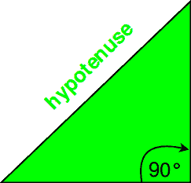

# c++中的 hypot()，hypotf()，hypotl()

> 原文:[https://www.geeksforgeeks.org/hypot-hypotf-hypotl-c/](https://www.geeksforgeeks.org/hypot-hypotf-hypotl-c/)

C++中的**hypt()**函数返回传递的参数平方和的平方根。它找到了斜边，*斜边*是直角三角形最长的边。其计算公式如下:

```cpp
 h = sqrt(x<sup>2</sup>+y<sup>2</sup>)
```

其中 x 和 y 是三角形的另外两条边。


```cpp
Syntax:
double hypot(double x, double y);
float hypot(float x, float y);
long double hypot(long double x, long double y);

```

**示例:**

```cpp
Input : x=3, y=4
Output :5

Input :x=9, y=10
Output :13.4536

```

**解释**

> **头文件** : cmath
> **参数**:hypt()取 2 或 3 个整型或浮点型参数。
> **返回** :
> 1。如果传递两个参数，直角三角形的斜边。
> 2。如果传递了三个参数，从原点到(x，y，x)的距离

**异常或错误**
1。海波(x，y)、海波(y，x)和海波(x，-y)是等价的。
2。如果其中一个参数为 0，则 hypt(x，y)相当于用非零参数
3 调用的**晶圆厂**。如果其中一个参数为*无穷大*或未定义，则 hypt(x，y)返回 undefined。

**示例应用:** **求直角三角形的斜边，给定它的另外两条边。**

```cpp
// CPP program to illustrate
// hypot() function
#include <cmath>
#include <iostream>
using namespace std;
// Driver Program
int main()
{
    double x = 9, y = 10, res;
    res = hypot(x, y);

    // hypot() returns double in this case
    cout << res << endl;
    long double a, b, result;
    a = 4.525252;
    b = 5.767676;

    // hypot() returns long double in this case
    result = hypot(a, b);
    cout << result;
    return 0;
}
```

输出:

```cpp
13.4536
7.33103

```

**hypotf()功能**

hypotf()函数与 hypot 函数相同。唯一的区别是函数的参数和返回类型是浮点类型。附加到“hypotf”的“f”字符代表 float，它表示函数的参数类型和返回类型。

```cpp
Syntax
float hypotf(float x);

```

海波 tf()
的 C++程序实现这里，变量被赋值为浮点类型否则*类型不匹配*错误发生。

```cpp
// CPP program to illustrate
// hypotf() function
#include <cmath>
#include <iostream>
using namespace std;
// Driver Program
int main()
{
    float x = 9.3425, y = 10.0987, res;

    // hypotf() takes float values and returns float
    res = hypotf(x, y);
    cout << res << endl;
    return 0;
}
```

输出:

```cpp
13.7574

```

**hypotl()功能**

hypotl()函数与 hypot 函数相同。唯一的区别是函数的参数和返回类型是长双精度类型。附加到“hypotl”的“l”字符代表长 double，它表示函数的参数类型和返回类型。

```cpp
Syntax
long double hypotl(long double x);

```

hypotl()
的 C++程序实现这里，变量被赋值为长双类型否则*类型不匹配*错误发生。

```cpp
// CPP program to illustrate
// hypotl() function
#include <cmath>
#include <iostream>
using namespace std;
// Driver Program
int main()
{
    long double x = 9.3425453435, y = 10.0987456456, res;

    // hypotl() takes long double values and returns long double
    res = hypotl(x, y);
    cout << res << endl;
    return 0;
}
```

输出:

```cpp
13.7575

```