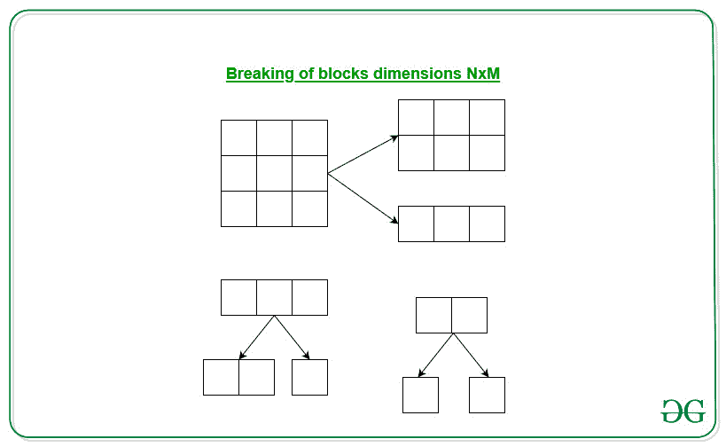

# 矩形网格中的相同分裂

> 原文:[https://www . geeksforgeeks . org/同分矩形网格/](https://www.geeksforgeeks.org/identical-splitting-in-a-rectangular-grid/)

给定一个矩形网格 **NxM** 的尺寸，任务是找到将给定的矩形网格分割成尺寸为 **1×1** 的正方形所需的最小切割数。

**示例:**

> **输入:** N = 4，M = 4
> T3】输出: 15
> 
> **输入:** N = 2，M = 1
> T3】输出: 1

**进场:**



上图显示了矩形网格的拆分。我们可以观察到，每一次切割都会使不同尺寸的矩形数量增加 **1** 。我们将进行分裂，直到我们达到维度的平方 **1×1** 。
所以对于给定的 NxM 矩形尺寸，尺寸 1×1 的方块总数为 N*M，因此我们要求**N * M–1**切口将 NxM 的给定矩形尺寸切割成尺寸 1×1 的方块。

下面是上述方法的实现:

## C++

```cpp
// C++ program of the above approach
#include <iostream>
using namespace std;

// Function to find the minimum cuts
void minimumCuts(int N, int M)
{

    // Print the minimum cuts using
    // the formula
    cout << (N * M - 1);
}

// Driver Code
int main()
{

    // Given dimensions
    int N = 4, M = 4;

    // Function call
    minimumCuts(N, M);

    return 0;
}
```

## Java 语言(一种计算机语言，尤用于创建网站)

```cpp
// Java program of the above approach
import java.util.*;

class GFG{

// Function to find the minimum cuts
static void minimumCuts(int N, int M)
{

    // Print the minimum cuts using
    // the formula
    System.out.print(N * M - 1);
}

// Driver Code
public static void main(String[] args)
{

    // Given dimensions
    int N = 4, M = 4;

    // Function call
    minimumCuts(N, M);
}
}

// This code is contributed by Rohit_ranjan
```

## 蟒蛇 3

```cpp
# Python3 program of the above approach

# Function to find the minimum cuts
def minimumCuts(N, M):

    # Print the minimum cuts using
    # the formula
    print(N * M - 1)

# Driver Code
if __name__ == "__main__":

    # Given dimensions
    N = 4
    M = 4

    # Function call
    minimumCuts(N, M)

# This code is contributed by coder001
```

## C#

```cpp
// C# program of the above approach
using System;

class GFG{

// Function to find the minimum cuts
static void minimumCuts(int N, int M)
{

    // Print the minimum cuts using
    // the formula
    Console.Write(N * M - 1);
}

// Driver Code
public static void Main(String[] args)
{

    // Given dimensions
    int N = 4, M = 4;

    // Function call
    minimumCuts(N, M);
}
}

// This code is contributed by Princi Singh
```

## java 描述语言

```cpp
<script>

// Javascript program of the above approach

// Function to find the minimum cuts
function minimumCuts(N, M)
{

    // Print the minimum cuts using
    // the formula
    document.write(N * M - 1);
}

// Driver Code
// Given dimensions
var N = 4, M = 4;

// Function call
minimumCuts(N, M);

// This code is contributed by noob2000.
</script>
```

**Output:** 

```cpp
15
```

**时间复杂度:** *O(1)*