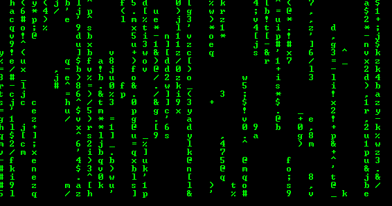

# 下降矩阵的实现

> 原文:[https://www . geesforgeks . org/implementation-fall-matrix/](https://www.geeksforgeeks.org/implementation-falling-matrix/)

自从计算机出现以来，好莱坞已经很好地展示了一个黑客或程序员，他坐在电脑上，在电脑上输入随机键，最终编译成一个类似模拟的坠落矩阵。这里，我们将尝试使用 C++在控制台上实现类似的下降矩阵模拟。



这里的想法是在一个定义的宽度上打印随机字符，其中两个连续的字符可能有也可能没有随机定义的一定量的间隙。为了产生“下降效应”，必须在打印连续行之间实现一定量的延迟。

```cpp
// C++ program for implementation of falling matrix.
#include<iostream>
#include<string>
#include<thread>
#include<cstdlib>
#include<ctime>
#include<chrono>

// Width of the matrix line
const int width = 70;

// Defines the number of flips in Boolean Array 'switches'
const int flipsPerLine =5;

// Delay between two successive line print
const int sleepTime = 100;

using namespace std;

int main()
{
    int i=0, x=0;

    // srand initialized with time function
    // to get distinct rand values at runtime
    srand(time(NULL));

    // Used to decide whether to print
    // the character in that particular iteration
    bool switches[width] = {0};

    // Set of characters to print from
    const string ch = "1234567890qwertyuiopasdfghjkl"
                      "zxcvbnm,./';[]!@#$%^&*()-=_+";
    const int l = ch.size();

    // Green font over black console, duh!
    system("Color 0A");

    // Indefinite Loop
    while (true)
    {
        // Loop over the width
        // Increment by 2 gives better effect
        for (i=0;i<width;i+=2)
        {
            // Print character if switches[i] is 1
            // Else print a blank character
            if (switches[i])
                cout << ch[rand() % l] << " ";
            else
                cout<<"  ";
        }

        // Flip the defined amount of Boolean values
        // after each line
        for (i=0; i!=flipsPerLine; ++i)
        {
            x = rand() % width;
            switches[x] = !switches[x];
        }

         // New Line
        cout << endl;

        // Using sleep_for function to delay,
        // chrono milliseconds function to convert to milliseconds
        this_thread::sleep_for(chrono::milliseconds(sleepTime));
    }
    return 0;
}
```

这在控制台上打印了惊人的坠落矩阵模拟。

注意:

*   由于系统被禁用，该程序无法使用“在集成开发环境上运行”按钮运行。
*   如果您在编译这个程序时遇到编译器错误。在 GCC 上使用下面的命令编译它。

    ```cpp
    $ g++ -std=c++11 abc.cpp -o falling.o
    $ falling.o 
    ```

本文由 [**Raghav Jajodia**](http://jajodiaraghav.me) 供稿。如果你喜欢 GeeksforGeeks 并想投稿，你也可以使用[contribute.geeksforgeeks.org](http://www.contribute.geeksforgeeks.org)写一篇文章或者把你的文章邮寄到 contribute@geeksforgeeks.org。看到你的文章出现在极客博客主页上，帮助其他极客。

如果你发现任何不正确的地方，或者你想分享更多关于上面讨论的话题的信息，请写评论。