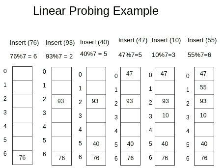

# 用开放寻址线性探测实现自己的散列表

> 原文:[https://www . geesforgeks . org/implementing-hash-table-open-addressing-linear-projection-CPP/](https://www.geeksforgeeks.org/implementing-hash-table-open-addressing-linear-probing-cpp/)

**先决条件–**[哈希介绍](https://www.geeksforgeeks.org/hashing-set-1-introduction/)、[用 Java 中的单独链接实现我们自己的哈希表](https://www.geeksforgeeks.org/implementing-our-own-hash-table-with-separate-chaining-in-java/)
在开放寻址中，所有元素都存储在哈希表本身中。因此，在任何时候，表的大小都必须大于或等于键的总数(请注意，如果需要，我们可以通过复制旧数据来增加表的大小)。

*   **插入(k)–**继续探测，直到找到一个空插槽。一旦找到空槽，插入 k。
*   **搜索(k)–**继续探测，直到槽的键不等于 k 或者到达空槽。
*   **删除(k)–**删除操作有意思。如果我们简单地删除一个键，那么搜索可能会失败。所以被删除密钥的槽被特别标记为“已删除”。

这里，为了标记删除的节点，我们使用了键和值为-1 的**伪节点**。
Insert 可以在已删除的槽中插入项目，但搜索不会在已删除的槽中停止。
整个过程保证了对于任意一个键，我们在哈希表的大小内得到一个整数位置来插入对应的值。
所以过程很简单，用户给出一个(键，值)对集作为输入，并基于散列函数生成的值，生成一个索引，指向对应于特定键的值的存储位置。所以每当我们需要获取一个对应于一个只有 0(1)的键的值时。



**代码–**

## 卡片打印处理机（Card Print Processor 的缩写）

```
#include <bits/stdc++.h>
using namespace std;

// template for generic type
template <typename K, typename V>

// Hashnode class
class HashNode {
public:
    V value;
    K key;

    // Constructor of hashnode
    HashNode(K key, V value)
    {
        this->value = value;
        this->key = key;
    }
};

// template for generic type
template <typename K, typename V>

// Our own Hashmap class
class HashMap {
    // hash element array
    HashNode<K, V>** arr;
    int capacity;
    // current size
    int size;
    // dummy node
    HashNode<K, V>* dummy;

public:
    HashMap()
    {
        // Initial capacity of hash array
        capacity = 20;
        size = 0;
        arr = new HashNode<K, V>*[capacity];

        // Initialise all elements of array as NULL
        for (int i = 0; i < capacity; i++)
            arr[i] = NULL;

        // dummy node with value and key -1
        dummy = new HashNode<K, V>(-1, -1);
    }
    // This implements hash function to find index
    // for a key
    int hashCode(K key)
    {
        return key % capacity;
    }

    // Function to add key value pair
    void insertNode(K key, V value)
    {
        HashNode<K, V>* temp = new HashNode<K, V>(key, value);

        // Apply hash function to find index for given key
        int hashIndex = hashCode(key);

        // find next free space
        while (arr[hashIndex] != NULL
               && arr[hashIndex]->key != key
               && arr[hashIndex]->key != -1) {
            hashIndex++;
            hashIndex %= capacity;
        }

        // if new node to be inserted
        // increase the current size
        if (arr[hashIndex] == NULL
            || arr[hashIndex]->key == -1)
            size++;
        arr[hashIndex] = temp;
    }

    // Function to delete a key value pair
    V deleteNode(int key)
    {
        // Apply hash function
        // to find index for given key
        int hashIndex = hashCode(key);

        // finding the node with given key
        while (arr[hashIndex] != NULL) {
            // if node found
            if (arr[hashIndex]->key == key) {
                HashNode<K, V>* temp = arr[hashIndex];

                // Insert dummy node here for further use
                arr[hashIndex] = dummy;

                // Reduce size
                size--;
                return temp->value;
            }
            hashIndex++;
            hashIndex %= capacity;
        }

        // If not found return null
        return NULL;
    }

    // Function to search the value for a given key
    V get(int key)
    {
        // Apply hash function to find index for given key
        int hashIndex = hashCode(key);
        int counter = 0;

        // finding the node with given key
        while (arr[hashIndex] != NULL) { // int counter =0; // BUG!

            if (counter++ > capacity) // to avoid infinite loop
                return NULL;

            // if node found return its value
            if (arr[hashIndex]->key == key)
                return arr[hashIndex]->value;
            hashIndex++;
            hashIndex %= capacity;
        }

        // If not found return null
        return NULL;
    }

    // Return current size
    int sizeofMap()
    {
        return size;
    }

    // Return true if size is 0
    bool isEmpty()
    {
        return size == 0;
    }

    // Function to display the stored key value pairs
    void display()
    {
        for (int i = 0; i < capacity; i++) {
            if (arr[i] != NULL && arr[i]->key != -1)
                cout << "key = " << arr[i]->key
                     << "  value = "
                     << arr[i]->value << endl;
        }
    }
};

// Driver method to test map class
int main()
{
    HashMap<int, int>* h = new HashMap<int, int>;
    h->insertNode(1, 1);
    h->insertNode(2, 2);
    h->insertNode(2, 3);
    h->display();
    cout << h->sizeofMap() << endl;
    cout << h->deleteNode(2) << endl;
    cout << h->sizeofMap() << endl;
    cout << h->isEmpty() << endl;
    cout << h->get(2);

    return 0;
}
```

**输出–**

```
key = 1 value = 1
key = 2 value = 3
2
3
1
0
0
```

本文由 **Chhavi** 供稿。如果你喜欢 GeeksforGeeks 并想投稿，你也可以使用[write.geeksforgeeks.org](https://write.geeksforgeeks.org)写一篇文章或者把你的文章邮寄到 review-team@geeksforgeeks.org。看到你的文章出现在极客博客主页上，帮助其他极客。
如果你发现任何不正确的地方，或者你想分享更多关于上面讨论的话题的信息，请写评论。