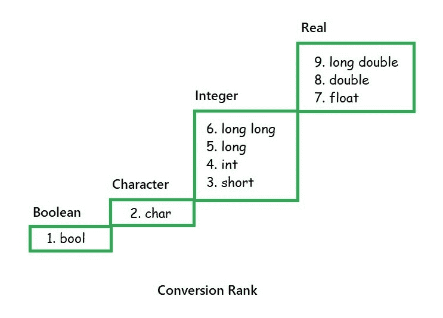

# C 语言隐式类型转换，示例

> 原文:[https://www . geesforgeks . org/implicit-type-conversion-in-c-with-examples/](https://www.geeksforgeeks.org/implicit-type-conversion-in-c-with-examples/)

**前提:** [数据类型](https://www.geeksforgeeks.org/data-types-in-c/)[类型转换](https://www.geeksforgeeks.org/type-conversion-c/)

**隐式类型转换**又称为“**自动类型转换**”。它是由编译器自己完成的，用户不需要任何外部触发器。当表达式中存在多个数据类型时，通常会发生这种情况。在这种情况下，会进行类型转换(类型提升)以避免数据丢失。变量的所有数据类型都升级为数据类型最大的变量的数据类型。

C 语言中隐式类型转换有多种方式，例如:

*   **转换等级**
    一个等级可以分配给*整数和浮点运算*类型，从 **1 到 9** 。这个比例在理论上是准确的，但实际执行起来并没有这么容易。如图所示，长双实数比长实数具有更高的秩，短整数比字符具有更高的秩。
    [](https://media.geeksforgeeks.org/wp-content/uploads/20191112133243/Conversion.jpg)
*   **赋值表达式中的转换**
    在赋值操作中有两个操作数和一个赋值运算符。等级的不同决定了右表达式的升降，以均衡左表达式和右表达式的等级。提升意味着正确的表达是低级的。降级意味着正确的表达具有更高的等级。
*   **晋级**
    晋级不制造任何问题。右表达式的秩提升到左表达式的秩。表达式的值是升级后正确表达式的值。

**示例:**

```
bool        x = true;
char        y = ‘X’;
int         i = 123;
Long double d = 1234.5;

y = x;   // value of y is SOH (ASCII 1)
i = y;   // value of i is 88
d = x;   // value of d is 1.0
d = i;   // value of d is 1234.0

*Here SOH is Start of Header

```

*   **Demotion**
    Demotion may or may not create problems. If the size of the variable of the left expression can accommodate the value of the expression, no problem arises but the results can be a bit different from those expected. Any real or integer value can be assigned to the Boolean variable. If the value of the right expression is **zero**, it implies **false(0)** is stored. And if the value is something other than zero, i.e. either positive or negative, it implies **true(1)** is stored.

    当一个整数或实数值被赋给一个字符变量时，该数字的最低有效字节被转换成一个字符并被存储。当一个实数值存储在一个整数变量中时，只分配一个整数部分，去掉小数部分。但是如果整数值大于可以存储的最大值，那么就会得到不可预测的结果。

    同样，如果一个**长双**值存储在一个浮点型变量中，那么只有当该值符合否则非常**大的值变得无效**时，结果才有效。
    **例:**

    ```
    bool  b = false;
    char  c = ‘X’;
    short s = 98;
    int   j = INT_MAX;
    int   k = 88;

    b = c;     // value of b is 1 (true)
    s = j;     // value of s is unpredictable
    c = k + 1; // demotion: value of c is ‘Y’

    ```

    *   **Conversions in other Binary Expressions**
    There are different set of rules for other binary expressions and they become complicated sometimes so summarising them as steps:
    1.  具有较高等级的操作数使用上图所示的等级来确定。
    2.  排名较低的操作数提升到步骤 1 中定义的排名。
    3.  使用具有提升等级类型的表达式值来执行该操作。

    **示例:**

    ```
    bool        x = true;
    char        y = ‘X’;
    int         i = 123;
    short       s = 98;
    long double d = 1234.5678;

    x + y;   // b is promoted, result is ‘Y’ (‘X’ + 1)
    i * s;   // result is an int
    d * c;   // result is long double

    ```

    下面是一个示例，演示数值类型的隐式类型转换，以便更好地理解。

    ```
    // C program to demonstrate Implicit
    // Type Conversion of numeric types

    #include <stdbool.h>
    #include <stdio.h>

    int main(void)
    {
        // Local Declarations
        bool b = true;
        char c = 'X';
        float d = 1234.5;
        int i = 123;
        short s = 98;

        // Statements
        printf("bool + char is char:     %c\n", b + c);
        printf("int * short is int:      %d\n", i * s);
        printf("float * char is float:   %f\n", d * c);

        // bool promoted to char
        c = c + b;

        // char promoted to float
        d = d + c;

        b = false;

        // float demoted to bool
        b = -d;

        printf("\nAfter execution \n");
        printf("char + true:     %c\n", c);
        printf("float + char:    %f\n", d);
        printf("bool = -float:   %d\n", b);

        return 0;
    }
    ```

    **Output:**

    ```
    bool + char is char:     Y
    int * short is int:      12054
    float * char is float:   108636.000000

    After execution 
    char + true:     Y
    float + char:    1323.500000
    bool = -float:   1

    ```