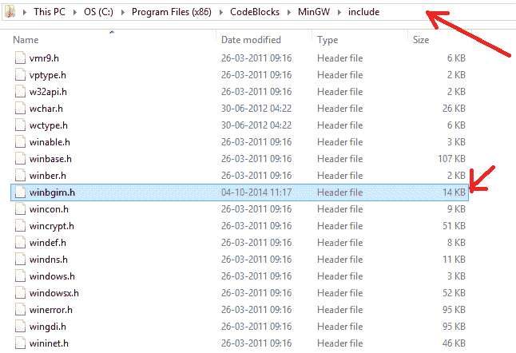
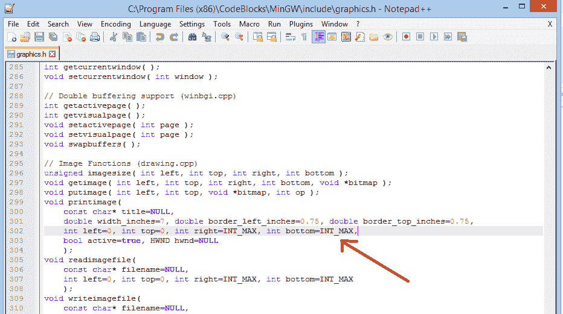

# 如何在 CodeBlocks 中包含 graphics.h？

> 原文:[https://www . geesforgeks . org/include-graphics-h-codeblocks/](https://www.geeksforgeeks.org/include-graphics-h-codeblocks/)

在**代码块** IDE 上编译图形代码时出现错误:**“找不到图形. h”**。这是因为 graphics.h runs 在 CodeBlocks 的库文件夹中不可用。要在代码块上成功编译图形代码，请设置 **winBGIm** 库。

### 如何在 CodeBlocks 中包含 graphics.h？

请按照以下步骤顺序将“graphics.h”包含在代码块中，以便在代码块上成功编译图形代码。
**第一步:**要在 CodeBlocks 中设置“graphics.h”，首先要设置 winBGIm 图形库。从[http://winbgim.codecutter.org/](http://winbgim.codecutter.org/)下载 WinBGIm 或使用此[链接](http://www.codewithc.com/wp-content/uploads/2014/04/WinBGIm_Library6_0_Nov2005.zip)。

更新:http://winbgim.codecutter.org/图书馆的建筑年代久远，最后一次建造是在 2006 年左右。使用 64 位编译器工具链进行链接时，会导致链接错误。在[https://github.com/ki9gpin/WinBGIm-64](https://github.com/ki9gpin/WinBGIm-64)这里是库的最新版本，带来了 64 位兼容性。为了精确起见，一些 win32 系统调用也更新为 MSDN 推荐的 64 位替代。

**第二步:**提取下载的文件。将有三个文件:

*   图形. h

*   winbgim . h .-

*   libbgi.a

**第三步:**将 **graphics.h** 和 **winbgim.h** 文件复制粘贴到编译器目录的**包含**文件夹中。(如果你的电脑 c 盘里安装了 Code::Blocks，请通过:Disk C > >程序文件>>Code Blocks>>MinGW>>包括。把这两个文件粘贴在那里。)

**第四步:**复制并粘贴 **libbgi.a** 到编译器目录的 **lib** 文件夹。

**第五步:**打开代码::Blocks。转到设置> >编译器> >链接器设置。

**步骤 6 :** 在该窗口中，单击“链接库”部分下的添加按钮，然后浏览。

选择步骤 4 中复制到 lib 文件夹的 **libbgi.a** 文件。

**第 7 步:**在右边部分(即。其他链接器选项)粘贴命令

**-lbgi-lgdi 32-lcomdlg 32-luid-lolo let 32-lole 32**

**第 8 步:**点击确定

**第九步:**尝试用 C 或 C++编译 graphics.h 程序，还是会有错误。要解决这个问题，用记事本++打开 graphics.h 文件(在步骤 3 中粘贴到 include 文件夹中)。转到**第 302 行**，将该行替换为: **int left=0，int top=0，int right=INT_MAX，int bottom=INT_MAX，**

**第十步:**保存文件。搞定了。

**注意:**现在，你可以编译任何包含 graphics.h 头文件的 C 或 C++程序。如果你编译 C 代码，你仍然会得到一个错误说:**“致命错误:sstream:没有这样的文件目录”。**

#### **对于此问题，请将您的文件扩展名更改为。如果是 cpp。c**