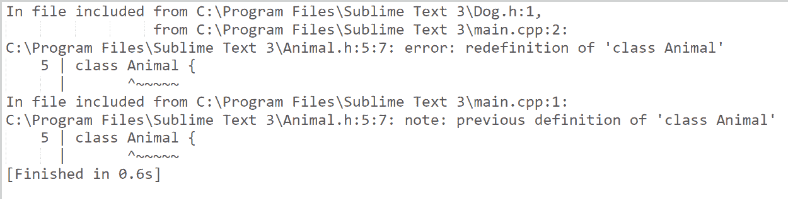

# 在 C++中包含守卫

> 原文:[https://www.geeksforgeeks.org/include-guards-in-c/](https://www.geeksforgeeks.org/include-guards-in-c/)

在 C++中进行[编程时](https://www.geeksforgeeks.org/c-plus-plus/)我们经常会多次使用一个[类](https://www.geeksforgeeks.org/c-classes-and-objects/)，因此需要创建一个[头文件](https://www.geeksforgeeks.org/header-files-in-c-cpp-and-its-uses/)并将其包含在主程序中。现在，有时会发生某个[头文件](https://www.geeksforgeeks.org/write-header-file-c/)直接或间接多次被包含，然后头文件中声明的类被重新声明，这就产生了[错误](https://www.geeksforgeeks.org/core-dump-segmentation-fault-c-cpp/)。要了解**的需求包括警卫员**让我们先了解一个例子:

**程序 1:** 创建一个动物类并将其保存为“**Animal . h”**。下面是同样的程序:

## C++

```
// C++ program to create a header
// file named as "Animal.h"
#include <iostream>
#include <string>
using namespace std;

// Animal Class
class Animal {
    string name, color, type;

public:
    // Function to take input
    void input()
    {
        name = "Dog";
        color = "White";
    }

    // Function to display the member
    // variables
    void display()
    {
        cout << name << " is of "
             << color << endl;
    }
};
```

**程序 2:** 创建一个狗类并保存为**狗. h** 。请记住包含上面声明的“**animal . h”**头文件:

## C++

```
// C++ program to create header file
// named as Dog.h

// Include the header file "Animal.h"
#include "Animal.h"

// Dog Class
class Dog {
    Animal d;

public:
    // Take input to member variable
    // using function call in another
    // header file
    void dog_input() { d.input(); }

    // Function to display the member
    // variable using function call
    // in another header file
    void dog_display() { d.display(); }
};
```

**程序 3:** 创建一个 **main.cpp** 文件，并包含以上两个头文件。下面是同样的程序:

## C++

```
// C++ program to illustrate the
// include guards
#include "Animal.h"
#include "Dog.h"
#include <iostream>
using namespace std;

// Driver Code
int main()
{
    // Object of Dog class in
    // "Dog.h" header file
    Dog a;

    // Member Function Call
    a.dog_input();
    a.dog_display();

    return 0;
}
```

**输出:**现在，当执行上述程序**“main . CPP”**时，会出现以下错误:

[](https://media.geeksforgeeks.org/wp-content/uploads/20201231193353/Screenshot90.png)

**说明:**当使用 include **Animal.h** 编译**main . CPP**程序并定义 Animal 类时，此后当包含 **Dog.h** 、 **Animal.h** 时，在主程序中有两个定义 **Animal 类**，这就是为什么会产生此错误。现在让我们使用**包括防护装置**来解决问题。

> *在*[*【C】*](https://www.geeksforgeeks.org/c-programming-language/)*和 C++编程语言中，一个#include guard，有时称为宏保护、头保护或文件保护，是在处理 include 指令时用来避免双重包含问题的特殊构造。*

**解决方案:**
**Include guards** 保证编译器只处理这个文件一次，不管包含多少次。**包含防护**只是一系列预处理器指令，保证文件只包含一次。
使用的预处理程序:

*   **#ifndef:** 如果未定义，确定提供的宏是否不存在。
*   **#定义:**定义宏。
*   **【endif:**关闭**【ifndef】**指令。

只有在未定义宏或带有 **#ifndef** 的标识符的情况下， **#ifndef** 和 **#endif** 之间的语句块才会被执行。

**语法:**

```
#ifndef ANIMAL(Any word you like but unique to program)
#define ANIMAL(same word as used earlier)

class Animal {
    // Code
};

#endif
```

所以**“animal . h”**头文件应该声明为:

## C++

```
// Checks if _ANIMALS IF DECLARED
#ifndef _ANIMALS_

// Defines _ANIMALS_ if above
// conditions fails
#define _ANIMALS_

#include <iostream>
#include <string>
using namespace std;

// Animal Class
class Animal {
    string name, color, type;

public:
    // Function to take input to
    // member variable
    void input()
    {
        name = "Dog";
        color = "White";
    }

    // Function to display the
    // member variable
    void display()
    {
        cout << name << " is of"
             << color << endl;
    }
};
#endif // _ANIMALS_
```

**输出:**

[](https://media.geeksforgeeks.org/wp-content/uploads/20201231195404/Screenshot91.png)

**说明:**当 **main.cpp** 运行时，包含 **Animal.h** ，并申报动物等级。这里第一行**动物. h** 头在执行时和 as _ RATIONS _ 未定义时代码正常执行。当 **Dog.h** 头文件被包含，进而包含 **Animal.h** 时，这一次 _ANIMALS_ 是在程序中定义的，所以第一行 **#ifndef** 条件为真，整个代码从**跳过**到最后一行，即 **#endif** 。简单来说，如果预处理器定义了这个名字，那么它会跳过整个文件，转到 **#endif** ，换句话说，它不处理文件。