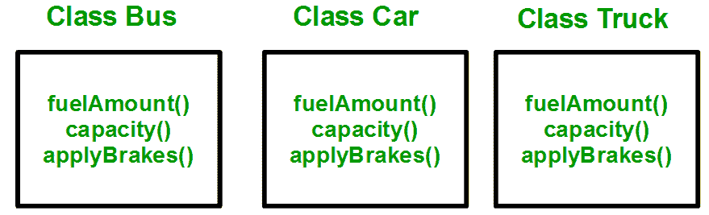
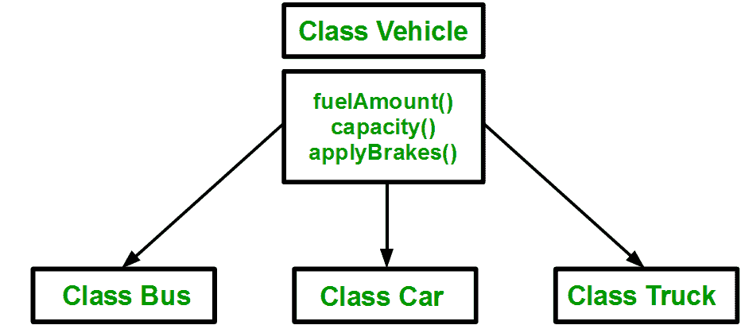

# c++ 中的遗传

> 原文:[https://www.geeksforgeeks.org/inheritance-in-c/](https://www.geeksforgeeks.org/inheritance-in-c/)

一个类从另一个类派生属性和特性的能力称为**继承**。继承是面向对象编程最重要的特征之一。
**子类:**从另一个类继承属性的类称为子类或派生类。
**超类:**属性被子类继承的类称为基类或超类。
**文章分为以下几个副主题:**

1.  [为什么用继承，什么时候用继承？](#Why and when to use inheritance?)
2.  [继承方式](#Modes of Inheritance)
3.  [继承类型](#Types of Inheritance)

**为什么用继承，什么时候用继承？**

考虑一组车辆。您需要为公共汽车、汽车和卡车创建类。对于所有三个类，方法 fuelAmount()、capacity()、applyBrakes()都是相同的。如果我们创建这些类来避免继承，那么我们必须在三个类的每一个中编写所有这些函数，如下图所示:



您可以清楚地看到，上述过程导致相同的代码重复 3 次。这增加了出错和数据冗余的机会。为了避免这种情况，使用了继承。如果我们创建一个 vehicle 类，并在其中写入这三个函数，然后从 Vehicle 类继承其余的类，那么我们就可以简单地避免数据的重复，并增加可重用性。请看下图，其中三个类继承自车辆类:



使用继承，我们只需要编写一次函数，而不是三次，因为我们已经从基类(Vehicle)继承了其余的三个类。
**在 C++** 中实现继承:为了创建从基类继承的子类，我们必须遵循下面的语法。
**语法**:

```cpp
class subclass_name : access_mode base_class_name
{
  //body of subclass
};
```

这里， **subclass_name** 是子类的名称， **access_mode** 是您想要继承这个子类的模式，例如:公有、私有等。而 **base_class_name** 是您想要从中继承子类的基类的名称。
**注意**:派生类不继承 ***对私有数据成员的*** 访问。但是，它确实继承了一个完整的父对象，该对象包含该类声明的任何私有成员。

## 卡片打印处理机（Card Print Processor 的缩写）

```cpp
// C++ program to demonstrate implementation
// of Inheritance

#include <bits/stdc++.h>
using namespace std;

//Base class
class Parent
{
    public:
      int id_p;
};

// Sub class inheriting from Base Class(Parent)
class Child : public Parent
{
    public:
      int id_c;
};

//main function
int main()
   {

        Child obj1;

        // An object of class child has all data members
        // and member functions of class parent
        obj1.id_c = 7;
        obj1.id_p = 91;
        cout << "Child id is " <<  obj1.id_c << endl;
        cout << "Parent id is " <<  obj1.id_p << endl;

        return 0;
   }
```

**Output**

```cpp
Child id is 7
Parent id is 91

```

在上面的程序中，“子”类是从“父”类公开继承的，因此“父”类的公共数据成员也将由“子”类继承。
**继承方式**

1.  **公共模式**:如果我们从公共基类派生一个子类。那么基类的公共成员将在派生类中成为公共的，并且基类的受保护成员将在派生类中成为受保护的。
2.  **保护模式**:如果我们从一个受保护的基类派生一个子类。那么基类的公共成员和受保护成员都将在派生类中受到保护。
3.  **私有模式**:如果我们从私有基类派生一个子类。那么基类的公共成员和受保护成员在派生类中都将变成私有。

**注意:**基类中的私有成员不能在派生类中直接访问，而受保护成员可以直接访问。例如，在下面的例子中，类 B、C 和 D 都包含变量 x、y 和 z。这只是准入问题。

## 卡片打印处理机（Card Print Processor 的缩写）

```cpp
// C++ Implementation to show that a derived class
// doesn’t inherit access to private data members.
// However, it does inherit a full parent object
class A
{
public:
    int x;
protected:
    int y;
private:
    int z;
};

class B : public A
{
    // x is public
    // y is protected
    // z is not accessible from B
};

class C : protected A
{
    // x is protected
    // y is protected
    // z is not accessible from C
};

class D : private A    // 'private' is default for classes
{
    // x is private
    // y is private
    // z is not accessible from D
};
```